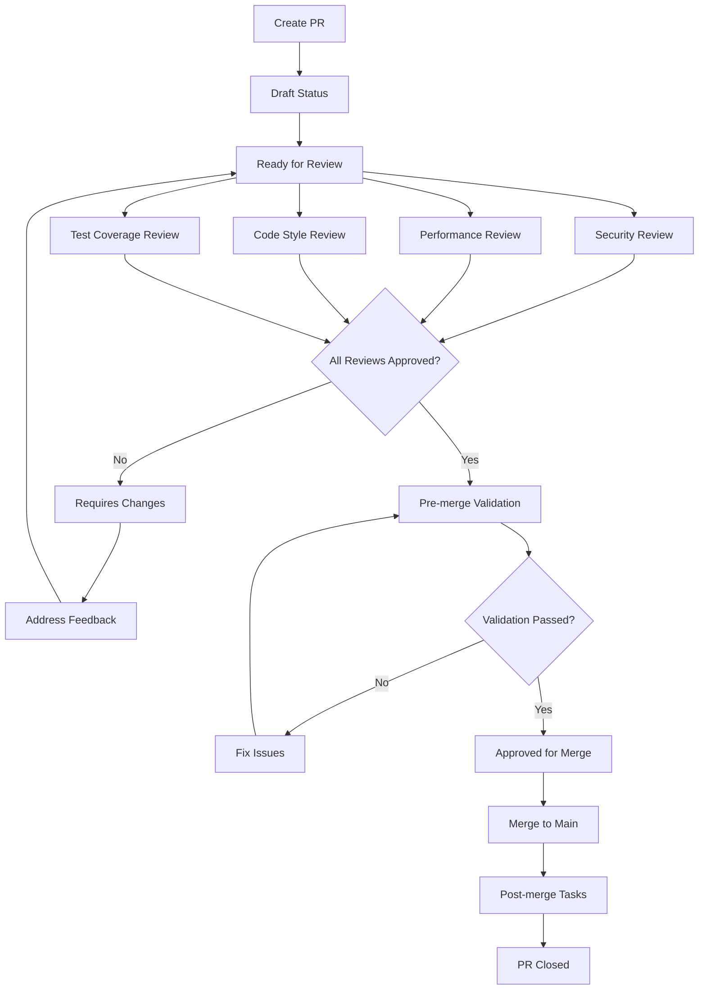

# Pull Request Lifecycle Management

## Overview

This document defines the complete lifecycle management for Pull Requests (PRs) within the Claude PM trackdown framework. It covers all stages from creation to merge and post-merge activities.

## PR States

### 1. Draft
- **Purpose**: Work-in-progress PRs that are not ready for review
- **Visibility**: Internal development status
- **Actions**: Development, testing, documentation
- **Transition**: Ready for Review when complete

### 2. Ready for Review
- **Purpose**: PR is complete and ready for comprehensive review
- **Visibility**: Team notification and review assignment
- **Actions**: Review assignment, security/performance/style/test analysis
- **Transition**: Under Review when reviews begin

### 3. Under Review
- **Purpose**: Active review process across multiple dimensions
- **Visibility**: Review progress tracking and status updates
- **Actions**: Security, performance, code style, and test coverage reviews
- **Transition**: Requires Changes or Approved based on review outcomes

### 4. Requires Changes
- **Purpose**: Review feedback requires implementation changes
- **Visibility**: Author notification with specific feedback
- **Actions**: Address feedback, update implementation, resubmit
- **Transition**: Under Review after changes implemented

### 5. Approved
- **Purpose**: All reviews passed, ready for merge validation
- **Visibility**: Merge readiness notification
- **Actions**: Pre-merge validation, final checks
- **Transition**: Merged after validation passes

### 6. Merged
- **Purpose**: Changes integrated into main branch
- **Visibility**: Completion notification and post-merge tasks
- **Actions**: Post-merge validation, monitoring, cleanup
- **Transition**: Closed after post-merge tasks complete

### 7. Closed
- **Purpose**: PR lifecycle complete or abandoned
- **Visibility**: Archive status
- **Actions**: Documentation update, metrics collection
- **Transition**: Final state

## Lifecycle Workflow

## Review Assignment Rules

### Automatic Assignment
1. **Security Engineer**: All PRs touching authentication, API keys, data handling
2. **Performance Engineer**: PRs affecting core loops, database queries, API responses
3. **Code Style Reviewer**: All PRs for consistency and standards compliance
4. **Test Coverage Reviewer**: PRs with new functionality requiring test validation

### Manual Override
- Specialized review requirements
- Domain expertise needs
- Workload balancing
- Escalation scenarios

## Review Completion Criteria

### Security Review
- [ ] Authentication and authorization patterns verified
- [ ] Input validation and sanitization complete
- [ ] Credential management secure
- [ ] Data protection adequate
- [ ] API security implemented
- [ ] Audit and monitoring configured

### Performance Review
- [ ] Memory usage optimized
- [ ] Database queries efficient
- [ ] API response times acceptable
- [ ] Concurrent access handled
- [ ] Performance benchmarks met
- [ ] Resource usage within limits

### Code Style Review
- [ ] Coding standards compliance
- [ ] Documentation completeness
- [ ] Error handling patterns consistent
- [ ] Logging and monitoring adequate
- [ ] Naming conventions followed
- [ ] Code organization logical

### Test Coverage Review
- [ ] Minimum 80% code coverage achieved
- [ ] Critical path testing complete
- [ ] Edge case coverage adequate
- [ ] Integration test coverage sufficient
- [ ] Error condition testing complete
- [ ] Performance test coverage adequate

## Merge Validation Process

### Pre-merge Checklist
1. **Review Approvals**: All required reviews approved (minimum 3)
2. **CI/CD Pipeline**: All automated tests passing
3. **Security Scan**: No critical or high security issues
4. **Performance Benchmarks**: All performance criteria met
5. **Test Coverage**: Minimum coverage threshold achieved
6. **Documentation**: All documentation updated
7. **Changelog**: Changes documented appropriately
8. **Breaking Changes**: Analysis complete and communicated

### Merge Execution
1. **Final Validation**: Last-minute checks before merge
2. **Automated Merge**: System executes merge if all criteria met
3. **Post-merge Verification**: Immediate validation of merge success
4. **Stakeholder Notification**: Relevant teams and individuals notified
5. **Monitoring Setup**: Alerts and monitoring configured for changes

## Post-Merge Activities

### Immediate Tasks (< 1 hour)
- [ ] Validate merge success and system stability
- [ ] Deploy to staging environment
- [ ] Run smoke tests on staging
- [ ] Update monitoring dashboards
- [ ] Notify dependent teams

### Short-term Tasks (< 24 hours)
- [ ] Monitor production metrics
- [ ] Validate functionality in staging
- [ ] Schedule production deployment
- [ ] Update project documentation
- [ ] Close related tickets

### Medium-term Tasks (< 1 week)
- [ ] Production deployment complete
- [ ] Performance monitoring analysis
- [ ] User feedback collection
- [ ] Documentation review and updates
- [ ] Lessons learned documentation

## Error Handling and Rollback

### Rollback Triggers
- **Critical Security Vulnerability**: Immediate security threat discovered
- **Performance Degradation**: System performance below acceptable thresholds
- **Integration Failures**: Dependent services failing due to changes
- **Data Corruption**: Data integrity issues detected
- **User Impact**: Significant negative user experience

### Rollback Procedure
1. **Immediate Stop**: Halt new deployments and changes
2. **Assessment**: Quick impact assessment and decision
3. **Revert Changes**: Execute rollback to previous stable version
4. **Validation**: Confirm system restoration and stability
5. **Communication**: Notify stakeholders of rollback and reasons
6. **Analysis**: Document issues and plan resolution

### Recovery Validation
- [ ] All services operational at expected performance levels
- [ ] Performance metrics restored to baseline
- [ ] No data loss or corruption occurred
- [ ] Dependent systems functional and stable
- [ ] User experience restored to expected levels
- [ ] Monitoring confirms system health

## Metrics and Monitoring

### PR Lifecycle Metrics
- **Creation to Merge Time**: Complete PR lifecycle duration
- **Review Cycle Time**: Time from review request to approval
- **Merge Success Rate**: Percentage of PRs merged without issues
- **Rollback Frequency**: Number of rollbacks per period
- **Review Quality**: Defects found post-merge vs. during review

### Quality Metrics
- **Security Issues**: Number and severity of security issues found
- **Performance Impact**: Performance changes per PR
- **Test Coverage**: Coverage improvement or degradation
- **Documentation Quality**: Completeness and accuracy metrics
- **Code Quality**: Style and maintainability improvements

### Process Improvement
- **Review Effectiveness**: How well reviews prevent issues
- **Automation Success**: Percentage of automated validations working
- **Team Satisfaction**: Developer and reviewer satisfaction scores
- **Learning Loop**: Process improvements implemented per period
- **Knowledge Transfer**: Cross-team learning and pattern sharing

## Integration with Trackdown Framework

### Ticket Integration
- PRs automatically reference related tickets (TD-XXX, MEM-XXX, etc.)
- Ticket status updates based on PR progress
- Cross-reference tracking in BACKLOG.md
- Status synchronization between tickets and PRs

### Framework Impact Tracking
- PRs affecting core framework components flagged
- Cross-project impact analysis required
- Framework health monitoring includes PR status
- Multi-project coordination for breaking changes

### Managed Projects Coordination
- PR changes affecting multiple managed projects tracked
- Coordinated rollout for framework changes
- Impact assessment across project portfolio
- Unified testing and validation across projects

## Tools and Automation

### Status Tracking
- Automated status updates based on review completion
- Real-time dashboard for PR pipeline health
- Notification system for review requests and completions
- Integration with existing trackdown automation

### Quality Gates
- Automated security scanning integration
- Performance benchmark automation
- Code coverage reporting and enforcement
- Style checking and compliance validation

### Reporting and Analytics
- Daily PR status reports
- Weekly review metrics analysis
- Monthly process improvement reports
- Quarterly framework impact assessment

---

**Document Version**: 1.0  
**Last Updated**: 2025-07-07  
**Owner**: Claude PM Framework Team  
**Review Cycle**: Monthly