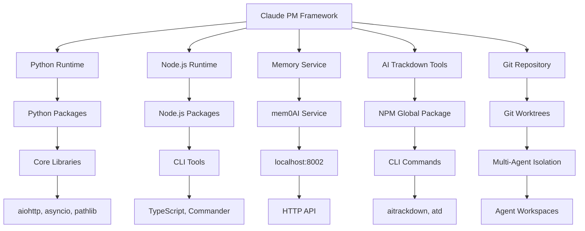

# Dependencies Comprehensive Guide - Claude PM Framework

## Overview

This comprehensive guide covers all dependency management aspects of the Claude PM Framework v4.5.1, including dependency resolution, installation automation, health monitoring, and maintenance procedures for a complete multi-agent deployment ecosystem.

## System Architecture

### Dependency Classification

- **Critical**: System cannot function without these dependencies
- **Important**: Core functionality is impacted without these dependencies
- **Optional**: Enhanced functionality that can gracefully degrade
- **Development**: Required only for development and testing

### Dependency Health Levels

- **Healthy**: Dependency is functional and responsive
- **Degraded**: Dependency is functional but with reduced performance
- **Failing**: Dependency is not functioning properly
- **Unavailable**: Dependency is completely unavailable

### Dependency Relationship Map



## Core Dependencies

### 1. Python Runtime Environment

**Classification**: Critical  
**Version**: >= 3.8.0  
**Health Check**: `python3 --version`

#### Components
- **Python Interpreter**: Core runtime for framework execution
- **Standard Library**: Built-in modules (asyncio, pathlib, json, etc.)
- **Virtual Environment**: Isolated Python environment (optional but recommended)

#### Health Monitoring
```bash
# Check Python version
python3 --version

# Check Python path
python3 -c "import sys; print(sys.executable)"

# Check available modules
python3 -c "import asyncio, pathlib, json; print('Core modules available')"

# Check framework import
python3 -c "import claude_pm; print('Framework accessible')"
```

#### Troubleshooting
```bash
# Common issues and solutions
# 1. Python not found
which python3 || echo "Python 3 not installed"

# 2. Version too old
python3 -c "import sys; print(sys.version_info >= (3, 8))"

# 3. Missing modules
pip list | grep -E "(asyncio|pathlib)"

# 4. Import errors
python3 -c "import claude_pm" 2>&1 | head -5
```

### 2. Node.js Runtime Environment

**Classification**: Important  
**Version**: >= 16.0.0  
**Health Check**: `node --version`

#### Components
- **Node.js Runtime**: JavaScript runtime for CLI tools
- **NPM Package Manager**: Package management for Node.js packages
- **Global Package Directory**: Location for globally installed packages

#### Health Monitoring
```bash
# Check Node.js version
node --version

# Check NPM version
npm --version

# Check global packages
npm list -g --depth=0

# Check Node.js path
which node
```

#### Troubleshooting
```bash
# Common issues and solutions
# 1. Node.js not found
which node || echo "Node.js not installed"

# 2. Version too old
node -e "console.log(process.version >= 'v16.0.0')"

# 3. NPM issues
npm doctor

# 4. Permission issues
npm config get prefix
```

### 3. Git Repository

**Classification**: Critical  
**Version**: >= 2.0.0  
**Health Check**: `git --version`

#### Components
- **Git Binary**: Version control system
- **Repository**: Framework source code repository
- **Worktrees**: Multi-agent isolation mechanism
- **Remotes**: Remote repository connections

#### Health Monitoring
```bash
# Check Git version
git --version

# Check repository status
git status

# Check worktree status
git worktree list

# Check remotes
git remote -v
```

#### Troubleshooting
```bash
# Common issues and solutions
# 1. Git not found
which git || echo "Git not installed"

# 2. Repository corruption
git fsck --full

# 3. Worktree issues
git worktree prune

# 4. Remote issues
git remote show origin
```

## Service Dependencies

### 1. Memory Service (mem0AI)

**Classification**: Important  
**Endpoint**: http://localhost:8002  
**Health Check**: `curl http://localhost:8002/health`

#### Components
- **mem0AI Server**: Memory service backend
- **HTTP API**: RESTful API for memory operations
- **Memory Categories**: Project, Pattern, Team, Error memories
- **Connection Pool**: Async HTTP connection management

#### Health Monitoring
```bash
# Check service availability
curl -s http://localhost:8002/health | jq .

# Check service response time
time curl -s http://localhost:8002/health >/dev/null

# Check connection pool
python3 -c "
from claude_pm.services.memory_service import get_memory_service
ms = get_memory_service()
print('Connected:', ms.client.is_connected())
"

# Check memory operations
python3 -c "
from claude_pm.services.memory_service import get_memory_service
ms = get_memory_service()
result = ms.client.add_memory('test', 'test content', 'project')
print('Memory operation successful:', result is not None)
"
```

#### Configuration
```python
# Memory service configuration
MEMORY_CONFIG = {
    "host": "localhost",
    "port": 8002,
    "timeout": 30,
    "max_retries": 3,
    "retry_delay": 1.0,
    "connection_pool_size": 50,
    "cache_ttl": 300,
    "max_memory_size": 1000
}
```

#### Troubleshooting
```bash
# Common issues and solutions
# 1. Service not responding
curl -s http://localhost:8002/health || echo "Service unavailable"

# 2. Connection timeout
curl -s --max-time 5 http://localhost:8002/health || echo "Service timeout"

# 3. Port in use
netstat -an | grep 8002

# 4. Service restart
sudo systemctl restart mem0ai || echo "No systemd service"
```

### 2. Health Monitor Service

**Classification**: Important  
**Dependencies**: Memory Service, Python Runtime  
**Health Check**: Python health check

#### Components
- **Health Monitor**: Core health monitoring service
- **Background Monitor**: Continuous monitoring process
- **Health Reports**: JSON health report generation
- **Alert System**: Health threshold monitoring

#### Health Monitoring
```bash
# Check health monitor status
python3 -c "
from claude_pm.services.health_monitor import HealthMonitorService
hms = HealthMonitorService()
print('Health Monitor available:', hms is not None)
"

# Check health reports
ls -la logs/health-*.json

# Check background monitoring
ps aux | grep health_monitor

# Check health dashboard
python3 -c "
from claude_pm.services.health_dashboard import HealthDashboard
hd = HealthDashboard()
print('Dashboard available:', hd is not None)
"
```

#### Configuration
```json
{
  "health_check_interval": 300,
  "enable_background_monitoring": true,
  "alert_threshold": 60,
  "alert_thresholds": {
    "critical_issues": 1,
    "broken_links": 5,
    "inconsistencies": 3
  }
}
```

#### Troubleshooting
```bash
# Common issues and solutions
# 1. Health monitor not starting
python3 -c "from claude_pm.services.health_monitor import HealthMonitorService; HealthMonitorService()"

# 2. Background monitoring not working
ps aux | grep health_monitor || echo "Background monitoring not running"

# 3. Corrupted health reports
find logs/ -name "health-*.json" -exec python3 -m json.tool {} \; || echo "Corrupted report"

# 4. Configuration issues
python3 -m json.tool config/health_monitoring_config.json
```

### 3. Project Service

**Classification**: Important  
**Dependencies**: Memory Service, Python Runtime, File System  
**Health Check**: Python project check

#### Components
- **Project Discovery**: Automatic project discovery
- **Compliance Monitoring**: Framework compliance scoring
- **Project Registry**: Project information storage
- **Git Integration**: Git repository information

#### Health Monitoring
```bash
# Check project service status
python3 -c "
from claude_pm.services.project_service import ProjectService
ps = ProjectService()
print('Project Service available:', ps is not None)
print('Projects discovered:', len(ps.get_projects()))
"

# Check project paths
ls -la /Users/masa/Projects/
ls -la /Users/masa/Projects/managed/

# Check project registry
cat logs/project-registry.json | jq .timestamp

# Check compliance
python3 -c "
from claude_pm.services.project_service import ProjectService
ps = ProjectService()
stats = ps.get_project_stats()
print('Project stats:', stats)
"
```

#### Configuration
```python
PROJECT_CONFIG = {
    "base_path": "/Users/masa/Projects",
    "managed_path": "/Users/masa/Projects/managed",
    "auto_discovery_interval": 3600,
    "compliance_check_interval": 1800
}
```

#### Troubleshooting
```bash
# Common issues and solutions
# 1. Project paths not found
ls -la /Users/masa/Projects/ || echo "Base path missing"

# 2. Project discovery issues
python3 -c "
from claude_pm.services.project_service import ProjectService
ps = ProjectService()
ps._discover_projects()
"

# 3. Compliance check failures
python3 -c "
from claude_pm.services.project_service import ProjectService
ps = ProjectService()
ps._check_all_compliance()
"

# 4. Registry corruption
python3 -m json.tool logs/project-registry.json || echo "Registry corrupted"
```

### 4. Multi-Agent Orchestrator

**Classification**: Important  
**Dependencies**: Memory Service, Git Repository, Python Runtime  
**Health Check**: Python orchestrator check

#### Components
- **Agent Definitions**: 11-agent ecosystem definitions
- **Worktree Manager**: Git worktree management
- **Memory Context**: Agent memory context preparation
- **Enforcement Engine**: Agent authorization and constraints

#### Health Monitoring
```bash
# Check orchestrator status
python3 -c "
from claude_pm.services.multi_agent_orchestrator import MultiAgentOrchestrator
from claude_pm.services.memory_service import get_memory_service
memory = get_memory_service()
orchestrator = MultiAgentOrchestrator('/Users/masa/Projects/claude-multiagent-pm', memory.client)
print('Orchestrator available:', orchestrator is not None)
print('Agent definitions:', len(orchestrator.agent_definitions))
"

# Check worktree status
git worktree list

# Check enforcement engine
python3 -c "
from claude_pm.core.enforcement import get_enforcement_engine
engine = get_enforcement_engine()
print('Enforcement engine available:', engine is not None)
"
```

#### Configuration
```python
ORCHESTRATOR_CONFIG = {
    "max_parallel": 5,
    "base_repo_path": "/Users/masa/Projects/claude-multiagent-pm",
    "worktree_base_path": "/Users/masa/Projects/claude-multiagent-pm/.worktrees"
}
```

#### Troubleshooting
```bash
# Common issues and solutions
# 1. Orchestrator initialization failure
python3 -c "from claude_pm.services.multi_agent_orchestrator import MultiAgentOrchestrator; print('Import successful')"

# 2. Worktree issues
git worktree prune
rm -rf .worktrees/*

# 3. Memory context issues
python3 -c "
from claude_pm.services.memory_service import get_memory_service
ms = get_memory_service()
print('Memory service connected:', ms.client.is_connected())
"

# 4. Enforcement engine issues
python3 -c "
from claude_pm.core.enforcement import get_enforcement_engine
engine = get_enforcement_engine()
print('Enforcement engine stats:', engine.get_enforcement_stats())
"
```

## External Dependencies

### 1. AI Trackdown Tools

**Classification**: Important  
**Package**: @bobmatnyc/ai-trackdown-tools  
**Version**: >= 2.0.0  
**Health Check**: `aitrackdown --version`

#### Components
- **NPM Package**: Globally installed NPM package
- **CLI Commands**: aitrackdown and atd commands
- **Task Management**: Epic, issue, and task management
- **Integration**: Framework integration utilities

#### Health Monitoring
```bash
# Check package installation
npm list -g @bobmatnyc/ai-trackdown-tools

# Check CLI availability
aitrackdown --version
atd --version

# Check CLI functionality
aitrackdown status
aitrackdown epic list

# Check framework integration
python3 -c "
from claude_pm.utils.ai_trackdown_tools import get_ai_trackdown_tools
tools = get_ai_trackdown_tools()
print('AI Trackdown enabled:', tools.is_enabled())
print('AI Trackdown available:', tools.is_available())
"
```

#### Configuration
```python
AI_TRACKDOWN_CONFIG = {
    "enabled": True,
    "timeout": 30,
    "fallback_logging": True,
    "fallback_method": "logging",
    "cli_command": "aitrackdown",
    "cli_alias": "atd"
}
```

#### Troubleshooting
```bash
# Common issues and solutions
# 1. Package not installed
npm install -g @bobmatnyc/ai-trackdown-tools

# 2. CLI not found
which aitrackdown || echo "CLI not in PATH"

# 3. Permission issues
npm config get prefix
ls -la $(npm config get prefix)/bin/

# 4. Fallback mode
python3 -c "
from claude_pm.utils.ai_trackdown_tools import get_ai_trackdown_tools
tools = get_ai_trackdown_tools()
print('Fallback method:', tools.get_fallback_method())
"
```

### 2. GitHub API Integration

**Classification**: Optional  
**Dependencies**: Internet connectivity, GitHub API  
**Health Check**: API connectivity test

#### Components
- **GitHub API**: Issue and PR synchronization
- **Authentication**: GitHub token management
- **Rate Limiting**: API rate limit management
- **Webhook Integration**: Real-time updates

#### Health Monitoring
```bash
# Check GitHub API connectivity
curl -s https://api.github.com/rate_limit | jq .

# Check authentication
curl -s -H "Authorization: token $GITHUB_TOKEN" https://api.github.com/user | jq .login

# Check repository access
curl -s -H "Authorization: token $GITHUB_TOKEN" https://api.github.com/repos/bobmatnyc/claude-multiagent-pm | jq .full_name
```

#### Configuration
```bash
# Environment variables
export GITHUB_TOKEN="your_token_here"
export GITHUB_REPOSITORY="bobmatnyc/claude-multiagent-pm"
```

#### Troubleshooting
```bash
# Common issues and solutions
# 1. Token not set
echo $GITHUB_TOKEN || echo "Token not set"

# 2. Rate limiting
curl -s https://api.github.com/rate_limit | jq .rate.remaining

# 3. Repository access
curl -s -H "Authorization: token $GITHUB_TOKEN" \
  https://api.github.com/repos/bobmatnyc/claude-multiagent-pm | jq .message
```

## Dependency Management System

### DependencyManager Service

The main service class that orchestrates all dependency operations:

```python
from claude_pm.services.dependency_manager import DependencyManager

# Initialize dependency manager
dependency_manager = DependencyManager()
await dependency_manager._initialize()

# Check dependencies
dependencies = dependency_manager.get_dependencies()

# Install missing dependencies
result = await dependency_manager.install_dependency("ai-trackdown-tools")

# Generate comprehensive report
report = await dependency_manager.generate_dependency_report()
```

### DependencyType Enumeration

Defines the types of dependencies managed by the system:

- `PYTHON_PACKAGE`: Python packages installed via pip
- `NPM_GLOBAL`: npm packages installed globally
- `NPM_LOCAL`: npm packages installed locally
- `SYSTEM_BINARY`: System binaries (python, node, git, etc.)
- `AI_TRACKDOWN_TOOLS`: Special handling for ai-trackdown-tools

### InstallationMethod Enumeration

Defines available installation methods:

- `NPM_GLOBAL`: Global npm installation
- `NPM_LOCAL`: Local npm installation
- `NPX`: NPX execution (no installation)
- `SOURCE`: Source-based installation
- `PIP`: Python pip installation
- `SYSTEM`: System package manager

### Data Models

#### DependencyInfo
```python
@dataclass
class DependencyInfo:
    name: str
    type: DependencyType
    version: Optional[str] = None
    required_version: Optional[str] = None
    is_installed: bool = False
    installation_path: Optional[str] = None
    installation_method: Optional[InstallationMethod] = None
    last_checked: Optional[str] = None
    metadata: Optional[Dict[str, Any]] = None
```

#### InstallationResult
```python
@dataclass
class InstallationResult:
    success: bool
    dependency_name: str
    method: InstallationMethod
    version: Optional[str] = None
    installation_path: Optional[str] = None
    error_message: Optional[str] = None
    logs: Optional[List[str]] = None
```

#### DependencyReport
```python
@dataclass
class DependencyReport:
    deployment_type: str
    platform: str
    timestamp: str
    dependencies: Dict[str, DependencyInfo]
    missing_dependencies: List[str]
    outdated_dependencies: List[str]
    installation_recommendations: List[str]
    health_score: int
```

## CLI Interface

### Basic Usage

```bash
# Show dependency status
claude-pm dependency status

# Check all dependencies
claude-pm dependency check

# Install a dependency
claude-pm dependency install ai-trackdown-tools

# Verify installation
claude-pm dependency verify ai-trackdown-tools

# Generate report
claude-pm dependency report

# Check health
claude-pm dependency health
```

### Advanced Usage

```bash
# Show status in JSON format
claude-pm dependency status --format json

# Show only missing dependencies
claude-pm dependency status --missing-only

# Force refresh dependencies
claude-pm dependency check --refresh --verbose

# Install with specific method
claude-pm dependency install ai-trackdown-tools --method npm_global

# Dry run installation
claude-pm dependency install ai-trackdown-tools --dry-run

# Verify all dependencies
claude-pm dependency verify --all

# Generate detailed report
claude-pm dependency report --format detailed --output report.json

# Check health with details
claude-pm dependency health --detailed

# AI-Trackdown-Tools specific operations
claude-pm dependency ai-trackdown --status
claude-pm dependency ai-trackdown --install
claude-pm dependency ai-trackdown --verify
```

## Installation Strategies

### ai-trackdown-tools Installation

The system supports multiple installation methods for ai-trackdown-tools:

#### NPM Global (Recommended)
```bash
npm install -g @bobmatnyc/ai-trackdown-tools
```

#### NPM Local
```bash
npm install @bobmatnyc/ai-trackdown-tools
```

#### NPX (No Installation)
```bash
npx @bobmatnyc/ai-trackdown-tools
```

#### Source Installation
For development environments with source access.

### Python Package Installation

Automatic detection and installation of Python packages:

```python
# Install Python package
result = await dependency_manager.install_dependency("pydantic")

# Verify installation
dependency_info = dependency_manager.get_dependency("pydantic")
```

### System Binary Verification

Automatic detection of system binaries:

- Python (python3, python)
- Node.js (node)
- npm (npm)
- Git (git)

## Health Monitoring

### Health Checks

The system performs comprehensive health checks:

- **python_available**: Python interpreter availability
- **node_available**: Node.js runtime availability
- **npm_available**: npm package manager availability
- **git_available**: Git version control availability
- **ai_trackdown_tools_available**: ai-trackdown-tools functionality
- **deployment_detector_available**: Deployment detection integration
- **deployment_config_valid**: Deployment configuration validity
- **dependencies_tracked**: Dependency tracking status
- **critical_dependencies_met**: Critical dependency satisfaction

### Health Score Calculation

Health score is calculated as:
```
Health Score = (Passed Checks / Total Checks) × 100
```

### Automated Health Check Script

```bash
#!/bin/bash
# Dependency Health Check Script

echo "Claude PM Framework Dependency Health Check"
echo "=========================================="

# Core dependencies
echo "Core Dependencies:"
python3 --version && echo "✓ Python 3 available" || echo "✗ Python 3 missing"
node --version && echo "✓ Node.js available" || echo "✗ Node.js missing"
git --version && echo "✓ Git available" || echo "✗ Git missing"

# Service dependencies
echo "Service Dependencies:"
curl -s http://localhost:8002/health >/dev/null 2>&1 && echo "✓ Memory service available" || echo "✗ Memory service unavailable"
python3 -c "from claude_pm.services.health_monitor import HealthMonitorService; HealthMonitorService()" 2>/dev/null && echo "✓ Health monitor available" || echo "✗ Health monitor unavailable"

# External dependencies
echo "External Dependencies:"
aitrackdown --version >/dev/null 2>&1 && echo "✓ AI Trackdown available" || echo "✗ AI Trackdown unavailable"
curl -s https://api.github.com/rate_limit >/dev/null 2>&1 && echo "✓ GitHub API available" || echo "✗ GitHub API unavailable"

# System dependencies
echo "System Dependencies:"
ping -c 1 google.com >/dev/null 2>&1 && echo "✓ Internet connectivity" || echo "✗ Internet connectivity issue"
df -h | grep -E "(9[0-9]%|100%)" >/dev/null || echo "✓ Disk space adequate" && echo "⚠ Disk space low"

echo "Health check completed"
```

### Continuous Monitoring

Background monitoring task that:
- Periodically checks all dependencies
- Updates dependency status
- Detects changes in installation status
- Maintains health metrics

#### Monitoring Configuration
```python
DEPENDENCY_MONITORING = {
    "python_runtime": {
        "check_interval": 300,
        "health_command": "python3 --version",
        "alert_on_failure": True
    },
    "memory_service": {
        "check_interval": 60,
        "health_endpoint": "http://localhost:8002/health",
        "timeout": 5,
        "alert_on_failure": True
    },
    "ai_trackdown": {
        "check_interval": 300,
        "health_command": "aitrackdown --version",
        "alert_on_failure": False
    }
}
```

## Error Handling and Recovery

### Installation Failures

The system provides comprehensive error handling:

```python
result = await dependency_manager.install_dependency("package-name")
if not result.success:
    print(f"Installation failed: {result.error_message}")
    if result.logs:
        print("Installation logs:", result.logs)
```

### Dependency Verification

Failed dependencies are handled gracefully:

```python
# Verify ai-trackdown-tools functionality
is_functional = await dependency_manager.verify_ai_trackdown_tools()
if not is_functional:
    # Handle non-functional installation
    recommendations = await dependency_manager.get_installation_recommendations()
```

### Recovery Strategies

Automatic recovery strategies:
- Retry installation with different methods
- Fallback to alternative installation approaches
- Provide detailed error reporting and recommendations

### Automated Recovery Script

```bash
#!/bin/bash
# Dependency Recovery Script

echo "Starting dependency recovery..."

# Python runtime recovery
if ! python3 --version >/dev/null 2>&1; then
    echo "Recovering Python runtime..."
    brew install python3 || apt-get install python3
fi

# Memory service recovery
if ! curl -s http://localhost:8002/health >/dev/null 2>&1; then
    echo "Recovering memory service..."
    sudo systemctl restart mem0ai || nohup python3 -m mem0ai.server &
fi

# AI trackdown recovery
if ! aitrackdown --version >/dev/null 2>&1; then
    echo "Recovering AI trackdown..."
    npm install -g @bobmatnyc/ai-trackdown-tools
fi

echo "Dependency recovery completed"
```

## Configuration

### Service Configuration

```python
config = {
    "check_interval": 1800,  # 30 minutes
    "auto_install": True,
    "installation_timeout": 300,  # 5 minutes
    "enable_dependency_monitoring": True
}

dependency_manager = DependencyManager(config)
```

### Environment Variables

Supported environment variables:
- `CLAUDE_PM_FRAMEWORK_PATH`: Framework installation path
- `CLAUDE_PM_DEPENDENCY_AUTO_INSTALL`: Enable/disable auto-installation
- `CLAUDE_PM_DEPENDENCY_TIMEOUT`: Installation timeout

## Development Dependencies

### 1. Python Development Packages

**Classification**: Development  
**Location**: requirements/dev.txt  
**Health Check**: `pip check`

#### Components
- **Testing**: pytest, unittest, coverage
- **Code Quality**: flake8, black, mypy
- **Documentation**: sphinx, mkdocs
- **Development Tools**: ipython, jupyter

#### Health Monitoring
```bash
# Check development packages
pip list | grep -E "(pytest|flake8|black|mypy)"

# Check package integrity
pip check

# Check for outdated packages
pip list --outdated
```

### 2. Node.js Development Tools

**Classification**: Development  
**Location**: package.json devDependencies  
**Health Check**: `npm audit`

#### Components
- **Build Tools**: TypeScript, Webpack, Rollup
- **Testing**: Jest, Mocha, Cypress
- **Code Quality**: ESLint, Prettier
- **Development Server**: Nodemon, Live Server

#### Health Monitoring
```bash
# Check development dependencies
npm list --depth=0

# Check for security vulnerabilities
npm audit

# Check for outdated packages
npm outdated
```

## Update Procedures

### Python Dependencies
```bash
# Update Python packages
pip install -r requirements/production.txt --upgrade

# Check for security vulnerabilities
pip-audit

# Update development dependencies
pip install -r requirements/dev.txt --upgrade
```

### Node.js Dependencies
```bash
# Update Node.js packages
npm update

# Check for security vulnerabilities
npm audit

# Update global packages
npm update -g @bobmatnyc/ai-trackdown-tools
```

### System Dependencies
```bash
# Update system packages (macOS)
brew update && brew upgrade

# Update system packages (Ubuntu)
apt-get update && apt-get upgrade
```

### Update Validation

#### Validation Script
```bash
#!/bin/bash
# Dependency Update Validation Script

echo "Validating dependency updates..."

# Validate Python dependencies
python3 -c "import claude_pm; print('✓ Framework import successful')" || echo "✗ Framework import failed"

# Validate Node.js dependencies
aitrackdown --version >/dev/null 2>&1 && echo "✓ AI Trackdown functional" || echo "✗ AI Trackdown failed"

# Validate service dependencies
curl -s http://localhost:8002/health >/dev/null 2>&1 && echo "✓ Memory service functional" || echo "✗ Memory service failed"

# Run full health check
./scripts/health-check.sh

echo "Dependency update validation completed"
```

### Rollback Procedures

#### Dependency Rollback
```bash
#!/bin/bash
# Dependency Rollback Script

echo "Rolling back dependencies..."

# Rollback Python dependencies
pip install -r requirements/production.txt --force-reinstall

# Rollback Node.js dependencies
npm install --force

# Rollback specific package
npm install -g @bobmatnyc/ai-trackdown-tools@2.0.0

# Validate rollback
./scripts/health-check.sh

echo "Dependency rollback completed"
```

## Best Practices

### Dependency Management

1. **Regular Health Checks**: Monitor dependency health regularly
2. **Automated Installation**: Use auto-installation for critical dependencies
3. **Version Pinning**: Specify required versions for stability
4. **Deployment Awareness**: Leverage deployment-specific strategies
5. **Error Handling**: Implement robust error handling and recovery

### Performance Optimization

1. **Caching**: Cache dependency information to reduce check frequency
2. **Parallel Checks**: Perform dependency checks in parallel when possible
3. **Selective Monitoring**: Focus monitoring on critical dependencies
4. **Batch Operations**: Group related operations for efficiency

### Security Considerations

1. **Trusted Sources**: Only install from trusted package repositories
2. **Version Validation**: Validate package versions before installation
3. **Permission Checking**: Verify installation permissions
4. **Audit Logging**: Log all dependency operations for audit trails

## Testing

### Unit Tests

Comprehensive unit test suite:

```bash
# Run dependency manager tests
python -m pytest tests/test_dependency_manager.py

# Run with coverage
python -m pytest tests/test_dependency_manager.py --cov=claude_pm.services.dependency_manager
```

### Integration Tests

Integration tests verify:
- Deployment detection integration
- Cross-platform compatibility
- Real dependency installation
- Health monitoring accuracy

### Demo Script

Interactive demonstration:

```bash
# Run dependency integration demo
python scripts/dependency_integration_demo.py
```

## Troubleshooting Common Issues

### 1. Python Runtime Issues
```bash
# Issue: Python not found
which python3 || echo "Python 3 not installed"

# Solution: Install Python 3
brew install python3  # macOS
apt-get install python3  # Ubuntu

# Issue: Wrong Python version
python3 --version | grep -E "3\.[8-9]|3\.[1-9][0-9]" || echo "Python version too old"

# Solution: Update Python
brew upgrade python3  # macOS
```

### 2. Memory Service Issues
```bash
# Issue: Service not responding
curl -s http://localhost:8002/health || echo "Service unavailable"

# Solution: Restart service
sudo systemctl restart mem0ai

# Issue: Port in use
netstat -an | grep 8002

# Solution: Kill process using port
sudo lsof -ti:8002 | xargs sudo kill
```

### 3. AI Trackdown Issues
```bash
# Issue: CLI not found
which aitrackdown || echo "CLI not in PATH"

# Solution: Reinstall package
npm uninstall -g @bobmatnyc/ai-trackdown-tools
npm install -g @bobmatnyc/ai-trackdown-tools

# Issue: Permission errors
ls -la $(npm config get prefix)/bin/aitrackdown

# Solution: Fix permissions
chmod +x $(npm config get prefix)/bin/aitrackdown
```

### Debug Information

Enable verbose logging for troubleshooting:

```python
import logging
logging.basicConfig(level=logging.DEBUG)

dependency_manager = DependencyManager()
await dependency_manager._initialize()
```

## Future Enhancements

### Planned Features

1. **Package Manager Integration**: Direct integration with system package managers
2. **Dependency Graphs**: Visual dependency relationship mapping
3. **Automated Updates**: Automatic dependency updates with compatibility checking
4. **Security Scanning**: Vulnerability scanning for dependencies
5. **Performance Metrics**: Detailed performance metrics and optimization suggestions

### Extensibility

The system is designed for extensibility:

- **Custom Dependency Types**: Add new dependency types
- **Installation Methods**: Implement custom installation methods
- **Health Checks**: Add custom health check implementations
- **Reporting Formats**: Create custom report formats
- **Integration Points**: Add integration with external systems

## Summary

This comprehensive dependencies guide provides:

### Key Dependency Categories
1. **Core Runtime**: Python, Node.js, Git
2. **Framework Services**: Memory, Health Monitor, Project Service
3. **External Tools**: AI Trackdown, GitHub API
4. **Development Tools**: Testing, Code Quality, Documentation
5. **System Components**: OS, Network, File System

### Monitoring Strategy
- **Automated Health Checks**: Regular validation of all dependencies
- **Continuous Monitoring**: Real-time dependency status tracking
- **Performance Metrics**: Response time and availability tracking
- **Alert System**: Notifications for dependency failures

### Maintenance Procedures
- **Regular Updates**: Scheduled dependency updates
- **Security Scanning**: Regular vulnerability assessments
- **Recovery Procedures**: Automated recovery from failures
- **Rollback Capability**: Safe rollback of problematic updates

The Claude PM Framework Dependency Management System provides a comprehensive, deployment-aware solution for managing dependencies across all deployment scenarios. With its tight integration with the deployment detection system, automated installation capabilities, and comprehensive health monitoring, it ensures reliable dependency management for the Claude PM Framework ecosystem.

Whether you're developing locally, deploying to production, or managing a complex multi-deployment environment, the dependency management system provides the tools and automation needed for successful dependency management.

---

**Framework Version**: 4.5.1  
**Last Updated**: 2025-07-11  
**Dependencies Guide Version**: 2.0.0  
**Authority Level**: Complete Dependency Management