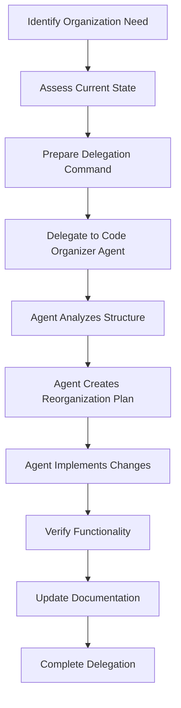

# Code Organizer Agent Delegation Guide

## 🎯 Overview

The Code Organizer Agent is a specialized user-defined agent that handles file structure optimization and code organization according to best practices. This guide provides comprehensive instructions for when and how to delegate tasks to this agent.

**Agent Type**: User-Defined Agent (extends Engineer Agent)  
**Base Type**: Engineer Agent  
**Specialization**: Task-Specific Code Organization  
**Domain Focus**: File structure and project organization  

## 🚨 When to Delegate to Code Organizer Agent

### Primary Delegation Triggers

#### 1. **After Substantial Development Work**
**Trigger Condition**: When significant code has been added or modified
- **Threshold**: 20+ files modified or created
- **Pattern**: Files created in suboptimal locations during rapid development
- **Example**: "After implementing the user authentication system, delegate to code-organizer to ensure proper file organization"

#### 2. **Framework Migration**  
**Trigger Condition**: When transitioning between frameworks or major version upgrades
- **Examples**: React → Next.js, Django → FastAPI, Express → NestJS
- **Reason**: Different frameworks have different organization conventions
- **Example**: "After migrating from Create React App to Next.js, delegate to code-organizer to restructure according to Next.js conventions"

#### 3. **Project Scaling**
**Trigger Condition**: When simple structure becomes inadequate for project complexity
- **Indicators**: Difficulty finding files, long import paths, unclear module boundaries
- **Growth Patterns**: Monolith → modular, single → multi-service, prototype → production
- **Example**: "Project has grown to 100+ components in single directory, delegate to code-organizer for proper component organization"

#### 4. **Team Onboarding**
**Trigger Condition**: When new team members need clear, predictable organization
- **Goal**: Reduce cognitive load for new developers
- **Focus**: Consistent, discoverable file locations
- **Example**: "Before onboarding 3 new developers, delegate to code-organizer to ensure intuitive project structure"

#### 5. **Code Review Findings**
**Trigger Condition**: When code reviews identify organization issues
- **Common Issues**: Misplaced utilities, unclear module boundaries, inconsistent patterns
- **Preventive Action**: Address organization before it becomes technical debt
- **Example**: "Code review identified utility functions scattered across components, delegate to code-organizer"

#### 6. **Performance Optimization**
**Trigger Condition**: When file organization affects build performance or module loading
- **Build Issues**: Slow compilation, circular dependencies, large bundles
- **Optimization Opportunity**: Tree shaking, code splitting, lazy loading
- **Example**: "Bundle analysis shows poor tree shaking due to file organization, delegate to code-organizer"

### Secondary Delegation Triggers

- **Pre-deployment organization audit**
- **Documentation update requirements**
- **Compliance or standards enforcement**
- **Tool integration setup (linting, testing, CI/CD)**

## 📋 How to Delegate to Code Organizer Agent

### Delegation Command Template

```
I need to delegate to the code-organizer agent. [PROJECT_CONTEXT] [SPECIFIC_ISSUES] [FRAMEWORK_INFO] [FOCUS_AREAS]

Current situation:
- [Describe current state and issues]
- [Mention any specific pain points]

Project context:
- Framework: [Primary framework/language]
- Type: [web app, library, CLI, microservice, etc.]
- Scale: [team size, codebase size, complexity]

Focus areas:
- [Specific areas needing attention]
- [Any constraints or requirements]
- [Performance or build considerations]
- [Existing patterns to preserve or build upon]
```

### Example Delegation Commands

#### Example 1: Post-Development Cleanup
```
I need to delegate to the code-organizer agent. We just completed a major feature development sprint and have files scattered throughout the project. The React/TypeScript web application needs organization according to modern React best practices.

Current situation:
- 45 new components created in various directories
- Utility functions mixed with components
- Custom hooks scattered across feature directories
- Type definitions in multiple locations

Project context:
- Framework: React 18 with TypeScript
- Type: E-commerce web application
- Scale: 5-person team, 200+ components

Focus areas:
- Consolidate utility functions following existing utils/ structure
- Organize components by feature vs reusability (maintain existing pattern)
- Centralize type definitions in existing types/ directory
- Implement consistent import patterns based on current well-organized files
```

#### Example 2: Framework Migration
```
I need to delegate to the code-organizer agent. We're migrating from Express.js to NestJS and need to restructure the entire backend according to NestJS conventions while maintaining all existing functionality.

Current situation:
- Express routes mixed with business logic
- Middleware scattered across directories
- Database models in various locations
- Configuration files inconsistently organized

Project context:
- Framework: Migrating Express.js → NestJS
- Type: RESTful API microservice
- Scale: 3-person team, 50+ endpoints

Focus areas:
- Implement NestJS module structure
- Organize controllers, services, and DTOs
- Restructure middleware as guards/interceptors
- Organize configuration according to NestJS patterns
```

#### Example 3: Performance Optimization
```
I need to delegate to the code-organizer agent. Bundle analysis shows our Next.js application has poor tree shaking and large initial bundles due to suboptimal file organization.

Current situation:
- Utility functions causing unnecessary imports
- Components not properly separated by usage patterns
- Styles mixed with logic causing bloated bundles
- Third-party integrations not optimally organized

Project context:
- Framework: Next.js 14 with App Router
- Type: SaaS dashboard application
- Scale: 8-person team, 300+ components

Focus areas:
- Optimize for tree shaking and code splitting
- Separate frequently vs rarely used components
- Organize for lazy loading opportunities
- Implement barrel exports strategically
```

### Command Structure Breakdown

#### 1. **Opening Statement**
Always begin with: "I need to delegate to the code-organizer agent."

#### 2. **Context Description** 
Provide current state and specific issues:
- What triggered the need for organization
- Specific pain points or problems
- Scale and complexity indicators

#### 3. **Project Information**
Essential context for proper organization:
- **Framework**: Primary technology stack
- **Type**: Application category (web app, API, library, CLI, etc.)
- **Scale**: Team size, codebase size, complexity level

#### 4. **Focus Areas**
Specific guidance for the agent:
- Priority areas needing attention
- Performance considerations
- Constraints or requirements
- Desired outcomes

## 🔄 Delegation Workflow

### Pre-Delegation Checklist

1. **Assessment Complete**: Understand current organization issues
2. **Backup Created**: Ensure git commits are current
3. **Context Gathered**: Framework, scale, and specific issues identified
4. **Goals Defined**: Clear objectives for reorganization
5. **Testing Plan**: Plan to verify functionality after reorganization

### Delegation Process



### Post-Delegation Verification

1. **Functionality Check**: Ensure all features still work
2. **Build Verification**: Confirm project builds successfully
3. **Import Path Validation**: Verify all imports are correct
4. **Performance Testing**: Check for performance improvements
5. **Team Communication**: Update team on new organization

## 🎯 Expected Outcomes

### Immediate Benefits

- **Predictable File Locations**: Files in expected, conventional locations
- **Improved Discoverability**: Easy to find related functionality
- **Consistent Patterns**: Uniform organization across similar file types
- **Clean Structure**: Elimination of misplaced or orphaned files
- **Working Build**: Project builds and functions correctly after reorganization
- **Updated References**: All import paths and configuration files properly updated

### Long-Term Benefits

- **Reduced Onboarding Time**: New developers find files intuitively
- **Faster Development**: Less time searching for files and understanding structure
- **Better Maintainability**: Clear boundaries and responsibilities
- **Improved Performance**: Optimized for bundling and tree shaking

### Quality Metrics

- **Organization Consistency**: 95%+ of similar files in standard locations
- **Discovery Time**: 50%+ reduction in time to find relevant files
- **Build Performance**: Potential 10-30% improvement in build times
- **Developer Satisfaction**: Improved developer experience scores

## 🚫 What Code Organizer Agent Does NOT Do

### Explicitly Forbidden
- **Code Modification**: Never changes business logic or functionality
- **Feature Implementation**: Does not add new features or capabilities
- **Bug Fixes**: Does not fix existing bugs (may expose them through reorganization)
- **Framework Changes**: Does not change technologies or frameworks

### Out of Scope
- **Performance Optimization**: Beyond organization-related improvements
- **Security Enhancements**: Does not implement security measures
- **Testing**: Does not write or modify tests
- **Documentation Writing**: Only updates organization-related documentation

## 🔧 Integration with Standard Agents

### Coordination Patterns

The Code Organizer Agent works effectively with:

- **Engineer Agent**: Coordinates on implementation organization
- **Performance Agent**: Aligns on performance-impacting organization decisions
- **Documentation Agent**: Collaborates on structure documentation updates
- **QA Agent**: Coordinates to ensure testing still works after reorganization

### Multi-Agent Workflows

Common patterns:
1. **Engineer → Code Organizer**: After development sprints
2. **Code Organizer → Performance**: For build optimization
3. **Code Organizer → Documentation**: For structure documentation
4. **Code Organizer → QA**: For test organization updates

## 📚 Related Documentation

- [User-Defined Agents Strategy](/Users/masa/Projects/claude-multiagent-pm/docs/USER_DEFINED_AGENTS_STRATEGY.md)
- [Code Organizer Agent Specification](/Users/masa/Projects/claude-multiagent-pm/framework/agent-roles/code-organizer-agent.md)
- [Agent Registry Configuration](/Users/masa/Projects/claude-multiagent-pm/framework/agent-roles/agents.json)
- [Multi-Agent Coordination Guide](/Users/masa/Projects/claude-multiagent-pm/framework/coordination/)

---

**Document Version**: 1.0.0  
**Last Updated**: 2025-07-08  
**Owner**: Claude PM Framework Orchestrator  
**Next Review**: After first production usage