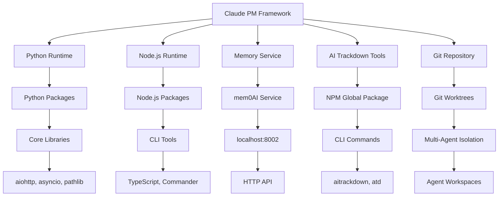

# Claude PM Framework Dependency Map v4.2.0

## Table of Contents

1. [Overview](#overview)
2. [System Architecture](#system-architecture)
3. [Core Dependencies](#core-dependencies)
4. [Service Dependencies](#service-dependencies)
5. [External Dependencies](#external-dependencies)
6. [Development Dependencies](#development-dependencies)
7. [Deployment Dependencies](#deployment-dependencies)
8. [Dependency Health Monitoring](#dependency-health-monitoring)
9. [Troubleshooting Dependencies](#troubleshooting-dependencies)
10. [Dependency Updates](#dependency-updates)

## Overview

This document provides a comprehensive mapping of all dependencies in the Claude PM Framework v4.2.0, including their relationships, health monitoring, and management procedures.

### Dependency Classification

- **Critical**: System cannot function without these dependencies
- **Important**: Core functionality is impacted without these dependencies
- **Optional**: Enhanced functionality that can gracefully degrade
- **Development**: Required only for development and testing

### Dependency Health Levels

- **Healthy**: Dependency is functional and responsive
- **Degraded**: Dependency is functional but with reduced performance
- **Failing**: Dependency is not functioning properly
- **Unavailable**: Dependency is completely unavailable

## System Architecture



## Core Dependencies

### 1. Python Runtime Environment

**Classification**: Critical  
**Version**: >= 3.8.0  
**Health Check**: `python3 --version`

#### Components
- **Python Interpreter**: Core runtime for framework execution
- **Standard Library**: Built-in modules (asyncio, pathlib, json, etc.)
- **Virtual Environment**: Isolated Python environment (optional but recommended)

#### Health Monitoring
```bash
# Check Python version
python3 --version

# Check Python path
python3 -c "import sys; print(sys.executable)"

# Check available modules
python3 -c "import asyncio, pathlib, json; print('Core modules available')"

# Check framework import
python3 -c "import claude_pm; print('Framework accessible')"
```

#### Troubleshooting
```bash
# Common issues and solutions
# 1. Python not found
which python3 || echo "Python 3 not installed"

# 2. Version too old
python3 -c "import sys; print(sys.version_info >= (3, 8))"

# 3. Missing modules
pip list | grep -E "(asyncio|pathlib)"

# 4. Import errors
python3 -c "import claude_pm" 2>&1 | head -5
```

### 2. Node.js Runtime Environment

**Classification**: Important  
**Version**: >= 16.0.0  
**Health Check**: `node --version`

#### Components
- **Node.js Runtime**: JavaScript runtime for CLI tools
- **NPM Package Manager**: Package management for Node.js packages
- **Global Package Directory**: Location for globally installed packages

#### Health Monitoring
```bash
# Check Node.js version
node --version

# Check NPM version
npm --version

# Check global packages
npm list -g --depth=0

# Check Node.js path
which node
```

#### Troubleshooting
```bash
# Common issues and solutions
# 1. Node.js not found
which node || echo "Node.js not installed"

# 2. Version too old
node -e "console.log(process.version >= 'v16.0.0')"

# 3. NPM issues
npm doctor

# 4. Permission issues
npm config get prefix
```

### 3. Git Repository

**Classification**: Critical  
**Version**: >= 2.0.0  
**Health Check**: `git --version`

#### Components
- **Git Binary**: Version control system
- **Repository**: Framework source code repository
- **Worktrees**: Multi-agent isolation mechanism
- **Remotes**: Remote repository connections

#### Health Monitoring
```bash
# Check Git version
git --version

# Check repository status
git status

# Check worktree status
git worktree list

# Check remotes
git remote -v
```

#### Troubleshooting
```bash
# Common issues and solutions
# 1. Git not found
which git || echo "Git not installed"

# 2. Repository corruption
git fsck --full

# 3. Worktree issues
git worktree prune

# 4. Remote issues
git remote show origin
```

## Service Dependencies

### 1. Memory Service (mem0AI)

**Classification**: Important  
**Endpoint**: http://localhost:8002  
**Health Check**: `curl http://localhost:8002/health`

#### Components
- **mem0AI Server**: Memory service backend
- **HTTP API**: RESTful API for memory operations
- **Memory Categories**: Project, Pattern, Team, Error memories
- **Connection Pool**: Async HTTP connection management

#### Health Monitoring
```bash
# Check service availability
curl -s http://localhost:8002/health | jq .

# Check service response time
time curl -s http://localhost:8002/health >/dev/null

# Check connection pool
python3 -c "
from claude_pm.services.memory_service import get_memory_service
ms = get_memory_service()
print('Connected:', ms.client.is_connected())
"

# Check memory operations
python3 -c "
from claude_pm.services.memory_service import get_memory_service
ms = get_memory_service()
result = ms.client.add_memory('test', 'test content', 'project')
print('Memory operation successful:', result is not None)
"
```

#### Configuration
```python
# Memory service configuration
MEMORY_CONFIG = {
    "host": "localhost",
    "port": 8002,
    "timeout": 30,
    "max_retries": 3,
    "retry_delay": 1.0,
    "connection_pool_size": 50,
    "cache_ttl": 300,
    "max_memory_size": 1000
}
```

#### Troubleshooting
```bash
# Common issues and solutions
# 1. Service not responding
curl -s http://localhost:8002/health || echo "Service unavailable"

# 2. Connection timeout
curl -s --max-time 5 http://localhost:8002/health || echo "Service timeout"

# 3. Port in use
netstat -an | grep 8002

# 4. Service restart
sudo systemctl restart mem0ai || echo "No systemd service"
```

### 2. Health Monitor Service

**Classification**: Important  
**Dependencies**: Memory Service, Python Runtime  
**Health Check**: Python health check

#### Components
- **Health Monitor**: Core health monitoring service
- **Background Monitor**: Continuous monitoring process
- **Health Reports**: JSON health report generation
- **Alert System**: Health threshold monitoring

#### Health Monitoring
```bash
# Check health monitor status
python3 -c "
from claude_pm.services.health_monitor import HealthMonitorService
hms = HealthMonitorService()
print('Health Monitor available:', hms is not None)
"

# Check health reports
ls -la logs/health-*.json

# Check background monitoring
ps aux | grep health_monitor

# Check health dashboard
python3 -c "
from claude_pm.services.health_dashboard import HealthDashboard
hd = HealthDashboard()
print('Dashboard available:', hd is not None)
"
```

#### Configuration
```json
{
  "health_check_interval": 300,
  "enable_background_monitoring": true,
  "alert_threshold": 60,
  "alert_thresholds": {
    "critical_issues": 1,
    "broken_links": 5,
    "inconsistencies": 3
  }
}
```

#### Troubleshooting
```bash
# Common issues and solutions
# 1. Health monitor not starting
python3 -c "from claude_pm.services.health_monitor import HealthMonitorService; HealthMonitorService()"

# 2. Background monitoring not working
ps aux | grep health_monitor || echo "Background monitoring not running"

# 3. Corrupted health reports
find logs/ -name "health-*.json" -exec python3 -m json.tool {} \; || echo "Corrupted report"

# 4. Configuration issues
python3 -m json.tool config/health_monitoring_config.json
```

### 3. Project Service

**Classification**: Important  
**Dependencies**: Memory Service, Python Runtime, File System  
**Health Check**: Python project check

#### Components
- **Project Discovery**: Automatic project discovery
- **Compliance Monitoring**: Framework compliance scoring
- **Project Registry**: Project information storage
- **Git Integration**: Git repository information

#### Health Monitoring
```bash
# Check project service status
python3 -c "
from claude_pm.services.project_service import ProjectService
ps = ProjectService()
print('Project Service available:', ps is not None)
print('Projects discovered:', len(ps.get_projects()))
"

# Check project paths
ls -la /Users/masa/Projects/
ls -la /Users/masa/Projects/managed/

# Check project registry
cat logs/project-registry.json | jq .timestamp

# Check compliance
python3 -c "
from claude_pm.services.project_service import ProjectService
ps = ProjectService()
stats = ps.get_project_stats()
print('Project stats:', stats)
"
```

#### Configuration
```python
PROJECT_CONFIG = {
    "base_path": "/Users/masa/Projects",
    "managed_path": "/Users/masa/Projects/managed",
    "auto_discovery_interval": 3600,
    "compliance_check_interval": 1800
}
```

#### Troubleshooting
```bash
# Common issues and solutions
# 1. Project paths not found
ls -la /Users/masa/Projects/ || echo "Base path missing"

# 2. Project discovery issues
python3 -c "
from claude_pm.services.project_service import ProjectService
ps = ProjectService()
ps._discover_projects()
"

# 3. Compliance check failures
python3 -c "
from claude_pm.services.project_service import ProjectService
ps = ProjectService()
ps._check_all_compliance()
"

# 4. Registry corruption
python3 -m json.tool logs/project-registry.json || echo "Registry corrupted"
```

### 4. Multi-Agent Orchestrator

**Classification**: Important  
**Dependencies**: Memory Service, Git Repository, Python Runtime  
**Health Check**: Python orchestrator check

#### Components
- **Agent Definitions**: 11-agent ecosystem definitions
- **Worktree Manager**: Git worktree management
- **Memory Context**: Agent memory context preparation
- **Enforcement Engine**: Agent authorization and constraints

#### Health Monitoring
```bash
# Check orchestrator status
python3 -c "
from claude_pm.services.multi_agent_orchestrator import MultiAgentOrchestrator
from claude_pm.services.memory_service import get_memory_service
memory = get_memory_service()
orchestrator = MultiAgentOrchestrator('/Users/masa/Projects/claude-multiagent-pm', memory.client)
print('Orchestrator available:', orchestrator is not None)
print('Agent definitions:', len(orchestrator.agent_definitions))
"

# Check worktree status
git worktree list

# Check enforcement engine
python3 -c "
from claude_pm.core.enforcement import get_enforcement_engine
engine = get_enforcement_engine()
print('Enforcement engine available:', engine is not None)
"
```

#### Configuration
```python
ORCHESTRATOR_CONFIG = {
    "max_parallel": 5,
    "base_repo_path": "/Users/masa/Projects/claude-multiagent-pm",
    "worktree_base_path": "/Users/masa/Projects/claude-multiagent-pm/.worktrees"
}
```

#### Troubleshooting
```bash
# Common issues and solutions
# 1. Orchestrator initialization failure
python3 -c "from claude_pm.services.multi_agent_orchestrator import MultiAgentOrchestrator; print('Import successful')"

# 2. Worktree issues
git worktree prune
rm -rf .worktrees/*

# 3. Memory context issues
python3 -c "
from claude_pm.services.memory_service import get_memory_service
ms = get_memory_service()
print('Memory service connected:', ms.client.is_connected())
"

# 4. Enforcement engine issues
python3 -c "
from claude_pm.core.enforcement import get_enforcement_engine
engine = get_enforcement_engine()
print('Enforcement engine stats:', engine.get_enforcement_stats())
"
```

## External Dependencies

### 1. AI Trackdown Tools

**Classification**: Important  
**Package**: @bobmatnyc/ai-trackdown-tools  
**Version**: >= 2.0.0  
**Health Check**: `aitrackdown --version`

#### Components
- **NPM Package**: Globally installed NPM package
- **CLI Commands**: aitrackdown and atd commands
- **Task Management**: Epic, issue, and task management
- **Integration**: Framework integration utilities

#### Health Monitoring
```bash
# Check package installation
npm list -g @bobmatnyc/ai-trackdown-tools

# Check CLI availability
aitrackdown --version
atd --version

# Check CLI functionality
aitrackdown status
aitrackdown epic list

# Check framework integration
python3 -c "
from claude_pm.utils.ai_trackdown_tools import get_ai_trackdown_tools
tools = get_ai_trackdown_tools()
print('AI Trackdown enabled:', tools.is_enabled())
print('AI Trackdown available:', tools.is_available())
"
```

#### Configuration
```python
AI_TRACKDOWN_CONFIG = {
    "enabled": True,
    "timeout": 30,
    "fallback_logging": True,
    "fallback_method": "logging",
    "cli_command": "aitrackdown",
    "cli_alias": "atd"
}
```

#### Troubleshooting
```bash
# Common issues and solutions
# 1. Package not installed
npm install -g @bobmatnyc/ai-trackdown-tools

# 2. CLI not found
which aitrackdown || echo "CLI not in PATH"

# 3. Permission issues
npm config get prefix
ls -la $(npm config get prefix)/bin/

# 4. Fallback mode
python3 -c "
from claude_pm.utils.ai_trackdown_tools import get_ai_trackdown_tools
tools = get_ai_trackdown_tools()
print('Fallback method:', tools.get_fallback_method())
"
```

### 2. GitHub API Integration

**Classification**: Optional  
**Dependencies**: Internet connectivity, GitHub API  
**Health Check**: API connectivity test

#### Components
- **GitHub API**: Issue and PR synchronization
- **Authentication**: GitHub token management
- **Rate Limiting**: API rate limit management
- **Webhook Integration**: Real-time updates

#### Health Monitoring
```bash
# Check GitHub API connectivity
curl -s https://api.github.com/rate_limit | jq .

# Check authentication
curl -s -H "Authorization: token $GITHUB_TOKEN" https://api.github.com/user | jq .login

# Check repository access
curl -s -H "Authorization: token $GITHUB_TOKEN" https://api.github.com/repos/bobmatnyc/claude-multiagent-pm | jq .full_name
```

#### Configuration
```bash
# Environment variables
export GITHUB_TOKEN="your_token_here"
export GITHUB_REPOSITORY="bobmatnyc/claude-multiagent-pm"
```

#### Troubleshooting
```bash
# Common issues and solutions
# 1. Token not set
echo $GITHUB_TOKEN || echo "Token not set"

# 2. Rate limiting
curl -s https://api.github.com/rate_limit | jq .rate.remaining

# 3. Repository access
curl -s -H "Authorization: token $GITHUB_TOKEN" \
  https://api.github.com/repos/bobmatnyc/claude-multiagent-pm | jq .message
```

## Development Dependencies

### 1. Python Development Packages

**Classification**: Development  
**Location**: requirements/dev.txt  
**Health Check**: `pip check`

#### Components
- **Testing**: pytest, unittest, coverage
- **Code Quality**: flake8, black, mypy
- **Documentation**: sphinx, mkdocs
- **Development Tools**: ipython, jupyter

#### Health Monitoring
```bash
# Check development packages
pip list | grep -E "(pytest|flake8|black|mypy)"

# Check package integrity
pip check

# Check for outdated packages
pip list --outdated
```

#### Troubleshooting
```bash
# Common issues and solutions
# 1. Missing packages
pip install -r requirements/dev.txt

# 2. Version conflicts
pip check

# 3. Outdated packages
pip list --outdated | head -10
```

### 2. Node.js Development Tools

**Classification**: Development  
**Location**: package.json devDependencies  
**Health Check**: `npm audit`

#### Components
- **Build Tools**: TypeScript, Webpack, Rollup
- **Testing**: Jest, Mocha, Cypress
- **Code Quality**: ESLint, Prettier
- **Development Server**: Nodemon, Live Server

#### Health Monitoring
```bash
# Check development dependencies
npm list --depth=0

# Check for security vulnerabilities
npm audit

# Check for outdated packages
npm outdated
```

#### Troubleshooting
```bash
# Common issues and solutions
# 1. Missing dependencies
npm install

# 2. Security vulnerabilities
npm audit fix

# 3. Outdated packages
npm update
```

## Deployment Dependencies

### 1. System Dependencies

**Classification**: Critical  
**Platform**: macOS (Darwin)  
**Health Check**: System verification

#### Components
- **Operating System**: macOS version compatibility
- **System Tools**: curl, wget, tar, gzip
- **Network**: Internet connectivity, DNS resolution
- **File System**: Disk space, permissions

#### Health Monitoring
```bash
# Check system information
uname -a

# Check system tools
which curl wget tar gzip

# Check network connectivity
ping -c 1 google.com

# Check disk space
df -h | grep -E "(Filesystem|/)"

# Check permissions
ls -la /Users/masa/Projects/claude-multiagent-pm/
```

#### Troubleshooting
```bash
# Common issues and solutions
# 1. Missing system tools
xcode-select --install

# 2. Network issues
ping -c 1 8.8.8.8

# 3. Disk space issues
df -h | grep -E "(9[0-9]%|100%)"

# 4. Permission issues
chmod -R 755 /Users/masa/Projects/claude-multiagent-pm/bin/
```

### 2. Service Management

**Classification**: Important  
**Type**: systemd/launchd  
**Health Check**: Service status

#### Components
- **Service Manager**: systemd or launchd
- **Service Files**: Unit files for services
- **Process Management**: Service lifecycle management
- **Log Management**: Service log collection

#### Health Monitoring
```bash
# Check service manager
if command -v systemctl >/dev/null 2>&1; then
    echo "Using systemd"
    systemctl status mem0ai
else
    echo "Using launchd"
    launchctl list | grep mem0ai
fi

# Check service logs
if command -v journalctl >/dev/null 2>&1; then
    journalctl -u mem0ai --since "1 hour ago"
else
    tail -f /var/log/mem0ai.log
fi
```

#### Troubleshooting
```bash
# Common issues and solutions
# 1. Service not starting
sudo systemctl start mem0ai
sudo systemctl enable mem0ai

# 2. Service configuration issues
sudo systemctl daemon-reload

# 3. Log issues
sudo journalctl -u mem0ai --since "1 hour ago"
```

## Dependency Health Monitoring

### 1. Automated Health Checks

#### Health Check Script
```bash
#!/bin/bash
# Dependency Health Check Script

echo "Claude PM Framework Dependency Health Check"
echo "=========================================="

# Core dependencies
echo "Core Dependencies:"
python3 --version && echo "✓ Python 3 available" || echo "✗ Python 3 missing"
node --version && echo "✓ Node.js available" || echo "✗ Node.js missing"
git --version && echo "✓ Git available" || echo "✗ Git missing"

# Service dependencies
echo "Service Dependencies:"
curl -s http://localhost:8002/health >/dev/null 2>&1 && echo "✓ Memory service available" || echo "✗ Memory service unavailable"
python3 -c "from claude_pm.services.health_monitor import HealthMonitorService; HealthMonitorService()" 2>/dev/null && echo "✓ Health monitor available" || echo "✗ Health monitor unavailable"

# External dependencies
echo "External Dependencies:"
aitrackdown --version >/dev/null 2>&1 && echo "✓ AI Trackdown available" || echo "✗ AI Trackdown unavailable"
curl -s https://api.github.com/rate_limit >/dev/null 2>&1 && echo "✓ GitHub API available" || echo "✗ GitHub API unavailable"

# System dependencies
echo "System Dependencies:"
ping -c 1 google.com >/dev/null 2>&1 && echo "✓ Internet connectivity" || echo "✗ Internet connectivity issue"
df -h | grep -E "(9[0-9]%|100%)" >/dev/null || echo "✓ Disk space adequate" && echo "⚠ Disk space low"

echo "Health check completed"
```

### 2. Continuous Monitoring

#### Monitoring Configuration
```python
DEPENDENCY_MONITORING = {
    "python_runtime": {
        "check_interval": 300,
        "health_command": "python3 --version",
        "alert_on_failure": True
    },
    "memory_service": {
        "check_interval": 60,
        "health_endpoint": "http://localhost:8002/health",
        "timeout": 5,
        "alert_on_failure": True
    },
    "ai_trackdown": {
        "check_interval": 300,
        "health_command": "aitrackdown --version",
        "alert_on_failure": False
    }
}
```

#### Monitoring Script
```python
#!/usr/bin/env python3
"""
Dependency monitoring script for Claude PM Framework
"""

import asyncio
import aiohttp
import subprocess
import json
import time
from datetime import datetime

class DependencyMonitor:
    def __init__(self, config):
        self.config = config
        self.health_status = {}
    
    async def check_python_runtime(self):
        try:
            result = subprocess.run(
                ["python3", "--version"],
                capture_output=True,
                text=True,
                timeout=5
            )
            return result.returncode == 0
        except Exception:
            return False
    
    async def check_memory_service(self):
        try:
            async with aiohttp.ClientSession() as session:
                async with session.get(
                    "http://localhost:8002/health",
                    timeout=aiohttp.ClientTimeout(total=5)
                ) as response:
                    return response.status == 200
        except Exception:
            return False
    
    async def check_ai_trackdown(self):
        try:
            result = subprocess.run(
                ["aitrackdown", "--version"],
                capture_output=True,
                text=True,
                timeout=5
            )
            return result.returncode == 0
        except Exception:
            return False
    
    async def monitor_dependencies(self):
        while True:
            timestamp = datetime.now().isoformat()
            
            # Check all dependencies
            python_healthy = await self.check_python_runtime()
            memory_healthy = await self.check_memory_service()
            ai_trackdown_healthy = await self.check_ai_trackdown()
            
            # Update health status
            self.health_status = {
                "timestamp": timestamp,
                "python_runtime": python_healthy,
                "memory_service": memory_healthy,
                "ai_trackdown": ai_trackdown_healthy,
                "overall_health": all([
                    python_healthy,
                    memory_healthy,
                    ai_trackdown_healthy
                ])
            }
            
            # Save health status
            with open("logs/dependency_health.json", "w") as f:
                json.dump(self.health_status, f, indent=2)
            
            # Wait for next check
            await asyncio.sleep(60)

if __name__ == "__main__":
    monitor = DependencyMonitor({})
    asyncio.run(monitor.monitor_dependencies())
```

### 3. Health Dashboard

#### Dashboard Components
- **Overall Health**: Summary of all dependencies
- **Individual Status**: Status of each dependency
- **Response Times**: Performance metrics
- **Historical Data**: Trend analysis

#### Dashboard Access
```bash
# View current health status
cat logs/dependency_health.json | jq .

# View health trends
jq '.overall_health' logs/dependency_health_*.json | sort | uniq -c

# Check response times
jq '.response_times' logs/dependency_health.json
```

## Troubleshooting Dependencies

### 1. Common Dependency Issues

#### Python Runtime Issues
```bash
# Issue: Python not found
which python3 || echo "Python 3 not installed"

# Solution: Install Python 3
brew install python3  # macOS
apt-get install python3  # Ubuntu

# Issue: Wrong Python version
python3 --version | grep -E "3\.[8-9]|3\.[1-9][0-9]" || echo "Python version too old"

# Solution: Update Python
brew upgrade python3  # macOS
```

#### Memory Service Issues
```bash
# Issue: Service not responding
curl -s http://localhost:8002/health || echo "Service unavailable"

# Solution: Restart service
sudo systemctl restart mem0ai

# Issue: Port in use
netstat -an | grep 8002

# Solution: Kill process using port
sudo lsof -ti:8002 | xargs sudo kill
```

#### AI Trackdown Issues
```bash
# Issue: CLI not found
which aitrackdown || echo "CLI not in PATH"

# Solution: Reinstall package
npm uninstall -g @bobmatnyc/ai-trackdown-tools
npm install -g @bobmatnyc/ai-trackdown-tools

# Issue: Permission errors
ls -la $(npm config get prefix)/bin/aitrackdown

# Solution: Fix permissions
chmod +x $(npm config get prefix)/bin/aitrackdown
```

### 2. Dependency Recovery Procedures

#### Automated Recovery
```bash
#!/bin/bash
# Dependency Recovery Script

echo "Starting dependency recovery..."

# Python runtime recovery
if ! python3 --version >/dev/null 2>&1; then
    echo "Recovering Python runtime..."
    brew install python3 || apt-get install python3
fi

# Memory service recovery
if ! curl -s http://localhost:8002/health >/dev/null 2>&1; then
    echo "Recovering memory service..."
    sudo systemctl restart mem0ai || nohup python3 -m mem0ai.server &
fi

# AI trackdown recovery
if ! aitrackdown --version >/dev/null 2>&1; then
    echo "Recovering AI trackdown..."
    npm install -g @bobmatnyc/ai-trackdown-tools
fi

echo "Dependency recovery completed"
```

## Dependency Updates

### 1. Update Procedures

#### Python Dependencies
```bash
# Update Python packages
pip install -r requirements/production.txt --upgrade

# Check for security vulnerabilities
pip-audit

# Update development dependencies
pip install -r requirements/dev.txt --upgrade
```

#### Node.js Dependencies
```bash
# Update Node.js packages
npm update

# Check for security vulnerabilities
npm audit

# Update global packages
npm update -g @bobmatnyc/ai-trackdown-tools
```

#### System Dependencies
```bash
# Update system packages (macOS)
brew update && brew upgrade

# Update system packages (Ubuntu)
apt-get update && apt-get upgrade
```

### 2. Update Validation

#### Validation Script
```bash
#!/bin/bash
# Dependency Update Validation Script

echo "Validating dependency updates..."

# Validate Python dependencies
python3 -c "import claude_pm; print('✓ Framework import successful')" || echo "✗ Framework import failed"

# Validate Node.js dependencies
aitrackdown --version >/dev/null 2>&1 && echo "✓ AI Trackdown functional" || echo "✗ AI Trackdown failed"

# Validate service dependencies
curl -s http://localhost:8002/health >/dev/null 2>&1 && echo "✓ Memory service functional" || echo "✗ Memory service failed"

# Run full health check
./scripts/health-check.sh

echo "Dependency update validation completed"
```

### 3. Rollback Procedures

#### Dependency Rollback
```bash
#!/bin/bash
# Dependency Rollback Script

echo "Rolling back dependencies..."

# Rollback Python dependencies
pip install -r requirements/production.txt --force-reinstall

# Rollback Node.js dependencies
npm install --force

# Rollback specific package
npm install -g @bobmatnyc/ai-trackdown-tools@2.0.0

# Validate rollback
./scripts/health-check.sh

echo "Dependency rollback completed"
```

---

## Summary

This dependency map provides comprehensive coverage of all Claude PM Framework dependencies:

### Key Dependency Categories
1. **Core Runtime**: Python, Node.js, Git
2. **Framework Services**: Memory, Health Monitor, Project Service
3. **External Tools**: AI Trackdown, GitHub API
4. **Development Tools**: Testing, Code Quality, Documentation
5. **System Components**: OS, Network, File System

### Monitoring Strategy
- **Automated Health Checks**: Regular validation of all dependencies
- **Continuous Monitoring**: Real-time dependency status tracking
- **Performance Metrics**: Response time and availability tracking
- **Alert System**: Notifications for dependency failures

### Maintenance Procedures
- **Regular Updates**: Scheduled dependency updates
- **Security Scanning**: Regular vulnerability assessments
- **Recovery Procedures**: Automated recovery from failures
- **Rollback Capability**: Safe rollback of problematic updates

This dependency map ensures reliable operation of the Claude PM Framework by providing visibility into all system dependencies and their health status, enabling proactive management and quick recovery from issues.