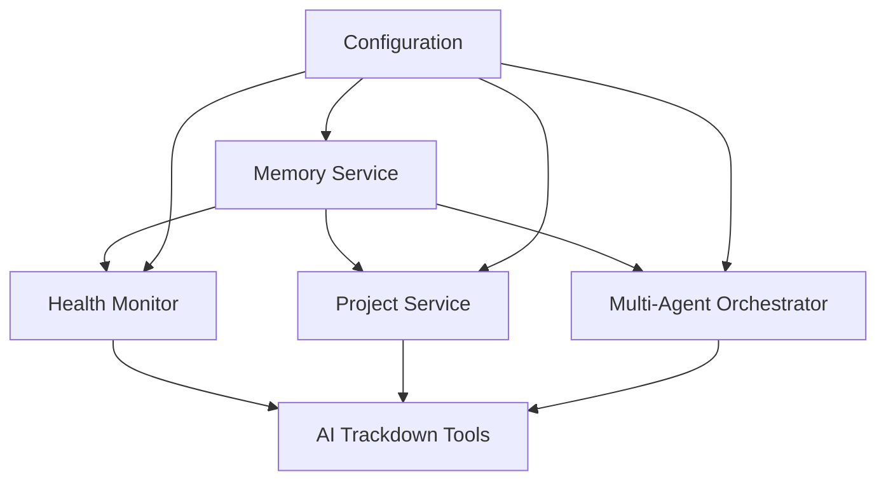

# Claude PM Framework Service Recovery Procedures v4.2.0

## Table of Contents

1. [Overview](#overview)
2. [Service Recovery Matrix](#service-recovery-matrix)
3. [Memory Service Recovery](#memory-service-recovery)
4. [Health Monitor Recovery](#health-monitor-recovery)
5. [Project Service Recovery](#project-service-recovery)
6. [Multi-Agent Orchestrator Recovery](#multi-agent-orchestrator-recovery)
7. [AI Trackdown Tools Recovery](#ai-trackdown-tools-recovery)
8. [Complete System Recovery](#complete-system-recovery)
9. [Recovery Validation](#recovery-validation)
10. [Emergency Procedures](#emergency-procedures)

## Overview

This document provides comprehensive recovery procedures for all Claude PM Framework services. Each procedure includes pre-recovery checks, step-by-step recovery instructions, post-recovery validation, and rollback procedures.

### Recovery Principles

1. **Minimal Impact**: Recovery procedures minimize service disruption
2. **Data Preservation**: All procedures preserve existing data
3. **Validation**: Each recovery includes comprehensive validation
4. **Rollback**: Failed recoveries can be rolled back safely
5. **Learning**: All recoveries are documented for future reference

### Service Dependencies



## Service Recovery Matrix

| Service | Recovery Time | Complexity | Data Loss Risk | Dependencies |
|---------|---------------|------------|----------------|--------------|
| Memory Service | 2-5 minutes | Medium | Low | None |
| Health Monitor | 1-2 minutes | Low | None | Memory Service |
| Project Service | 1-3 minutes | Low | None | Memory Service |
| Multi-Agent Orchestrator | 3-5 minutes | High | Low | Memory Service, Git |
| AI Trackdown Tools | 2-4 minutes | Medium | Low | Node.js, Tasks |
| Complete System | 10-15 minutes | High | Medium | All |

## Memory Service Recovery

### Pre-Recovery Checks
```bash
# Check memory service status
curl -s http://localhost:8002/health | jq . || echo "Service unreachable"

# Check process status
ps aux | grep mem0ai || echo "Process not running"

# Check port availability
netstat -an | grep 8002 || echo "Port not in use"

# Check configuration
python3 -c "
from claude_pm.services.memory_service import ClaudePMConfig
config = ClaudePMConfig()
print(f'Host: {config.host}')
print(f'Port: {config.port}')
print(f'Timeout: {config.timeout}')
"
```

### Recovery Procedure: Memory Service Down
```bash
#!/bin/bash
# Memory Service Recovery Procedure

echo "Starting Memory Service Recovery..."

# Step 1: Stop existing processes
sudo pkill -f mem0ai
sleep 2

# Step 2: Check port availability
if netstat -an | grep -q 8002; then
    echo "Port 8002 still in use, waiting..."
    sleep 5
fi

# Step 3: Clear temporary files
rm -rf /tmp/memory_cache/*
rm -rf /tmp/mem0ai_*

# Step 4: Start memory service
if command -v systemctl >/dev/null 2>&1; then
    # Using systemd
    sudo systemctl start mem0ai
    sudo systemctl enable mem0ai
    echo "Memory service started via systemd"
else
    # Manual start
    nohup python3 -m mem0ai.server --host localhost --port 8002 > logs/mem0ai.log 2>&1 &
    echo "Memory service started manually"
fi

# Step 5: Wait for service to be ready
echo "Waiting for service to be ready..."
for i in {1..30}; do
    if curl -s http://localhost:8002/health >/dev/null 2>&1; then
        echo "Service is ready"
        break
    fi
    sleep 1
done

echo "Memory Service Recovery Complete"
```

### Recovery Procedure: Memory Service Corruption
```bash
#!/bin/bash
# Memory Service Data Recovery

echo "Starting Memory Service Data Recovery..."

# Step 1: Stop service
sudo systemctl stop mem0ai || pkill -f mem0ai

# Step 2: Backup current data
mkdir -p backups/memory_recovery_$(date +%Y%m%d_%H%M%S)
cp -r /var/lib/mem0ai backups/memory_recovery_$(date +%Y%m%d_%H%M%S)/ 2>/dev/null || echo "No data to backup"

# Step 3: Clear corrupted data
rm -rf /var/lib/mem0ai/corrupted_*
rm -rf /tmp/memory_cache/*

# Step 4: Restore from backup if available
if [ -f "backups/memory_data_latest.tar.gz" ]; then
    echo "Restoring from backup..."
    tar -xzf backups/memory_data_latest.tar.gz -C /var/lib/mem0ai
fi

# Step 5: Restart service
sudo systemctl start mem0ai

echo "Memory Service Data Recovery Complete"
```

### Post-Recovery Validation
```bash
# Test memory service connectivity
curl -s http://localhost:8002/health | jq .

# Test memory operations
python3 -c "
from claude_pm.services.memory_service import get_memory_service
ms = get_memory_service()
print('Service connected:', ms.client.is_connected())

# Test memory operations
test_memory = ms.client.add_memory('test-project', 'test content', 'project')
print('Memory added:', test_memory is not None)
"

# Check service logs
tail -20 logs/mem0ai.log
```

## Health Monitor Recovery

### Pre-Recovery Checks
```bash
# Check health monitor status
python3 -c "
from claude_pm.services.health_monitor import HealthMonitorService
try:
    hms = HealthMonitorService()
    print('Health Monitor accessible:', hms.is_healthy())
except Exception as e:
    print('Health Monitor error:', e)
"

# Check background processes
ps aux | grep health_monitor

# Check health reports
ls -la logs/health-*.json
```

### Recovery Procedure: Health Monitor Service
```bash
#!/bin/bash
# Health Monitor Recovery Procedure

echo "Starting Health Monitor Recovery..."

# Step 1: Stop existing processes
pkill -f health_monitor
pkill -f automated_health_monitor

# Step 2: Clear corrupted health reports
find logs/ -name "health-*.json" -size 0 -delete
find logs/ -name "health-*.json" -exec sh -c 'python3 -m json.tool "$1" >/dev/null 2>&1 || rm "$1"' _ {} \;

# Step 3: Reset health monitoring configuration
cp config/health_monitoring_config.json.backup config/health_monitoring_config.json 2>/dev/null || echo "No backup config"

# Step 4: Restart health monitor
python3 scripts/automated_health_monitor.py once --verbose

# Step 5: Start background monitoring
nohup python3 scripts/automated_health_monitor.py monitor --interval=300 > logs/health_monitor.log 2>&1 &

echo "Health Monitor Recovery Complete"
```

### Recovery Procedure: Corrupted Health Reports
```bash
#!/bin/bash
# Health Reports Recovery

echo "Starting Health Reports Recovery..."

# Step 1: Backup corrupted reports
mkdir -p backups/health_reports_$(date +%Y%m%d_%H%M%S)
cp logs/health-*.json backups/health_reports_$(date +%Y%m%d_%H%M%S)/ 2>/dev/null

# Step 2: Remove corrupted reports
find logs/ -name "health-*.json" -exec sh -c 'python3 -m json.tool "$1" >/dev/null 2>&1 || rm "$1"' _ {} \;

# Step 3: Generate new health report
python3 scripts/automated_health_monitor.py once --verbose

# Step 4: Validate report generation
if [ -f "logs/health-report.json" ]; then
    python3 -m json.tool logs/health-report.json > /dev/null && echo "Health report valid"
else
    echo "Failed to generate health report"
fi

echo "Health Reports Recovery Complete"
```

### Post-Recovery Validation
```bash
# Test health monitor functionality
python3 -c "
from claude_pm.services.health_monitor import HealthMonitorService
hms = HealthMonitorService()
print('Health Monitor initialized:', hms is not None)

# Test health check
health_status = hms.get_health_status()
print('Health status available:', health_status is not None)
"

# Verify health report generation
python3 scripts/automated_health_monitor.py once
cat logs/health-report.json | jq .overall_health
```

## Project Service Recovery

### Pre-Recovery Checks
```bash
# Check project service status
python3 -c "
from claude_pm.services.project_service import ProjectService
try:
    ps = ProjectService()
    print('Project Service accessible:', ps is not None)
    print('Projects discovered:', len(ps.get_projects()))
except Exception as e:
    print('Project Service error:', e)
"

# Check project paths
ls -la /Users/masa/Projects/
ls -la /Users/masa/Projects/managed/
```

### Recovery Procedure: Project Service
```bash
#!/bin/bash
# Project Service Recovery Procedure

echo "Starting Project Service Recovery..."

# Step 1: Check project paths
mkdir -p /Users/masa/Projects/managed
mkdir -p /Users/masa/Projects/claude-multiagent-pm/logs

# Step 2: Clear project cache
rm -rf /tmp/project_cache/*
rm -f logs/project-registry.json.corrupted

# Step 3: Validate project structure
python3 -c "
from claude_pm.services.project_service import ProjectService
from pathlib import Path

ps = ProjectService()
print('Base path exists:', ps.base_path.exists())
print('Managed path exists:', ps.managed_path.exists())
print('Claude PM path exists:', ps.claude_pm_path.exists())
"

# Step 4: Rediscover projects
python3 -c "
from claude_pm.services.project_service import ProjectService
ps = ProjectService()
ps._discover_projects()
print('Projects discovered:', len(ps.get_projects()))
"

# Step 5: Validate project compliance
python3 -c "
from claude_pm.services.project_service import ProjectService
ps = ProjectService()
ps._check_all_compliance()
print('Compliance checks completed')
"

echo "Project Service Recovery Complete"
```

### Recovery Procedure: Project Registry Corruption
```bash
#!/bin/bash
# Project Registry Recovery

echo "Starting Project Registry Recovery..."

# Step 1: Backup corrupted registry
if [ -f "logs/project-registry.json" ]; then
    cp logs/project-registry.json logs/project-registry.json.corrupted.$(date +%Y%m%d_%H%M%S)
fi

# Step 2: Remove corrupted registry
rm -f logs/project-registry.json

# Step 3: Regenerate registry
python3 -c "
from claude_pm.services.project_service import ProjectService
ps = ProjectService()
ps._discover_projects()
ps._check_all_compliance()
ps._save_project_registry()
print('Project registry regenerated')
"

# Step 4: Validate registry
python3 -m json.tool logs/project-registry.json > /dev/null && echo "Registry valid"

echo "Project Registry Recovery Complete"
```

### Post-Recovery Validation
```bash
# Test project service functionality
python3 -c "
from claude_pm.services.project_service import ProjectService
ps = ProjectService()

# Test project discovery
projects = ps.get_projects()
print('Projects discovered:', len(projects))

# Test compliance checking
for name, project in projects.items():
    compliance = ps.get_compliance(name)
    print(f'{name}: {compliance.score if compliance else 'N/A'}% compliance')
"

# Verify project registry
cat logs/project-registry.json | jq .timestamp
```

## Multi-Agent Orchestrator Recovery

### Pre-Recovery Checks
```bash
# Check orchestrator status
python3 -c "
from claude_pm.services.multi_agent_orchestrator import MultiAgentOrchestrator
from claude_pm.services.memory_service import get_memory_service
try:
    memory = get_memory_service()
    orchestrator = MultiAgentOrchestrator('/Users/masa/Projects/claude-multiagent-pm', memory.client)
    print('Orchestrator accessible:', orchestrator is not None)
except Exception as e:
    print('Orchestrator error:', e)
"

# Check git worktrees
cd /Users/masa/Projects/claude-multiagent-pm
git worktree list
```

### Recovery Procedure: Multi-Agent Orchestrator
```bash
#!/bin/bash
# Multi-Agent Orchestrator Recovery

echo "Starting Multi-Agent Orchestrator Recovery..."

# Step 1: Stop orchestrator processes
pkill -f multi_agent_orchestrator

# Step 2: Clean up git worktrees
cd /Users/masa/Projects/claude-multiagent-pm
git worktree prune
rm -rf .worktrees/*

# Step 3: Verify git repository
if [ ! -d ".git" ]; then
    echo "ERROR: Git repository not found"
    exit 1
fi

# Step 4: Test memory service connectivity
python3 -c "
from claude_pm.services.memory_service import get_memory_service
ms = get_memory_service()
if not ms.client.is_connected():
    print('ERROR: Memory service not connected')
    exit(1)
print('Memory service connected')
"

# Step 5: Initialize orchestrator
python3 -c "
from claude_pm.services.multi_agent_orchestrator import MultiAgentOrchestrator
from claude_pm.services.memory_service import get_memory_service

memory = get_memory_service()
orchestrator = MultiAgentOrchestrator('/Users/masa/Projects/claude-multiagent-pm', memory.client)
print('Orchestrator initialized')
print('Agent definitions:', len(orchestrator.agent_definitions))
"

echo "Multi-Agent Orchestrator Recovery Complete"
```

### Recovery Procedure: Git Worktree Corruption
```bash
#!/bin/bash
# Git Worktree Recovery

echo "Starting Git Worktree Recovery..."

# Step 1: Stop all agent processes
pkill -f agent_

# Step 2: List and remove all worktrees
cd /Users/masa/Projects/claude-multiagent-pm
git worktree list | grep -v "$(pwd)" | awk '{print $1}' | xargs -I {} git worktree remove {} --force

# Step 3: Prune worktree references
git worktree prune

# Step 4: Clean worktree directory
rm -rf .worktrees/*

# Step 5: Verify git repository integrity
git fsck --full

# Step 6: Test worktree creation
python3 -c "
from framework.multi_agent.git_worktree_manager import GitWorktreeManager, WorktreeContext

manager = GitWorktreeManager('/Users/masa/Projects/claude-multiagent-pm', '/Users/masa/Projects/claude-multiagent-pm/.worktrees')
with WorktreeContext(manager, 'test-recovery') as (worktree_id, worktree_path):
    print(f'Test worktree created: {worktree_id} at {worktree_path}')
print('Worktree system functional')
"

echo "Git Worktree Recovery Complete"
```

### Post-Recovery Validation
```bash
# Test orchestrator functionality
python3 -c "
from claude_pm.services.multi_agent_orchestrator import MultiAgentOrchestrator, AgentType
from claude_pm.services.memory_service import get_memory_service

memory = get_memory_service()
orchestrator = MultiAgentOrchestrator('/Users/masa/Projects/claude-multiagent-pm', memory.client)

# Test agent definitions
print('Agent types available:', len(orchestrator.agent_definitions))

# Test memory context preparation
context = orchestrator.prepare_memory_context(AgentType.ENGINEER, 'test-project', 'test task')
print('Memory context prepared:', len(context.get('relevant_memories', {})))

# Test orchestrator stats
stats = orchestrator.get_orchestrator_stats()
print('Orchestrator stats:', stats)
"

# Verify git worktree functionality
cd /Users/masa/Projects/claude-multiagent-pm
git worktree list
```

## AI Trackdown Tools Recovery

### Pre-Recovery Checks
```bash
# Check AI trackdown installation
npm list -g @bobmatnyc/ai-trackdown-tools

# Check CLI accessibility
aitrackdown --version || echo "CLI not accessible"
atd --version || echo "Alias not accessible"

# Check task structure
ls -la tasks/
find tasks/ -name "*.md" | wc -l
```

### Recovery Procedure: AI Trackdown Tools
```bash
#!/bin/bash
# AI Trackdown Tools Recovery

echo "Starting AI Trackdown Tools Recovery..."

# Step 1: Remove existing installation
npm uninstall -g @bobmatnyc/ai-trackdown-tools

# Step 2: Clear npm cache
npm cache clean --force

# Step 3: Reinstall AI trackdown tools
npm install -g @bobmatnyc/ai-trackdown-tools

# Step 4: Verify installation
aitrackdown --version || echo "Installation failed"
atd --version || echo "Alias failed"

# Step 5: Test basic functionality
aitrackdown status || echo "Status command failed"

# Step 6: Check CLI wrappers
ls -la bin/aitrackdown
ls -la bin/atd
chmod +x bin/aitrackdown
chmod +x bin/atd

echo "AI Trackdown Tools Recovery Complete"
```

### Recovery Procedure: Task Structure Corruption
```bash
#!/bin/bash
# Task Structure Recovery

echo "Starting Task Structure Recovery..."

# Step 1: Backup existing tasks
mkdir -p backups/tasks_$(date +%Y%m%d_%H%M%S)
cp -r tasks/ backups/tasks_$(date +%Y%m%d_%H%M%S)/ 2>/dev/null

# Step 2: Recreate task structure
mkdir -p tasks/{epics,issues,tasks,prs,templates}

# Step 3: Restore templates
cp templates/epic-default.yaml tasks/templates/
cp templates/issue-default.yaml tasks/templates/
cp templates/task-default.yaml tasks/templates/

# Step 4: Validate task files
find tasks/ -name "*.md" -exec sh -c 'head -1 "$1" | grep -q "^#" || echo "Invalid task file: $1"' _ {} \;

# Step 5: Test task creation
aitrackdown epic create "Test Recovery Epic" --description "Test epic for recovery validation"

# Step 6: Clean up test data
find tasks/ -name "*Test Recovery*" -delete

echo "Task Structure Recovery Complete"
```

### Post-Recovery Validation
```bash
# Test AI trackdown functionality
aitrackdown --version
aitrackdown status

# Test task management
aitrackdown epic list
aitrackdown issue list
aitrackdown task list

# Test CLI wrappers
./bin/aitrackdown --version
./bin/atd --version

# Verify task structure
echo "Task structure validation:"
echo "Epics: $(find tasks/epics -name "*.md" | wc -l)"
echo "Issues: $(find tasks/issues -name "*.md" | wc -l)"
echo "Tasks: $(find tasks/tasks -name "*.md" | wc -l)"
```

## Complete System Recovery

### Pre-Recovery Assessment
```bash
#!/bin/bash
# Complete System Recovery Assessment

echo "System Recovery Assessment"
echo "========================="

# Check system resources
echo "System Resources:"
df -h | grep -E "(Filesystem|/)"
free -h 2>/dev/null || vm_stat | head -5

# Check running processes
echo "Claude PM Processes:"
ps aux | grep -E "(claude_pm|mem0ai|aitrackdown)" | grep -v grep

# Check network connectivity
echo "Network Status:"
ping -c 1 localhost >/dev/null 2>&1 && echo "✓ Localhost accessible" || echo "✗ Localhost issue"
curl -s http://localhost:8002/health >/dev/null 2>&1 && echo "✓ Memory service accessible" || echo "✗ Memory service issue"

# Check file system
echo "File System:"
ls -la /Users/masa/Projects/claude-multiagent-pm/ | head -5
ls -la /Users/masa/Projects/managed/ | head -5

echo "Assessment complete"
```

### Recovery Procedure: Complete System
```bash
#!/bin/bash
# Complete System Recovery Procedure

echo "Starting Complete System Recovery..."

# Step 1: Create emergency backup
echo "Creating emergency backup..."
tar -czf emergency_backup_$(date +%Y%m%d_%H%M%S).tar.gz \
    /Users/masa/Projects/claude-multiagent-pm \
    /Users/masa/Projects/managed \
    --exclude='*.pyc' \
    --exclude='__pycache__' \
    --exclude='node_modules' \
    --exclude='.git' \
    2>/dev/null

# Step 2: Stop all services
echo "Stopping all services..."
pkill -f claude_pm
pkill -f mem0ai
pkill -f aitrackdown
pkill -f health_monitor

# Step 3: Clear temporary files
echo "Clearing temporary files..."
rm -rf /tmp/claude_pm_*
rm -rf /tmp/memory_cache/*
rm -rf /tmp/aitrackdown_*

# Step 4: Reinstall dependencies
echo "Reinstalling dependencies..."
cd /Users/masa/Projects/claude-multiagent-pm
pip install -r requirements/production.txt
npm install -g @bobmatnyc/ai-trackdown-tools

# Step 5: Restart memory service
echo "Restarting memory service..."
if command -v systemctl >/dev/null 2>&1; then
    sudo systemctl restart mem0ai
else
    nohup python3 -m mem0ai.server --host localhost --port 8002 > logs/mem0ai.log 2>&1 &
fi

# Step 6: Wait for memory service
echo "Waiting for memory service..."
for i in {1..30}; do
    if curl -s http://localhost:8002/health >/dev/null 2>&1; then
        echo "Memory service ready"
        break
    fi
    sleep 1
done

# Step 7: Initialize framework services
echo "Initializing framework services..."
python3 -c "
from claude_pm.services.health_monitor import HealthMonitorService
from claude_pm.services.project_service import ProjectService
from claude_pm.services.memory_service import get_memory_service

# Initialize services
health = HealthMonitorService()
project = ProjectService()
memory = get_memory_service()

print('Services initialized')
"

# Step 8: Start background monitoring
echo "Starting background monitoring..."
nohup python3 scripts/automated_health_monitor.py monitor --interval=300 > logs/health_monitor.log 2>&1 &

# Step 9: Validate system
echo "Validating system..."
./scripts/health-check.sh

echo "Complete System Recovery Complete"
```

### Post-Recovery Validation
```bash
# Complete system validation
echo "System Validation"
echo "=================="

# Check all services
python3 -c "
from claude_pm.services.health_monitor import HealthMonitorService
from claude_pm.services.memory_service import get_memory_service
from claude_pm.services.project_service import ProjectService

services = [
    ('Health Monitor', HealthMonitorService()),
    ('Memory Service', get_memory_service()),
    ('Project Service', ProjectService())
]

for name, service in services:
    try:
        # Test service health
        if hasattr(service, 'is_healthy'):
            status = service.is_healthy()
        else:
            status = service is not None
        print(f'{name}: {'✓' if status else '✗'}')
    except Exception as e:
        print(f'{name}: ERROR - {e}')
"

# Check AI trackdown
aitrackdown --version && echo "✓ AI Trackdown OK" || echo "✗ AI Trackdown issue"

# Check memory service
curl -s http://localhost:8002/health | jq . && echo "✓ Memory Service OK" || echo "✗ Memory Service issue"

# Run full health check
./scripts/health-check.sh
```

## Recovery Validation

### Validation Checklist
```bash
#!/bin/bash
# Recovery Validation Checklist

echo "Recovery Validation Checklist"
echo "============================"

# 1. Framework Core
echo "1. Framework Core:"
python3 -c "import claude_pm; print('✓ Framework importable')" || echo "✗ Framework import failed"

# 2. Memory Service
echo "2. Memory Service:"
curl -s http://localhost:8002/health >/dev/null 2>&1 && echo "✓ Memory service responsive" || echo "✗ Memory service unresponsive"

# 3. Health Monitor
echo "3. Health Monitor:"
python3 -c "from claude_pm.services.health_monitor import HealthMonitorService; HealthMonitorService(); print('✓ Health monitor accessible')" || echo "✗ Health monitor failed"

# 4. Project Service
echo "4. Project Service:"
python3 -c "from claude_pm.services.project_service import ProjectService; ProjectService(); print('✓ Project service accessible')" || echo "✗ Project service failed"

# 5. Multi-Agent Orchestrator
echo "5. Multi-Agent Orchestrator:"
python3 -c "from claude_pm.services.multi_agent_orchestrator import MultiAgentOrchestrator; print('✓ Orchestrator accessible')" || echo "✗ Orchestrator failed"

# 6. AI Trackdown Tools
echo "6. AI Trackdown Tools:"
aitrackdown --version >/dev/null 2>&1 && echo "✓ AI trackdown accessible" || echo "✗ AI trackdown failed"

# 7. Task Structure
echo "7. Task Structure:"
[ -d "tasks" ] && echo "✓ Task structure exists" || echo "✗ Task structure missing"

# 8. Configuration
echo "8. Configuration:"
[ -f "config/health_monitoring_config.json" ] && echo "✓ Configuration files exist" || echo "✗ Configuration missing"

# 9. Logs
echo "9. Logs:"
[ -d "logs" ] && echo "✓ Log directory exists" || echo "✗ Log directory missing"

# 10. Health Check
echo "10. Health Check:"
./scripts/health-check.sh >/dev/null 2>&1 && echo "✓ Health check passed" || echo "✗ Health check failed"

echo "Validation complete"
```

### Performance Validation
```bash
# Performance validation after recovery
echo "Performance Validation"
echo "====================="

# Memory service response time
echo "Memory Service Response Time:"
time curl -s http://localhost:8002/health >/dev/null

# Framework import time
echo "Framework Import Time:"
time python3 -c "import claude_pm"

# Health check time
echo "Health Check Time:"
time ./scripts/health-check.sh >/dev/null

# AI trackdown response time
echo "AI Trackdown Response Time:"
time aitrackdown status >/dev/null

echo "Performance validation complete"
```

## Emergency Procedures

### Emergency Shutdown
```bash
#!/bin/bash
# Emergency Shutdown Procedure

echo "Emergency Shutdown Initiated"
echo "============================"

# Stop all Claude PM processes
pkill -f claude_pm
pkill -f mem0ai
pkill -f aitrackdown
pkill -f health_monitor

# Force kill if necessary
sleep 5
pkill -9 -f claude_pm
pkill -9 -f mem0ai

# Clear lock files
rm -f /tmp/claude_pm_*.lock
rm -f /tmp/mem0ai_*.lock

echo "Emergency shutdown complete"
```

### Emergency Restart
```bash
#!/bin/bash
# Emergency Restart Procedure

echo "Emergency Restart Initiated"
echo "=========================="

# Emergency shutdown first
pkill -f claude_pm
pkill -f mem0ai
sleep 2

# Clear temporary files
rm -rf /tmp/claude_pm_*
rm -rf /tmp/memory_cache/*

# Restart memory service
if command -v systemctl >/dev/null 2>&1; then
    sudo systemctl restart mem0ai
else
    nohup python3 -m mem0ai.server --host localhost --port 8002 > logs/mem0ai.log 2>&1 &
fi

# Wait for memory service
for i in {1..30}; do
    if curl -s http://localhost:8002/health >/dev/null 2>&1; then
        break
    fi
    sleep 1
done

# Quick validation
python3 -c "import claude_pm; print('Framework accessible')"
aitrackdown --version

echo "Emergency restart complete"
```

### Emergency Rollback
```bash
#!/bin/bash
# Emergency Rollback Procedure

echo "Emergency Rollback Initiated"
echo "==========================="

# Check for backup
if [ ! -f "emergency_backup_latest.tar.gz" ]; then
    echo "No emergency backup found"
    exit 1
fi

# Stop all services
pkill -f claude_pm
pkill -f mem0ai

# Create current state backup
tar -czf current_state_before_rollback_$(date +%Y%m%d_%H%M%S).tar.gz \
    /Users/masa/Projects/claude-multiagent-pm \
    --exclude='*.pyc' \
    --exclude='__pycache__' \
    2>/dev/null

# Restore from backup
cd /Users/masa/Projects/
rm -rf claude-multiagent-pm.rollback
mv claude-multiagent-pm claude-multiagent-pm.rollback
tar -xzf emergency_backup_latest.tar.gz

# Restart services
cd claude-multiagent-pm
./scripts/health-check.sh

echo "Emergency rollback complete"
```

### Emergency Contact Information
```bash
# Emergency contact and support information
echo "Emergency Contact Information"
echo "============================"
echo "System: Claude PM Framework v4.2.0"
echo "Location: /Users/masa/Projects/claude-multiagent-pm"
echo "Deployment: /Users/masa/Clients/claude-multiagent-pm"
echo "Support Bundle: tar -czf support_$(date +%Y%m%d_%H%M%S).tar.gz logs/ config/"
echo "Health Check: ./scripts/health-check.sh"
echo "System Info: uname -a; python3 --version; node --version"
```

---

## Summary

This document provides comprehensive recovery procedures for all Claude PM Framework services. Key points:

1. **Service Dependencies**: Follow the dependency order during recovery
2. **Validation**: Always validate after recovery
3. **Backup**: Create backups before recovery operations
4. **Monitoring**: Monitor service health after recovery
5. **Documentation**: Document all recovery actions for learning

### Recovery Time Estimates
- **Individual Service**: 2-5 minutes
- **Multiple Services**: 5-10 minutes
- **Complete System**: 10-15 minutes
- **Emergency Procedures**: 1-2 minutes

### Success Criteria
- All services pass health checks
- System performance within normal parameters
- No data loss or corruption
- All configurations valid
- Monitoring systems operational

Use these procedures as systematic approaches to service recovery, always following the validation steps to ensure successful recovery.