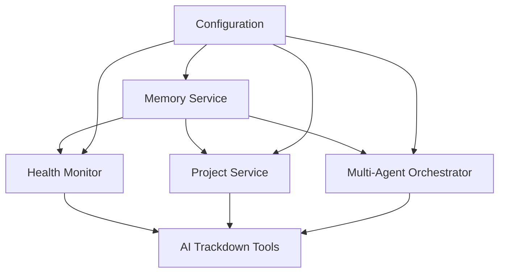

# Operations Comprehensive Guide - Claude PM Framework

## Overview

This comprehensive guide covers all operational aspects of the Claude PM Framework v4.5.1, including deployment, service management, health monitoring, troubleshooting, and recovery procedures for the complete multi-agent project management system.

## System Architecture

### Framework Structure

```
claude-multiagent-pm/
├── claude_pm/                    # Core framework implementation
│   ├── services/                 # Memory, health, project services
│   ├── integrations/             # mem0AI, security integrations
│   ├── core/                     # Base services, configuration
│   └── utils/                    # AI trackdown tools, utilities
├── tasks/                        # AI-trackdown managed tickets
│   ├── epics/                    # Strategic epics
│   ├── issues/                   # Implementation issues
│   └── tasks/                    # Development tasks
├── config/                       # Configuration files
├── scripts/                      # Deployment and health scripts
├── bin/                          # CLI wrappers
└── docs/                         # Documentation
```

### Key System Components

- **Claude PM Framework Core** (`/Users/masa/Projects/claude-multiagent-pm/claude_pm/`)
- **Memory Service** (localhost:8002 with mem0AI integration)
- **AI Trackdown Tools** (Persistent ticket management)
- **Multi-Agent Orchestrator** (11-agent ecosystem)
- **Health Monitoring** (Automated health checks)
- **Configuration Management** (YAML-based config system)

### Service Dependencies



## Deployment Operations

### Quick Deployment

#### Deploy to Client Directory

```bash
# Deploy to ~/Clients/project-name
npm run deploy -- --target ~/Clients/project-name --verbose

# Test deployment first
npm run deploy:dry-run -- --target ~/Clients/project-name

# Validate deployment
npm run validate-deployment -- --target ~/Clients/project-name --verbose
```

#### Deploy using Direct Commands

```bash
# Deploy to current directory
node install/deploy.js --verbose

# Deploy to specific directory
node install/deploy.js --target ~/Clients/project-name --verbose

# Dry run (test without changes)
node install/deploy.js --target ~/Clients/project-name --dry-run --verbose
```

### Prerequisites

#### Required Software
- **Node.js**: 16.0.0 or higher
- **Python**: 3.8 or higher
- **ai-trackdown-tools**: 1.0.1 or higher

#### Installation Commands
```bash
# Install ai-trackdown-tools globally
npm install -g @bobmatnyc/ai-trackdown-tools

# Verify installation
aitrackdown --version
```

### Deployment Architecture

#### Hybrid NPM + Local Build Strategy
- **NPM Package**: Distributable framework package
- **Local Build**: Environment-specific deployment creation
- **Portable Dependencies**: ai-trackdown-tools integration maintained across deployments

#### Three-Layer Configuration
1. **Package Defaults**: Built into framework
2. **Environment Variables**: System-level configuration
3. **Project-Specific**: `.claude-pm/config.json` in deployment

### Deployment Structure

```
deployment-directory/
├── claude_pm/              # Framework core
│   ├── cli.py              # Main CLI interface
│   ├── core/               # Core services
│   ├── services/           # Framework services
│   ├── integrations/       # External integrations
│   └── utils/              # Utility functions
├── tasks/                  # Ticket hierarchy
│   ├── epics/              # Strategic epics
│   ├── issues/             # Implementation issues
│   ├── tasks/              # Development tasks
│   ├── prs/                # Pull requests
│   └── templates/          # Ticket templates
├── templates/              # Project templates
├── schemas/                # Data schemas
├── bin/                    # CLI wrappers
│   ├── aitrackdown*        # Main CLI wrapper
│   └── atd*                # CLI alias
├── scripts/                # Deployment scripts
│   └── health-check*       # Health validation
├── requirements/           # Python dependencies
├── .claude-pm/             # Deployment config
│   └── config.json         # Configuration file
└── CLAUDE.md               # Framework configuration
```

### Initial Deployment Process

#### Prerequisites Check
```bash
# Check Node.js version
node --version  # Should be >= 16.0.0

# Check Python version
python3 --version  # Should be >= 3.8

# Check AI trackdown tools
npm list -g @bobmatnyc/ai-trackdown-tools
```

#### Installation Process
```bash
# Step 1: Install AI trackdown tools
npm install -g @bobmatnyc/ai-trackdown-tools

# Step 2: Verify installation
aitrackdown --version
atd --version

# Step 3: Deploy framework
cd /Users/masa/Projects/claude-multiagent-pm
npm run deploy

# Step 4: Validate deployment
npm run validate-deployment
```

### Redeployment Process

#### Full Redeployment
```bash
# Step 1: Backup current configuration
cp -r /Users/masa/Clients/claude-multiagent-pm/.claude-pm /tmp/claude-pm-backup

# Step 2: Clean deployment target
rm -rf /Users/masa/Clients/claude-multiagent-pm

# Step 3: Deploy from source
cd /Users/masa/Projects/claude-multiagent-pm
npm run deploy

# Step 4: Restore configuration if needed
cp -r /tmp/claude-pm-backup/.claude-pm /Users/masa/Clients/claude-multiagent-pm/

# Step 5: Validate deployment
cd /Users/masa/Clients/claude-multiagent-pm
./scripts/health-check.sh
```

#### Incremental Update
```bash
# Update specific components
cd /Users/masa/Projects/claude-multiagent-pm

# Update framework core
rsync -av claude_pm/ /Users/masa/Clients/claude-multiagent-pm/claude_pm/

# Update configuration
rsync -av config/ /Users/masa/Clients/claude-multiagent-pm/config/

# Update scripts
rsync -av scripts/ /Users/masa/Clients/claude-multiagent-pm/scripts/

# Validate update
cd /Users/masa/Clients/claude-multiagent-pm
./scripts/health-check.sh
```

## Core Services Management

### 1. Memory Service (`memory_service.py`)

**Purpose**: Central memory management with mem0AI integration

**Key Operations**:
- Connection management to localhost:8002
- Memory categorization (Project, Pattern, Team, Error)
- Async/sync operations with connection pooling
- Cache management and invalidation

**Configuration**:
```python
# Memory service configuration
{
    "host": "localhost",
    "port": 8002,
    "timeout": 30,
    "max_retries": 3,
    "connection_pool_size": 10
}
```

**Health Check**:
```bash
# Check memory service health
curl http://localhost:8002/health

# Test memory integration
python3 -c "from claude_pm.services.memory_service import get_memory_service; print(get_memory_service().client.is_connected())"
```

**Common Issues**:
- Connection timeout: Check mem0AI service status
- Memory not found: Verify project context
- Connection pool exhaustion: Restart service

### 2. Health Monitor Service (`health_monitor.py`)

**Purpose**: Comprehensive system health monitoring

**Key Operations**:
- Framework component monitoring
- AI trackdown tools health checks
- Memory service connectivity
- Background monitoring processes

**Configuration**:
```json
{
  "health_check_interval": 300,
  "enable_background_monitoring": true,
  "alert_threshold": 60
}
```

**Health Check**:
```bash
# Run health check
./scripts/health-check.sh

# Python health check
python3 -c "from claude_pm.services.health_monitor import HealthMonitorService; print('Health service available')"
```

**Monitoring Commands**:
```bash
# Background monitoring
python3 scripts/automated_health_monitor.py monitor

# One-time health check
python3 scripts/automated_health_monitor.py once

# Health status
python3 scripts/automated_health_monitor.py status
```

### 3. Project Service (`project_service.py`)

**Purpose**: Project discovery and compliance monitoring

**Key Operations**:
- Project discovery in managed directories
- Framework compliance scoring
- Git repository information
- Project lifecycle management

**Configuration**:
```python
{
    "base_path": "/Users/masa/Projects",
    "managed_path": "/Users/masa/Projects/managed",
    "auto_discovery_interval": 3600,
    "compliance_check_interval": 1800
}
```

**Health Check**:
```bash
# Check project service
python3 -c "from claude_pm.services.project_service import ProjectService; print('Project service available')"

# List discovered projects
python3 -c "from claude_pm.services.project_service import ProjectService; ps = ProjectService(); print(list(ps.get_projects().keys()))"
```

### 4. Multi-Agent Orchestrator (`multi_agent_orchestrator.py`)

**Purpose**: Coordinating 11-agent ecosystem with memory integration

**Key Operations**:
- Agent task submission and execution
- Memory-augmented context preparation
- Git worktree isolation
- Parallel execution coordination

**Configuration**:
```python
{
    "max_parallel": 5,
    "base_repo_path": "/Users/masa/Projects/claude-multiagent-pm",
    "worktree_base_path": "/Users/masa/Projects/claude-multiagent-pm/.worktrees"
}
```

**Health Check**:
```bash
# Check orchestrator status
python3 -c "from claude_pm.services.multi_agent_orchestrator import MultiAgentOrchestrator; print('Orchestrator available')"

# List agent types
python3 -c "from claude_pm.services.multi_agent_orchestrator import AgentType; print([a.value for a in AgentType])"
```

## AI-Trackdown Integration

### Automatic Path Resolution
The deployment system automatically:
1. Locates ai-trackdown-tools in global node_modules
2. Tries local node_modules as fallback
3. Uses npm ls to find installation
4. Creates environment-specific wrappers

### CLI Wrapper Creation
Platform-specific CLI wrappers maintain full functionality:

**Unix (Linux/macOS):**
```bash
#!/bin/bash
cd "/path/to/deployment"
node "/path/to/ai-trackdown-tools/dist/index.js" "$@"
```

**Windows:**
```batch
@echo off
cd /d "C:\path\to\deployment"
node "C:\path\to\ai-trackdown-tools\dist\index.js" %*
```

### Available Commands
- `./bin/aitrackdown` - Main CLI command
- `./bin/atd` - Alias for aitrackdown
- `./bin/aitrackdown status` - Current status
- `./bin/aitrackdown epic list` - List epics
- `./bin/aitrackdown issue list` - List issues

## Health Monitoring

### Automated Health Checks

#### Health Check Components
1. **Framework Core**: Python modules accessibility
2. **AI Trackdown Tools**: CLI functionality
3. **Memory Service**: Connection and response
4. **Task System**: Ticket hierarchy integrity
5. **Configuration**: Required files presence

#### Health Check Script
```bash
#!/bin/bash
# Comprehensive health check

echo "🔍 Claude PM Framework Health Check"
echo "===================================="

# Check framework core
if python3 -c "import claude_pm.cli; print('✓ Framework core accessible')" 2>/dev/null; then
    echo "✓ Framework core accessible"
else
    echo "❌ Framework core issue"
    exit 1
fi

# Check AI trackdown tools
if aitrackdown --version >/dev/null 2>&1; then
    echo "✓ AI trackdown tools available"
else
    echo "❌ AI trackdown tools issue"
    exit 1
fi

# Check memory service
if curl -s http://localhost:8002/health >/dev/null 2>&1; then
    echo "✓ Memory service responsive"
else
    echo "⚠ Memory service issue"
fi

# Check task system
if [ -d "tasks" ]; then
    TOTAL_TASKS=$(find tasks -name "*.md" | wc -l)
    echo "✓ Task system operational ($TOTAL_TASKS tasks)"
else
    echo "❌ Task system missing"
    exit 1
fi

echo "✅ Health check completed"
```

#### Automated Monitoring
```bash
# Setup background monitoring
python3 scripts/automated_health_monitor.py monitor --interval=300

# View health reports
cat logs/health-report.json

# Check health dashboard
python3 -c "from claude_pm.services.health_dashboard import HealthDashboard; hd = HealthDashboard(); print(hd.get_dashboard_summary())"
```

### Health Report Structure

```json
{
  "timestamp": "2025-07-11T12:00:00Z",
  "overall_health": 95,
  "components": {
    "framework_core": {
      "status": "healthy",
      "response_time": 150,
      "last_check": "2025-07-11T12:00:00Z"
    },
    "memory_service": {
      "status": "healthy",
      "connection": true,
      "response_time": 50
    },
    "ai_trackdown_tools": {
      "status": "healthy",
      "cli_functional": true,
      "task_count": 42
    },
    "task_system": {
      "status": "healthy",
      "epics": 29,
      "issues": 39,
      "tasks": 13
    }
  },
  "alerts": [],
  "recommendations": []
}
```

## Service Recovery Procedures

### Service Recovery Matrix

| Service | Recovery Time | Complexity | Data Loss Risk | Dependencies |
|---------|---------------|------------|----------------|--------------|
| Memory Service | 2-5 minutes | Medium | Low | None |
| Health Monitor | 1-2 minutes | Low | None | Memory Service |
| Project Service | 1-3 minutes | Low | None | Memory Service |
| Multi-Agent Orchestrator | 3-5 minutes | High | Low | Memory Service, Git |
| AI Trackdown Tools | 2-4 minutes | Medium | Low | Node.js, Tasks |
| Complete System | 10-15 minutes | High | Medium | All |

### Memory Service Recovery

#### Recovery Procedure: Memory Service Down
```bash
#!/bin/bash
# Memory Service Recovery Procedure

echo "Starting Memory Service Recovery..."

# Step 1: Stop existing processes
sudo pkill -f mem0ai
sleep 2

# Step 2: Check port availability
if netstat -an | grep -q 8002; then
    echo "Port 8002 still in use, waiting..."
    sleep 5
fi

# Step 3: Clear temporary files
rm -rf /tmp/memory_cache/*
rm -rf /tmp/mem0ai_*

# Step 4: Start memory service
if command -v systemctl >/dev/null 2>&1; then
    # Using systemd
    sudo systemctl start mem0ai
    sudo systemctl enable mem0ai
    echo "Memory service started via systemd"
else
    # Manual start
    nohup python3 -m mem0ai.server --host localhost --port 8002 > logs/mem0ai.log 2>&1 &
    echo "Memory service started manually"
fi

# Step 5: Wait for service to be ready
echo "Waiting for service to be ready..."
for i in {1..30}; do
    if curl -s http://localhost:8002/health >/dev/null 2>&1; then
        echo "Service is ready"
        break
    fi
    sleep 1
done

echo "Memory Service Recovery Complete"
```

#### Recovery Procedure: Memory Service Corruption
```bash
#!/bin/bash
# Memory Service Data Recovery

echo "Starting Memory Service Data Recovery..."

# Step 1: Stop service
sudo systemctl stop mem0ai || pkill -f mem0ai

# Step 2: Backup current data
mkdir -p backups/memory_recovery_$(date +%Y%m%d_%H%M%S)
cp -r /var/lib/mem0ai backups/memory_recovery_$(date +%Y%m%d_%H%M%S)/ 2>/dev/null || echo "No data to backup"

# Step 3: Clear corrupted data
rm -rf /var/lib/mem0ai/corrupted_*
rm -rf /tmp/memory_cache/*

# Step 4: Restore from backup if available
if [ -f "backups/memory_data_latest.tar.gz" ]; then
    echo "Restoring from backup..."
    tar -xzf backups/memory_data_latest.tar.gz -C /var/lib/mem0ai
fi

# Step 5: Restart service
sudo systemctl start mem0ai

echo "Memory Service Data Recovery Complete"
```

### AI Trackdown Tools Recovery

#### Recovery Procedure: AI Trackdown Tools
```bash
#!/bin/bash
# AI Trackdown Tools Recovery

echo "Starting AI Trackdown Tools Recovery..."

# Step 1: Remove existing installation
npm uninstall -g @bobmatnyc/ai-trackdown-tools

# Step 2: Clear npm cache
npm cache clean --force

# Step 3: Reinstall AI trackdown tools
npm install -g @bobmatnyc/ai-trackdown-tools

# Step 4: Verify installation
aitrackdown --version || echo "Installation failed"
atd --version || echo "Alias failed"

# Step 5: Test basic functionality
aitrackdown status || echo "Status command failed"

# Step 6: Check CLI wrappers
ls -la bin/aitrackdown
ls -la bin/atd
chmod +x bin/aitrackdown
chmod +x bin/atd

echo "AI Trackdown Tools Recovery Complete"
```

#### Recovery Procedure: Task Structure Corruption
```bash
#!/bin/bash
# Task Structure Recovery

echo "Starting Task Structure Recovery..."

# Step 1: Backup existing tasks
mkdir -p backups/tasks_$(date +%Y%m%d_%H%M%S)
cp -r tasks/ backups/tasks_$(date +%Y%m%d_%H%M%S)/ 2>/dev/null

# Step 2: Recreate task structure
mkdir -p tasks/{epics,issues,tasks,prs,templates}

# Step 3: Restore templates
cp templates/epic-default.yaml tasks/templates/
cp templates/issue-default.yaml tasks/templates/
cp templates/task-default.yaml tasks/templates/

# Step 4: Validate task files
find tasks/ -name "*.md" -exec sh -c 'head -1 "$1" | grep -q "^#" || echo "Invalid task file: $1"' _ {} \;

# Step 5: Test task creation
aitrackdown epic create "Test Recovery Epic" --description "Test epic for recovery validation"

# Step 6: Clean up test data
find tasks/ -name "*Test Recovery*" -delete

echo "Task Structure Recovery Complete"
```

### Complete System Recovery

#### Recovery Procedure: Complete System
```bash
#!/bin/bash
# Complete System Recovery Procedure

echo "Starting Complete System Recovery..."

# Step 1: Create emergency backup
echo "Creating emergency backup..."
tar -czf emergency_backup_$(date +%Y%m%d_%H%M%S).tar.gz \
    /Users/masa/Projects/claude-multiagent-pm \
    /Users/masa/Projects/managed \
    --exclude='*.pyc' \
    --exclude='__pycache__' \
    --exclude='node_modules' \
    --exclude='.git' \
    2>/dev/null

# Step 2: Stop all services
echo "Stopping all services..."
pkill -f claude_pm
pkill -f mem0ai
pkill -f aitrackdown
pkill -f health_monitor

# Step 3: Clear temporary files
echo "Clearing temporary files..."
rm -rf /tmp/claude_pm_*
rm -rf /tmp/memory_cache/*
rm -rf /tmp/aitrackdown_*

# Step 4: Reinstall dependencies
echo "Reinstalling dependencies..."
cd /Users/masa/Projects/claude-multiagent-pm
pip install -r requirements/production.txt
npm install -g @bobmatnyc/ai-trackdown-tools

# Step 5: Restart memory service
echo "Restarting memory service..."
if command -v systemctl >/dev/null 2>&1; then
    sudo systemctl restart mem0ai
else
    nohup python3 -m mem0ai.server --host localhost --port 8002 > logs/mem0ai.log 2>&1 &
fi

# Step 6: Wait for memory service
echo "Waiting for memory service..."
for i in {1..30}; do
    if curl -s http://localhost:8002/health >/dev/null 2>&1; then
        echo "Memory service ready"
        break
    fi
    sleep 1
done

# Step 7: Initialize framework services
echo "Initializing framework services..."
python3 -c "
from claude_pm.services.health_monitor import HealthMonitorService
from claude_pm.services.project_service import ProjectService
from claude_pm.services.memory_service import get_memory_service

# Initialize services
health = HealthMonitorService()
project = ProjectService()
memory = get_memory_service()

print('Services initialized')
"

# Step 8: Start background monitoring
echo "Starting background monitoring..."
nohup python3 scripts/automated_health_monitor.py monitor --interval=300 > logs/health_monitor.log 2>&1 &

# Step 9: Validate system
echo "Validating system..."
./scripts/health-check.sh

echo "Complete System Recovery Complete"
```

## Troubleshooting

### Common Issues and Solutions

#### 1. Memory Service Connection Issues

**Symptoms**:
- `ConnectionError: Failed to connect to mem0AI service`
- Memory operations timing out
- Context preparation failures

**Diagnosis**:
```bash
# Check memory service status
curl http://localhost:8002/health

# Check service logs
tail -f logs/memory_service.log

# Test connection
python3 -c "from claude_pm.services.memory_service import ClaudePMMemory; m = ClaudePMMemory(); print(m.is_connected())"
```

**Solutions**:
1. **Restart mem0AI service**: `systemctl restart mem0ai`
2. **Check port availability**: `netstat -ln | grep 8002`
3. **Verify configuration**: Check `config/memory_config.json`
4. **Clear connection pool**: Restart Python processes

#### 2. AI Trackdown Tools Issues

**Symptoms**:
- Command not found: `aitrackdown`
- CLI timeout errors
- Ticket creation failures

**Diagnosis**:
```bash
# Check installation
npm list -g @bobmatnyc/ai-trackdown-tools

# Test CLI functionality
aitrackdown --version
atd status

# Check task structure
ls -la tasks/
```

**Solutions**:
1. **Reinstall tools**: `npm install -g @bobmatnyc/ai-trackdown-tools`
2. **Fix PATH**: Add Node.js global modules to PATH
3. **Check permissions**: Ensure execute permissions on CLI
4. **Verify task structure**: Recreate `tasks/` directory structure

#### 3. Multi-Agent Orchestrator Issues

**Symptoms**:
- Agent execution failures
- Worktree creation errors
- Memory context preparation failures

**Diagnosis**:
```bash
# Check orchestrator status
python3 -c "from claude_pm.services.multi_agent_orchestrator import MultiAgentOrchestrator; print('Orchestrator available')"

# Check git worktree status
git worktree list

# Check memory integration
python3 -c "from claude_pm.services.mem0_context_manager import Mem0ContextManager; print('Context manager available')"
```

**Solutions**:
1. **Clean worktrees**: `git worktree prune`
2. **Check git repository**: Ensure `.git` directory exists
3. **Verify memory service**: Test memory connection
4. **Restart orchestrator**: Kill Python processes and restart

#### 4. Configuration Issues

**Symptoms**:
- Import errors
- Service initialization failures
- Path resolution issues

**Diagnosis**:
```bash
# Check configuration files
find . -name "*.json" -o -name "*.yaml" | head -10

# Verify Python path
python3 -c "import sys; print(sys.path)"

# Check environment variables
env | grep CLAUDE
```

**Solutions**:
1. **Fix Python path**: Add framework to PYTHONPATH
2. **Verify configuration**: Check JSON/YAML syntax
3. **Update paths**: Ensure absolute paths are correct
4. **Environment setup**: Source activation script

## Common Operations

### Daily Operations

#### 1. System Health Check
```bash
# Quick health check
./scripts/health-check.sh

# Detailed health report
python3 scripts/automated_health_monitor.py once --verbose

# Check service status
python3 -c "from claude_pm.services.health_monitor import HealthMonitorService; hms = HealthMonitorService(); print(hms.get_health_status())"
```

#### 2. Memory Service Maintenance
```bash
# Check memory statistics
python3 -c "from claude_pm.services.memory_service import get_memory_service; ms = get_memory_service(); print(ms.get_memory_stats('claude-pm'))"

# Clear memory cache
python3 -c "from claude_pm.services.memory_service import get_memory_service; ms = get_memory_service(); ms.client._invalidate_cache('claude-pm')"

# Test memory operations
python3 -c "from claude_pm.services.memory_service import get_memory_service; ms = get_memory_service(); print(ms.client.add_project_decision('test-project', 'Test decision', 'Test context'))"
```

#### 3. AI Trackdown Operations
```bash
# Check system status
aitrackdown status

# List active tickets
aitrackdown epic list --status active
aitrackdown issue list --status active
aitrackdown task list --status active

# Create new tickets
aitrackdown epic create "New Epic"
aitrackdown issue create "New Issue" --epic EP-001
aitrackdown task create "New Task" --issue ISS-001

# Update ticket status
aitrackdown issue update ISS-001 --status in-progress
aitrackdown task complete TSK-001
```

#### 4. Project Management
```bash
# Discover projects
python3 -c "from claude_pm.services.project_service import ProjectService; ps = ProjectService(); ps._discover_projects()"

# Check project compliance
python3 -c "from claude_pm.services.project_service import ProjectService; ps = ProjectService(); print(ps.get_project_stats())"

# Update project information
python3 -c "from claude_pm.services.project_service import ProjectService; ps = ProjectService(); ps.refresh_project('project-name')"
```

### Weekly Operations

#### 1. System Maintenance
```bash
# Update dependencies
pip install -r requirements/production.txt --upgrade
npm update -g @bobmatnyc/ai-trackdown-tools

# Clean up logs
find logs/ -name "*.log" -mtime +7 -delete
find logs/ -name "*.json" -mtime +7 -delete

# Cleanup worktrees
cd /Users/masa/Projects/claude-multiagent-pm
git worktree prune
```

#### 2. Health Report Review
```bash
# Generate weekly health report
python3 scripts/automated_health_monitor.py reports --period weekly

# Review system metrics
python3 -c "from claude_pm.services.health_monitor import HealthMonitorService; hms = HealthMonitorService(); print(hms.get_last_health_report())"

# Check component trends
grep "overall_health" logs/health-*.json | tail -10
```

#### 3. Data Backup
```bash
# Backup task data
tar -czf backups/tasks-$(date +%Y%m%d).tar.gz tasks/

# Backup configuration
tar -czf backups/config-$(date +%Y%m%d).tar.gz config/

# Backup logs
tar -czf backups/logs-$(date +%Y%m%d).tar.gz logs/
```

### Monthly Operations

#### 1. System Updates
```bash
# Update framework version
cd /Users/masa/Projects/claude-multiagent-pm
git pull origin main
npm run deploy

# Update system dependencies
pip install -r requirements/production.txt --upgrade
npm update -g @bobmatnyc/ai-trackdown-tools

# Validate system after updates
./scripts/health-check.sh
```

#### 2. Performance Review
```bash
# Review memory usage
python3 -c "from claude_pm.services.memory_service import get_memory_service; ms = get_memory_service(); print(ms.stats)"

# Check orchestrator performance
python3 -c "from claude_pm.services.multi_agent_orchestrator import MultiAgentOrchestrator; print('Orchestrator stats available')"

# Review health trends
python3 scripts/automated_health_monitor.py reports --period monthly
```

## Configuration Management

### Configuration Files

#### 1. Health Monitoring Configuration
**Location**: `config/health_monitoring_config.json`

```json
{
  "documentation_monitoring": {
    "enabled": true,
    "check_interval": 900,
    "alert_thresholds": {
      "critical_issues": 1,
      "broken_links": 5,
      "inconsistencies": 3
    }
  },
  "ai_trackdown_monitoring": {
    "enabled": true,
    "check_interval": 300,
    "cli_timeout": 10,
    "commands_to_test": [
      "status",
      "epic list",
      "issue list",
      "task list"
    ]
  }
}
```

#### 2. Memory Service Configuration
**Location**: `claude_pm/core/memory_config.py`

```python
MEMORY_CONFIG = {
    "host": "localhost",
    "port": 8002,
    "timeout": 30,
    "max_retries": 3,
    "retry_delay": 1.0,
    "connection_pool_size": 10,
    "cache_ttl": 300,
    "max_memory_size": 1000
}
```

#### 3. AI Trackdown Configuration
**Location**: `claude_pm/utils/ai_trackdown_tools.py`

```python
AI_TRACKDOWN_CONFIG = {
    "enabled": True,
    "timeout": 30,
    "fallback_logging": True,
    "fallback_method": "logging",
    "cli_command": "aitrackdown",
    "cli_alias": "atd"
}
```

### Environment Variables

#### Required Variables
```bash
# Python environment
export PYTHONPATH="/Users/masa/Projects/claude-multiagent-pm:$PYTHONPATH"

# Memory service
export CLAUDE_PM_MEMORY_HOST="localhost"
export CLAUDE_PM_MEMORY_PORT="8002"

# AI Trackdown
export CLAUDE_PM_AI_TRACKDOWN_ENABLED="true"
export CLAUDE_PM_AI_TRACKDOWN_TIMEOUT="30"
```

#### Optional Variables
```bash
# Debug mode
export CLAUDE_PM_DEBUG="true"

# Logging level
export CLAUDE_PM_LOG_LEVEL="INFO"

# Performance monitoring
export CLAUDE_PM_PERFORMANCE_MONITORING="true"
```

### Configuration Validation

#### Validation Script
```bash
#!/bin/bash
# Configuration validation

echo "Validating Claude PM Framework Configuration"
echo "=========================================="

# Check required files
CONFIG_FILES=(
    "config/health_monitoring_config.json"
    "config/performance_config.json"
    "config/doc_sync_config.json"
)

for file in "${CONFIG_FILES[@]}"; do
    if [ -f "$file" ]; then
        echo "✓ $file exists"
        # Validate JSON syntax
        if python3 -m json.tool "$file" >/dev/null 2>&1; then
            echo "✓ $file valid JSON"
        else
            echo "❌ $file invalid JSON"
        fi
    else
        echo "❌ $file missing"
    fi
done

# Check Python configuration
if python3 -c "from claude_pm.core.config import Config; print('✓ Configuration accessible')" 2>/dev/null; then
    echo "✓ Python configuration accessible"
else
    echo "❌ Python configuration issue"
fi

# Check environment variables
if [ -n "$PYTHONPATH" ]; then
    echo "✓ PYTHONPATH set"
else
    echo "⚠ PYTHONPATH not set"
fi

echo "Configuration validation completed"
```

## Emergency Procedures

### Emergency Shutdown
```bash
#!/bin/bash
# Emergency Shutdown Procedure

echo "Emergency Shutdown Initiated"
echo "============================"

# Stop all Claude PM processes
pkill -f claude_pm
pkill -f mem0ai
pkill -f aitrackdown
pkill -f health_monitor

# Force kill if necessary
sleep 5
pkill -9 -f claude_pm
pkill -9 -f mem0ai

# Clear lock files
rm -f /tmp/claude_pm_*.lock
rm -f /tmp/mem0ai_*.lock

echo "Emergency shutdown complete"
```

### Emergency Restart
```bash
#!/bin/bash
# Emergency Restart Procedure

echo "Emergency Restart Initiated"
echo "=========================="

# Emergency shutdown first
pkill -f claude_pm
pkill -f mem0ai
sleep 2

# Clear temporary files
rm -rf /tmp/claude_pm_*
rm -rf /tmp/memory_cache/*

# Restart memory service
if command -v systemctl >/dev/null 2>&1; then
    sudo systemctl restart mem0ai
else
    nohup python3 -m mem0ai.server --host localhost --port 8002 > logs/mem0ai.log 2>&1 &
fi

# Wait for memory service
for i in {1..30}; do
    if curl -s http://localhost:8002/health >/dev/null 2>&1; then
        break
    fi
    sleep 1
done

# Quick validation
python3 -c "import claude_pm; print('Framework accessible')"
aitrackdown --version

echo "Emergency restart complete"
```

### Emergency Rollback
```bash
#!/bin/bash
# Emergency Rollback Procedure

echo "Emergency Rollback Initiated"
echo "==========================="

# Check for backup
if [ ! -f "emergency_backup_latest.tar.gz" ]; then
    echo "No emergency backup found"
    exit 1
fi

# Stop all services
pkill -f claude_pm
pkill -f mem0ai

# Create current state backup
tar -czf current_state_before_rollback_$(date +%Y%m%d_%H%M%S).tar.gz \
    /Users/masa/Projects/claude-multiagent-pm \
    --exclude='*.pyc' \
    --exclude='__pycache__' \
    2>/dev/null

# Restore from backup
cd /Users/masa/Projects/
rm -rf claude-multiagent-pm.rollback
mv claude-multiagent-pm claude-multiagent-pm.rollback
tar -xzf emergency_backup_latest.tar.gz

# Restart services
cd claude-multiagent-pm
./scripts/health-check.sh

echo "Emergency rollback complete"
```

## Performance Considerations

### Deployment Speed
- Framework core copy: ~1-2 seconds
- CLI wrapper creation: ~0.5 seconds
- Configuration generation: ~0.5 seconds
- Health check creation: ~0.5 seconds
- **Total deployment time**: ~3-5 seconds

### Resource Usage
- **Disk space**: ~50MB per deployment
- **Memory**: Minimal during deployment
- **CPU**: Low during deployment process

### Recovery Time Estimates
- **Individual Service**: 2-5 minutes
- **Multiple Services**: 5-10 minutes
- **Complete System**: 10-15 minutes
- **Emergency Procedures**: 1-2 minutes

## Validation Infrastructure

### Deployment Validation
The validation system checks:
- Directory structure completeness
- Configuration file validity
- CLI wrapper functionality
- AI-trackdown integration
- Python environment readiness

### Health Check Validation
Regular health monitoring includes:
- Framework core accessibility
- CLI command functionality
- Python import capabilities
- Configuration integrity

### Validation Checklist
```bash
#!/bin/bash
# Recovery Validation Checklist

echo "Recovery Validation Checklist"
echo "============================"

# 1. Framework Core
echo "1. Framework Core:"
python3 -c "import claude_pm; print('✓ Framework importable')" || echo "✗ Framework import failed"

# 2. Memory Service
echo "2. Memory Service:"
curl -s http://localhost:8002/health >/dev/null 2>&1 && echo "✓ Memory service responsive" || echo "✗ Memory service unresponsive"

# 3. Health Monitor
echo "3. Health Monitor:"
python3 -c "from claude_pm.services.health_monitor import HealthMonitorService; HealthMonitorService(); print('✓ Health monitor accessible')" || echo "✗ Health monitor failed"

# 4. Project Service
echo "4. Project Service:"
python3 -c "from claude_pm.services.project_service import ProjectService; ProjectService(); print('✓ Project service accessible')" || echo "✗ Project service failed"

# 5. Multi-Agent Orchestrator
echo "5. Multi-Agent Orchestrator:"
python3 -c "from claude_pm.services.multi_agent_orchestrator import MultiAgentOrchestrator; print('✓ Orchestrator accessible')" || echo "✗ Orchestrator failed"

# 6. AI Trackdown Tools
echo "6. AI Trackdown Tools:"
aitrackdown --version >/dev/null 2>&1 && echo "✓ AI trackdown accessible" || echo "✗ AI trackdown failed"

# 7. Task Structure
echo "7. Task Structure:"
[ -d "tasks" ] && echo "✓ Task structure exists" || echo "✗ Task structure missing"

# 8. Configuration
echo "8. Configuration:"
[ -f "config/health_monitoring_config.json" ] && echo "✓ Configuration files exist" || echo "✗ Configuration missing"

# 9. Logs
echo "9. Logs:"
[ -d "logs" ] && echo "✓ Log directory exists" || echo "✗ Log directory missing"

# 10. Health Check
echo "10. Health Check:"
./scripts/health-check.sh >/dev/null 2>&1 && echo "✓ Health check passed" || echo "✗ Health check failed"

echo "Validation complete"
```

## Summary

This comprehensive operations guide provides systematic approaches to:

1. **Deployment Operations**: Complete framework deployment and redeployment procedures
2. **Service Management**: Detailed operations for all core services
3. **Health Monitoring**: Comprehensive health checking and alerting
4. **Troubleshooting**: Common issues and systematic resolution procedures
5. **Recovery Procedures**: Emergency recovery for all system components
6. **Configuration Management**: Complete configuration documentation
7. **Emergency Procedures**: Critical system emergency response

### Key Success Factors
1. Regular health monitoring and proactive issue detection
2. Systematic troubleshooting using documented procedures
3. Comprehensive recovery procedures for all services
4. Automated monitoring and alerting systems
5. Complete configuration management
6. Performance optimization through systematic monitoring

### Success Criteria
- All services pass health checks
- System performance within normal parameters
- No data loss or corruption
- All configurations valid
- Monitoring systems operational
- Complete deployment functionality preserved

This operational framework ensures the Claude PM Framework remains reliable, performant, and continuously improving through systematic operational intelligence.

---

**Framework Version**: 4.5.1  
**Last Updated**: 2025-07-11  
**Operations Guide Version**: 2.0.0  
**Authority Level**: Complete System Operations