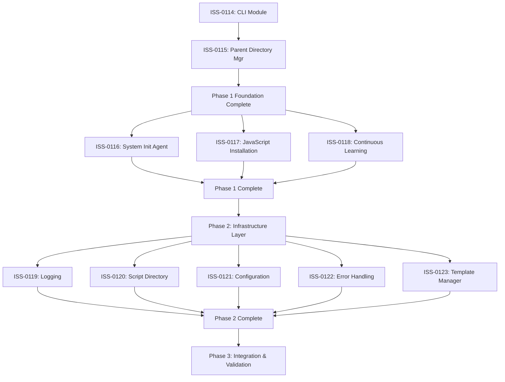

# EP-0041 Implementation Strategy: Detailed Execution Framework

**Companion Document**: EP-0041-ORCHESTRATION-ROADMAP.md  
**Framework Version**: 0.6.2  
**Document Date**: 2025-07-14  
**Focus**: Tactical Implementation Guidance  

## Strategic Dependency Mapping

### Critical Path Analysis



### Dependency Details

#### Critical Dependencies (Must Complete in Sequence)
1. **ISS-0114 → ISS-0115**: CLI service management patterns must be established before Parent Directory Manager refactoring
2. **ISS-0115 Completion**: Framework template protection mechanisms are ESSENTIAL for all subsequent work

#### Parallel Execution Groups
**Group A (After ISS-0115)**: ISS-0116, ISS-0117, ISS-0118
**Group B (Phase 2 Infrastructure)**: ISS-0119, ISS-0120
**Group C (Phase 2 Configuration)**: ISS-0121, ISS-0122, ISS-0123

#### Cross-Component Integration Points
- **CLI ↔ All Components**: Service initialization patterns
- **Parent Directory Mgr ↔ Template Manager**: Template deployment coordination
- **Logging ↔ All Components**: Unified logging adoption
- **Configuration ↔ All Components**: Centralized config patterns

## Phase 1: Core Infrastructure (Weeks 1-2)

### ISS-0114: CLI Module Architecture (Days 1-3)
**Priority**: CRITICAL (Blocks everything)
**Complexity**: High
**Impact**: Framework-wide

#### Implementation Sequence
1. **Day 1: Foundation Setup**
   ```
   Extract: cli/core/base_command.py (base interface)
   Extract: cli/core/service_manager.py (service coordination)
   Create: cli/core/context_manager.py (configuration management)
   ```

2. **Day 2: Command Modularization**
   ```
   Separate: cli/commands/agents/ (agent commands)
   Separate: cli/commands/project/ (project management)
   Separate: cli/commands/deployment/ (setup commands)
   ```

3. **Day 3: Integration and Testing**
   ```
   Integrate: All modular components
   Test: Complete CLI functionality preservation
   Validate: Performance benchmarks maintained
   ```

#### Success Validation
- CLI main module: 3,817 lines → <500 lines
- Each command module: <300 lines
- All existing commands functional
- Test coverage increase: +40%

### ISS-0115: Parent Directory Manager (Days 4-6)
**Priority**: CRITICAL (Framework Protection)
**Complexity**: High
**Impact**: Framework-wide deployment integrity

#### CRITICAL PROTECTION REQUIREMENTS
⚠️ **Framework template protection is ESSENTIAL** ⚠️
- Backup mechanisms MUST be preserved
- Version checking MUST remain robust
- Template integrity MUST be maintained

#### Implementation Sequence
1. **Day 4: Service Layer Extraction**
   ```
   Extract: services/deployment/framework_deployer.py
   Extract: services/deployment/backup_manager.py
   Extract: services/deployment/version_manager.py
   ```

2. **Day 5: Configuration and Protection**
   ```
   Extract: services/config/deployment_config.py
   Extract: services/protection/template_protector.py
   Extract: services/protection/integrity_validator.py
   ```

3. **Day 6: Integration and Critical Testing**
   ```
   Integrate: Service coordinator (<400 lines)
   Test: Framework protection mechanisms
   Validate: Backup and recovery functionality
   ```

#### Success Validation
- Parent Directory Manager: 2,075 lines → <400 lines (coordinator)
- Framework protection: 100% preserved
- Backup functionality: Enhanced and validated
- Template deployment: 20%+ performance improvement

### ISS-0116, ISS-0117, ISS-0118: Parallel Components (Days 7-10)
**Execution Mode**: Parallel after ISS-0115 completion
**Dependencies**: CLI patterns and Parent Directory Manager completion

#### ISS-0116: System Init Agent Components
**Target**: 2,275 lines → <600 lines across specialized components
```
Extract: agents/init/platform_detector.py
Extract: agents/init/service_initializer.py
Extract: agents/init/dependency_checker.py
Extract: agents/init/environment_validator.py
```

#### ISS-0117: JavaScript Installation System
**Target**: 2,032 lines → <500 lines across platform modules
```
Extract: installation/platform/macos_installer.py
Extract: installation/platform/linux_installer.py
Extract: installation/platform/windows_installer.py
Extract: installation/validation/installer_validator.py
```

#### ISS-0118: Continuous Learning Engine
**Target**: 1,726 lines → <400 lines across pluggable components
```
Extract: learning/adapters/context_adapter.py
Extract: learning/adapters/pattern_adapter.py
Extract: learning/processors/learning_processor.py
Extract: learning/storage/memory_manager.py
```

## Phase 2: Infrastructure Standardization (Weeks 3-4)

### Week 3: Infrastructure Consolidation

#### ISS-0119: Logging Infrastructure (Days 15-16)
**Target**: 71 duplicate patterns → unified system
```
Create: core/logging/unified_logger.py
Create: core/logging/formatters.py
Create: core/logging/handlers.py
Create: core/logging/specialized/performance_logger.py
Migrate: All 71 logging patterns to unified system
```

#### ISS-0120: Script Directory Utilities (Days 17-18)
**Target**: 26+ large scripts → organized utilities
```
Organize: scripts/deployment/ (deployment utilities)
Organize: scripts/maintenance/ (maintenance scripts)
Organize: scripts/validation/ (testing and validation)
Consolidate: Common functionality into shared utilities
```

### Week 4: Configuration and Processing

#### ISS-0121: Configuration Management (Days 19-20)
**Target**: 80+ config classes → centralized approach
```
Create: core/config/unified_config.py
Create: core/config/environment_config.py
Create: core/config/dynamic_config.py
Migrate: All configuration patterns to centralized system
```

#### ISS-0122: Error Handling Framework (Days 21-22)
**Target**: 923 broad handlers → structured framework
```
Create: core/errors/error_framework.py
Create: core/errors/specialized_handlers.py
Create: core/errors/recovery_strategies.py
Migrate: All error handling to structured framework
```

#### ISS-0123: Template Manager Complex Logic (Days 23-24)
**Target**: 1,169 lines → <200 lines coordinator
```
Extract: templates/core/template_processor.py
Extract: templates/variables/resolver.py
Extract: templates/cache/cache_manager.py
Extract: templates/io/template_loader.py
```

## Phase 3: Integration and Validation (Weeks 5-6)

### Week 5: Integration Testing
**Focus**: Cross-component validation and performance optimization

#### Day 25-27: Component Integration
- **Integration Testing**: All refactored components working together
- **Performance Validation**: Benchmark against baseline metrics
- **Functionality Testing**: End-to-end workflow validation

#### Day 28-29: Performance Optimization
- **Bottleneck Analysis**: Identify and resolve performance issues
- **Memory Optimization**: Ensure memory usage improvements
- **Build Time Optimization**: Validate build performance improvements

### Week 6: Production Readiness
**Focus**: Documentation, final validation, and deployment preparation

#### Day 30-32: Documentation and Validation
- **Architecture Documentation**: Complete modular architecture guides
- **API Documentation**: Updated interfaces and usage patterns
- **Migration Guides**: For developers working with refactored components

#### Day 33-35: Final Validation and Deployment
- **Production Simulation**: Full deployment scenario testing
- **Rollback Validation**: Ensure recovery procedures work
- **Release Preparation**: Version updates and release notes

## Risk Management Matrix

### High-Risk Components

| Component | Risk Level | Primary Risk | Mitigation Strategy |
|-----------|------------|--------------|-------------------|
| ISS-0115 | CRITICAL | Framework corruption | Mandatory backups + staged testing |
| ISS-0114 | HIGH | CLI functionality loss | Comprehensive test suite preservation |
| ISS-0123 | MEDIUM | Template processing breaks | Template compatibility testing |

### Risk Mitigation Protocols

#### CRITICAL: Framework Template Protection (ISS-0115)
1. **Pre-Refactoring**: Create multiple backup copies
2. **During Work**: Test each change in isolated environment
3. **Validation**: Comprehensive protection mechanism testing
4. **Rollback Ready**: Immediate rollback procedures available

#### Performance Risk Management
1. **Baseline Establishment**: Comprehensive performance metrics before changes
2. **Continuous Monitoring**: Performance testing at each milestone
3. **Optimization Triggers**: >5% degradation triggers immediate optimization
4. **Performance Gates**: No progression without performance validation

#### Functionality Preservation
1. **Test Suite Coverage**: 100% existing functionality test coverage
2. **Integration Testing**: Cross-component interaction validation
3. **End-to-End Testing**: Complete workflow scenario testing
4. **Regression Testing**: Automated regression test execution

## Quality Assurance Framework

### Testing Strategy

#### Unit Testing Requirements
- **Coverage Target**: >90% for each refactored component
- **Test Categories**: Functionality, performance, edge cases, error handling
- **Automation**: Integrated into CI/CD pipeline
- **Validation**: Tests must pass before milestone completion

#### Integration Testing Requirements
- **Component Integration**: All refactored components working together
- **Service Communication**: Inter-service communication validation
- **Data Flow**: End-to-end data flow testing
- **Performance Integration**: Integrated performance under load

#### Performance Testing Protocol
- **Baseline Metrics**: Comprehensive performance baseline before changes
- **Regression Testing**: Performance regression testing at each milestone
- **Load Testing**: System performance under various load conditions
- **Optimization Validation**: Performance improvement verification

### Code Quality Standards

#### Modularization Standards
- **Single Responsibility**: Each module handles one clear concern
- **Interface Design**: Clean, well-documented interfaces
- **Dependency Management**: Minimal, explicit dependencies
- **Error Handling**: Consistent error handling patterns

#### Documentation Requirements
- **API Documentation**: Complete interface documentation
- **Architecture Guides**: Clear architectural decision documentation
- **Usage Examples**: Practical usage examples for each component
- **Migration Guides**: Clear migration paths for existing code

## Success Metrics Dashboard

### Quantitative Metrics

| Metric | Baseline | Target | Tracking Method |
|--------|----------|--------|-----------------|
| Average File Size | 2,127 lines | <500 lines | Line count analysis |
| Test Coverage | 65% | 90%+ | Coverage reports |
| Build Time | 45 seconds | <36 seconds | CI/CD metrics |
| Cyclomatic Complexity | 15.2 avg | <9.0 avg | Static analysis |

### Qualitative Metrics
- **Developer Experience**: Improved code navigation and understanding
- **Maintainability**: Easier to modify and extend components
- **Debugging Efficiency**: Faster issue identification and resolution
- **Code Reusability**: Better component reuse across framework

### Milestone Tracking
- **Phase Completion**: Binary completion tracking for each phase
- **Component Status**: Individual component refactoring status
- **Risk Status**: Current risk levels and mitigation status
- **Quality Gates**: Pass/fail status for quality checkpoints

## Conclusion

This implementation strategy provides the tactical framework for executing EP-0041's strategic vision. Success depends on:

1. **Disciplined Execution**: Following the dependency-driven sequence
2. **Risk Management**: Continuous attention to critical protection mechanisms
3. **Quality Focus**: No compromise on testing and validation
4. **Performance Awareness**: Continuous performance monitoring and optimization

The modular patterns established through this systematic approach will serve as the foundation for all future framework development, making this investment critical for long-term success.

---

**Document Authority**: Tactical Implementation and Risk Management  
**Review Cycle**: Daily during active implementation  
**Updates**: Real-time with milestone completion  
**Integration**: Direct correlation with EP-0041-ORCHESTRATION-ROADMAP.md