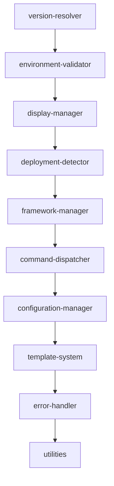

# Claude PM CLI Modules

This directory contains modularized components extracted from the monolithic `bin/claude-pm` script as part of ISS-0085 refactoring initiative.

## Architecture

The modules follow a structured approach to break down the 3,048-line monolithic script into 7 logical modules:

### Phase 1 Modules (Core - Lowest Risk)
1. **version-resolver.js** - Version resolution logic (Lines 17-102)
2. **environment-validator.js** - Environment validation and platform detection 
3. **display-manager.js** - User interface and console display logic

### Phase 2 Modules (Secondary)
4. **deployment-detector.js** - Deployment environment detection (Lines 110-649)
5. **framework-manager.js** - Framework initialization and management
6. **command-dispatcher.js** - Command parsing and routing logic

### Phase 3 Modules (Complex)
7. **configuration-manager.js** - Configuration loading and validation
8. **template-system.js** - Template deployment and management
9. **error-handler.js** - Centralized error handling
10. **utilities.js** - Shared utility functions

## Module Design Principles

### Interface Contracts
Each module exports a standard interface:
```javascript
module.exports = {
    // Primary function
    main: function(),
    
    // Configuration
    config: {},
    
    // Dependencies
    dependencies: [],
    
    // Cleanup function
    cleanup: function()
};
```

### Module Loading System
- Dynamic module loading with error handling
- Dependency injection for module communication
- Graceful fallback to monolithic behavior if modules fail

### Memory Management
- Each module implements cleanup functions
- Module-level memory monitoring
- Automatic garbage collection triggers

## Integration Testing

### Test Framework Structure
```
tests/
├── unit/              # Individual module tests
├── integration/       # Module interaction tests
├── performance/       # Memory and speed benchmarks
└── compatibility/     # Backward compatibility validation
```

### Success Criteria
- Each module under 600 lines maximum
- 90%+ test coverage for all modules
- Memory usage reduced by minimum 15%
- No breaking changes to CLI interface
- All existing functionality preserved

## Deployment Strategy

### Phase 1 (Weeks 1-3)
- Extract lowest-risk utility modules
- Implement module loading infrastructure
- Create comprehensive unit tests

### Phase 2 (Weeks 4-6)
- Extract core functionality modules
- Implement cross-module communication
- Performance optimization

### Phase 3 (Weeks 7-8)
- Extract remaining complex modules
- Full system integration testing
- Production deployment verification

## Module Dependencies



## Rollback Strategy

- Maintain monolithic version as fallback
- Feature flags for gradual module adoption
- Automated rollback triggers on failure detection
- Complete backup before any changes

---
**ISS-0085**: Modularize claude-pm script from monolithic 3,048-line file  
**Timeline**: 8 weeks (Q3 2025)  
**Target**: Memory usage <6GB, individual modules <600 lines each