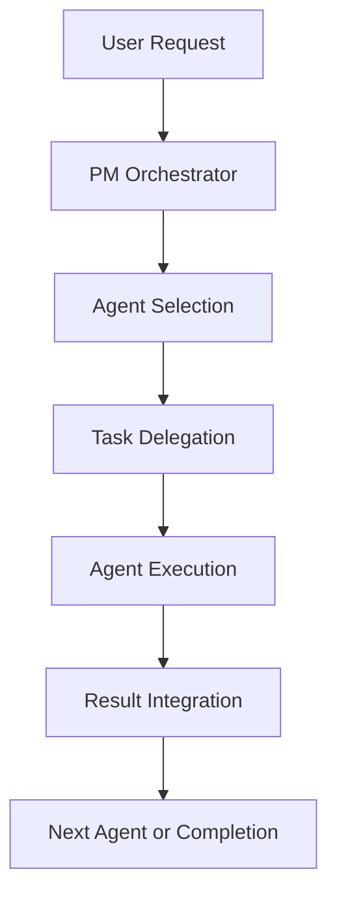

# Claude PM Framework - User Guide

[](https://www.npmjs.com/package/@bobmatnyc/claude-multiagent-pm)
[](./framework/CLAUDE.md)
[](https://nodejs.org/)
[](https://python.org/)

> **Get productive with Claude PM Framework in 30 minutes**
> 
> A comprehensive multi-agent framework that orchestrates AI-driven development workflows across teams and complex projects. This guide provides clear learning paths for beginners, practitioners, and advanced users.

---

## 📖 Guide Structure

**Progressive Learning Path with Time Estimates:**

- **Chapter 1: Quick Start** (5-10 minutes) - Get up and running immediately
- **Chapter 2: Core Concepts** (10-15 minutes) - Understand the framework fundamentals
- **Chapter 3: Common Use Cases** (20-30 minutes) - Apply the framework to real scenarios
- **Chapter 4: Working with Agents** (15-20 minutes) - Master agent orchestration patterns
- **Chapter 5: Ticketing and Project Management** (15-20 minutes) - Integrate project tracking workflows
- **Chapter 6: Advanced Features** (Optional) - Custom agent creation and optimization

**Total Learning Time: 30-60 minutes** (depending on your experience level)

---

## Chapter 1: Quick Start (5-10 minutes)

### ⚡ Immediate Setup

**Install and run in 3 commands:**

```bash
# Install globally
npm install -g @bobmatnyc/claude-multiagent-pm

# Navigate to your project
cd your-project

# Start the framework
claude-pm
```

### ✅ Verify Installation

```bash
# Check version
claude-pm --version

# Framework health check
claude-pm init --verify

# View current status
claude-pm status
```

**Expected Output:**
```bash
$ claude-pm --version
0.9.0

$ claude-pm status
✅ Framework: Operational
✅ Agents: 9 core agents loaded
✅ Project: Ready for development
```

### 🎯 Three Essential Commands

**Master these three commands for 80% of your workflow:**

1. **`push`** - Complete development pipeline
   ```bash
   push
   ```
   *What it does: Documentation → Testing → Git operations → Changelog generation*

2. **`deploy`** - Local deployment with validation
   ```bash
   deploy
   ```
   *What it does: Validates application → Health checks → Deployment readiness*

3. **`publish`** - Package publication pipeline
   ```bash
   publish
   ```
   *What it does: Package validation → Registry deployment → Publication*

### 🚀 First Success

**Try this now:**

```bash
cd your-project
claude-pm
# Ask: "What can you help me with in this project?"
```

**You're ready to move to Chapter 2 once you see the framework responding to your requests.**

---

## Chapter 2: Core Concepts (10-15 minutes)

### 🧠 Framework Philosophy

**Claude PM Framework vs Traditional Development:**

| Traditional Approach | Claude PM Framework |
|---------------------|-------------------|
| Manual testing → Manual docs → Manual review → Deploy | Coordinated agents handle testing, documentation, and review while developers focus on core logic |
| Individual developer coordination | Multi-agent orchestration with specialized expertise |
| Reactive quality checks | Proactive quality validation throughout development |

### 🏗️ Two-Tier Agent Architecture

**Simplified from three-tier to two-tier for better performance:**

1. **System Agents** (Code-Based)
   - Location: `claude_pm/agents/`
   - Built into the framework
   - Always available as fallback

2. **User Agents** (File-Based)
   - Location: Directory hierarchy with precedence
   - Customizable for your project needs
   - Higher precedence than system agents

### 🎯 Agent Discovery Precedence

**Agent selection follows this priority order:**

1. **Current Directory**: `$PWD/.claude-pm/agents/` (highest precedence)
2. **Parent Directories**: Walk up tree checking `.claude-pm/agents/`
3. **User Directory**: `~/.claude-pm/agents/`
4. **System Directory**: `claude_pm/agents/` (lowest precedence, always available)

### 🤖 Nine Core Agent Types

**Every framework deployment includes these specialized agents:**

| Agent | Nickname | Primary Role | When It's Used |
|-------|----------|--------------|----------------|
| **Documentation** | `Documenter` | Pattern analysis & operational understanding | Documentation tasks, changelog generation |
| **Ticketing** | `Ticketer` | Universal ticketing with GitHub Issues sync | Project tracking, issue management |
| **Version Control** | `Versioner` | Git operations & branch management | Git operations, version management |
| **QA** | `QA` | Testing & quality validation | Quality checks, testing workflows |
| **Research** | `Researcher` | Investigation & analysis | Research tasks, best practice analysis |
| **Ops** | `Ops` | Deployment & infrastructure | Deployment, environment setup |
| **Security** | `Security` | Security analysis & vulnerability assessment | Security audits, compliance checks |
| **Engineer** | `Engineer` | Code implementation & development | Code writing, feature implementation |
| **Data Engineer** | `Data Engineer` | Data store & AI API management | Database operations, API integrations |

### 🔄 Agent Orchestration Pattern

**How agents work together:**



**Example Multi-Agent Workflow:**
```
User: "Implement user authentication and deploy"
│
├─ Research Agent: Analyze authentication best practices
├─ Engineer Agent: Implement JWT authentication system
├─ QA Agent: Create comprehensive test suite
├─ Security Agent: Perform security audit
├─ Documentation Agent: Generate API documentation
└─ Ops Agent: Deploy to staging environment
```

### 📁 Project Structure Understanding

**Framework creates this structure:**

```
your-project/
├── .claude-pm/           # Framework configuration
│   ├── agents/           # Custom agent definitions (optional)
│   ├── config.json       # Project-specific settings
│   └── cache/            # Performance optimization data
├── docs/                 # Auto-generated documentation
├── src/                  # Your source code (unchanged)
└── README.md             # Enhanced project documentation

# Framework files (in parent directory)
../
├── CLAUDE.md             # 🚨 AUTO-GENERATED - Framework configuration
└── framework/            # Framework deployment files
```

**Key Point:** The framework adapts to YOUR existing project structure. It doesn't force you to reorganize your code.

---

## Chapter 3: Common Use Cases (20-30 minutes)

### 🌱 Use Case 1: New Project Setup

**Scenario:** Starting a new project with framework-based development patterns

**Step-by-step:**

```bash
# 1. Create and enter project directory
mkdir my-new-project
cd my-new-project

# 2. Install and initialize framework
npm install -g @bobmatnyc/claude-multiagent-pm
claude-pm init --setup

# 3. Start development with agent assistance
claude-pm
```

**Example workflow:**
```
You: "Help me set up a Node.js Express API with user authentication"

Framework Response:
├─ Research Agent: Analyzes Express.js best practices and auth patterns
├─ Engineer Agent: Creates project structure and basic Express setup
├─ Security Agent: Recommends security configurations
├─ QA Agent: Sets up testing framework (Jest/Mocha)
└─ Documentation Agent: Creates initial README and API docs
```

**Pro Tip:** Start with design documents for complex features:
> "Help me design a user authentication system with JWT tokens and role-based access control"

### 🔧 Use Case 2: Refactor Existing Project

**Scenario:** Modernizing an existing codebase with framework guidance

**Step-by-step:**

```bash
# 1. Navigate to existing project
cd existing-project

# 2. Initialize framework (non-destructive)
claude-pm init

# 3. Create refactoring branch
git checkout -b refactor/typescript-migration

# 4. Start coordinated refactoring
claude-pm
```

**Example coordinated refactoring:**
```
You: "Refactor this JavaScript project to use TypeScript with strict typing"

Multi-Agent Coordination:
├─ Research Agent: Analyzes current code patterns and TypeScript best practices
├─ Documentation Agent: Documents current architecture and migration plan
├─ Engineer Agent: Implements TypeScript configuration and gradual migration
├─ QA Agent: Validates against regressions during refactoring
├─ Version Control Agent: Manages branch strategy and incremental commits
└─ When complete: push  # Multi-agent validation before merge
```

**Advanced Refactoring Patterns:**
```bash
# Coordinate agents for systematic improvements
"Refactor files in src/components/ to use TypeScript with strict typing"
"Update all database queries to use prepared statements for security"
"Modernize authentication system to use JWT with refresh tokens"
```

### 📋 Use Case 3: Take Over Inherited Project

**Scenario:** Understanding and improving an unfamiliar codebase

**Step-by-step:**

```bash
# 1. Clone or access inherited project
cd inherited-project

# 2. Initialize framework for analysis
claude-pm init

# 3. Begin systematic analysis
claude-pm
```

**Example comprehensive analysis:**
```
You: "Help me understand this codebase and identify improvement opportunities"

Coordinated Analysis:
├─ Documentation Agent: Analyzes existing patterns and architectural decisions
├─ QA Agent: Identifies testing gaps and quality issues
├─ Security Agent: Scans for security vulnerabilities and compliance concerns
├─ Research Agent: Compares current implementation with modern best practices
├─ Ticketing Agent: Creates organized task breakdown for improvements
└─ Generates: Project analysis report with prioritized improvement recommendations
```

**Analysis Prompts:**
```
"Analyze the current authentication flow and document any security concerns"
"Identify technical debt and create a prioritized improvement roadmap"
"Document the data flow and identify potential performance bottlenecks"
```

### 🏢 Use Case 4: Monorepo Management

**Scenario:** Managing multiple packages in a single repository

**Setup and capabilities:**

```bash
# Framework automatically detects monorepo structure
cd my-monorepo
claude-pm
# AI agents understand workspace structures and cross-package dependencies
```

**Key Monorepo Features:**
- **Workspace Detection**: Automatically identifies package.json workspaces, Lerna, Rush, or Nx
- **Cross-Package Dependencies**: Tracks and validates dependencies between internal packages
- **Coordinated Testing**: Runs tests across affected packages when changes are made
- **Shared Configuration**: Manages consistent linting, formatting, and build configs
- **Release Coordination**: Handles version bumping and publishing for multiple packages

**Monorepo Examples:**
```bash
# Simple operations
"Update all packages in workspace to use TypeScript 5.0"
"Run tests for packages affected by changes in packages/shared"
"Ensure all packages follow the same ESLint configuration"

# Complex coordinated operations
git checkout -b feature/shared-utility-extraction
claude-pm
"Extract common utilities from packages/app-a and packages/app-b into packages/shared"
# Multi-agent coordination:
# ├─ Documentation Agent: Analyzes package dependencies
# ├─ QA Agent: Validates cross-package impacts
# ├─ Engineer Agent: Implements extraction and updates imports
# ├─ Ops Agent: Coordinates workspace builds
# └─ Ticketing Agent: Tracks cross-package changes
push  # Comprehensive validation across all packages
```

### 💡 Framework vs claude-flow Comparison

**When to choose Claude PM Framework:**

| Feature | Claude PM Framework | claude-flow |
|---------|-------------------|-------------|
| **Target Users** | Teams, enterprises, complex projects | Individuals, small teams, quick tasks |
| **Setup Complexity** | Comprehensive setup with agent hierarchy | Lightweight, minimal configuration |
| **Agent System** | 9 core + custom agent creation | Simple task delegation |
| **Project Scale** | Multi-repository, monorepo, enterprise | Single projects, personal workflows |
| **Customization** | Full agent customization and precedence | Basic prompt customization |
| **Integration** | Ticketing systems, CI/CD, deployment | File-based workflows |
| **Learning Curve** | Moderate (framework concepts) | Minimal (direct AI interaction) |
| **Best For** | Team coordination, complex workflows | Quick development tasks, prototyping |

**Choose Claude PM Framework when:**
- Working with teams that need coordination
- Managing complex multi-component projects
- Requiring specialized agent expertise (security, architecture, performance)
- Need integrated ticketing and project management
- Want consistent development practices across projects

---

## Chapter 4: Working with Agents (15-20 minutes)

### 🎯 Agent Prompting Patterns

**The framework automatically delegates tasks to appropriate agents, but you can also explicitly request specific agent types.**

### 📝 Documentation Agent Examples

**Pattern:** Clear documentation requests with specific deliverables

```
"Generate comprehensive API documentation for the authentication module"
"Update the README with the new deployment process"
"Create a changelog entry for the latest features"
"Analyze the current codebase patterns and create architectural documentation"
```

**What the Documentation Agent provides:**
- Project pattern analysis and architectural insights
- Auto-generated changelogs from Git commit history
- README updates and technical documentation
- Operational insights for better development practices

### 💻 Engineer Agent Examples

**Pattern:** Specific implementation requests with clear requirements

```
"Implement a JWT authentication system with refresh tokens"
"Create a React component for user profile management"
"Add error handling to the payment processing service"
"Refactor the database connection logic to use connection pooling"
```

**What the Engineer Agent provides:**
- Code writing, modification, and implementation
- Inline documentation and code comments
- Feature implementation and bug fixes
- Code that follows project conventions and standards

### 🔍 Quality Assurance Examples

**Pattern:** Quality validation and testing requests

```
"Run comprehensive tests and fix any failures"
"Perform security audit on the authentication system"
"Validate the deployment configuration"
"Set up automated testing for the new API endpoints"
```

**What the QA Agent provides:**
- Test execution and quality validation
- Code linting and standard compliance
- Deployment readiness validation
- Comprehensive quality assurance workflows

### 🔬 Research Agent Examples

**Pattern:** Investigation and analysis requests

```
"Research best practices for microservices architecture"
"Analyze the performance implications of this database design"
"Compare different authentication libraries for Node.js"
"Investigate modern React patterns for state management"
```

**What the Research Agent provides:**
- Technology research and best practice analysis
- Library and framework comparisons
- Implementation approach recommendations
- Informed decision-making support

### 🚀 Ops Agent Examples

**Pattern:** Deployment and infrastructure requests

```
"Deploy the application to staging environment"
"Set up health monitoring for the API service"
"Configure CI/CD pipeline for automated testing"
"Optimize the Docker configuration for production"
```

**What the Ops Agent provides:**
- Local and production deployment management
- Infrastructure and environment setup
- Health checks and system validation
- Deployment pipeline coordination

### 🔒 Security Agent Examples

**Pattern:** Security analysis and protection requests

```
"Audit the authentication system for security vulnerabilities"
"Scan dependencies for known security issues"
"Review the API endpoints for potential security risks"
"Implement security headers and CORS configuration"
```

**What the Security Agent provides:**
- Security vulnerability scanning and assessment
- Dependency security validation
- Security audit reports and recommendations
- Secure coding practice enforcement

### 🔢 Data Engineer Agent Examples

**Pattern:** Data management and AI API integration requests

```
"Optimize the database queries for better performance"
"Set up Redis caching for the user session data"
"Configure the OpenAI API integration with rate limiting"
"Design a data pipeline for processing user analytics"
```

**What the Data Engineer Agent provides:**
- Database, cache, and storage system management
- AI API integrations (OpenAI, Claude, etc.)
- Data pipeline design and optimization
- API key management and data analytics

### 🔗 Multi-Agent Coordination

**Pattern:** Complex requests that require multiple agent types

```
"Work with the QA agent to implement comprehensive testing for the new feature I'm about to build with the Engineer agent"

"Have the Research agent investigate GraphQL best practices, then have the Engineer agent implement those patterns"

"Coordinate with the Security agent to audit the authentication system while the Ops agent prepares the deployment"
```

**Advanced Coordination Examples:**
```
# Feature development with full pipeline
"Implement a user notification system with email and push notifications"
# Result: Research → Engineer → QA → Security → Documentation → Ops

# Systematic improvement workflow
"Analyze and improve the performance of our API endpoints"
# Result: Research → Data Engineer → Engineer → QA → Ops

# Security-focused enhancement
"Implement OAuth2 authentication with proper security measures"
# Result: Research → Security → Engineer → QA → Documentation
```

### 🎯 Context-Aware Prompting

**Pattern:** Leverage the framework's understanding of your project

```
"Based on the current project patterns, implement a user management system that follows our established architectural conventions"

"Using the team's coding standards, refactor the payment processing module"

"Analyze the recent deployment issues and implement preventive measures"
```

### ⚡ Performance Tips

**Agent Selection is Automatic:**
- The framework chooses the most appropriate agent based on your request
- Complex tasks automatically involve multiple agents in sequence
- Agents share relevant context and learnings across sessions

**99.7% Performance Improvement (v0.9.0):**
- SharedPromptCache integration for faster agent loading
- Optimized agent discovery (<100ms for typical projects)
- Real-time modification tracking for adaptive workflows

---

## Chapter 5: Ticketing and Project Management (15-20 minutes)

### 🎫 Integrated Project Tracking with ai-trackdown-tools

**The Ticketing Agent provides comprehensive project management through ai-trackdown-tools integration with GitHub Issues synchronization.**

### 🏗️ Hierarchical Organization Structure

**Epic → Issue → Task → PR Structure:**

```
Epic (EPK-001): User Authentication System
├─ Issue (ISS-001): Design authentication schema
│  ├─ Task (TSK-001): Research JWT libraries
│  ├─ Task (TSK-002): Design user schema
│  └─ PR (PR-001): Implement authentication schema
├─ Issue (ISS-002): Implement JWT middleware
│  ├─ Task (TSK-003): Write JWT token generation
│  ├─ Task (TSK-004): Add token validation middleware
│  └─ PR (PR-002): Implement JWT middleware
└─ Issue (ISS-003): Add user registration endpoint
   ├─ Task (TSK-005): Create registration validation
   ├─ Task (TSK-006): Implement password hashing
   └─ PR (PR-003): Add user registration endpoint
```

### 📋 Ticketing Agent Examples

**Pattern:** Project management and tracking requests

```
"Create an epic for the user authentication feature"
"Break down the authentication epic into issues and tasks"
"Update the status of issue ISS-001 to in-progress"
"Create a PR linked to issue ISS-001"
"Show me the current status of all tickets"
"Create a task for implementing JWT middleware under the auth issue"
"Sync the authentication issues to GitHub Issues"
"Set up GitHub Issues synchronization for this project"
```

### 🔄 Complete Ticketing Workflow

#### 1. Epic Creation and Planning

```
Request: "Create a new epic for implementing user authentication system"

Agent executes: aitrackdown epic create "User Authentication System"
Result: Epic created with ID EPK-001
```

#### 2. Issue Breakdown

```
Request: "Break down the authentication epic into specific issues"

Agent executes: 
- aitrackdown issue create "Design authentication schema" --epic EPK-001
- aitrackdown issue create "Implement JWT middleware" --epic EPK-001
- aitrackdown issue create "Add user registration endpoint" --epic EPK-001

Result: 3 issues created under EPK-001
```

#### 3. Task Management

```
Request: "Create detailed tasks for the JWT middleware issue"

Agent executes:
- aitrackdown task create "Research JWT libraries" --issue ISS-002
- aitrackdown task create "Write JWT token generation" --issue ISS-002
- aitrackdown task create "Add token validation middleware" --issue ISS-002

Result: 3 tasks created under ISS-002
```

#### 4. Development Workflow Integration

```
Request: "Update task TSK-003 to in-progress and start development"

Agent executes: 
- aitrackdown update TSK-003 --status "in-progress"
- Coordinates with Engineer agent for implementation

Result: Task status updated, development begins
```

#### 5. PR Creation and Tracking

```
Request: "Create a PR for the completed JWT middleware task"

Agent executes: 
- aitrackdown pr create "Implement JWT middleware" --task TSK-003
- Links PR to task and updates status automatically

Result: PR created and linked to task hierarchy
```

#### 6. GitHub Issues Synchronization

```
Request: "Sync the authentication issues to GitHub Issues"

Agent executes: 
- aitrackdown sync --platform github --filter "authentication"
- Automatically creates corresponding GitHub Issues with proper links

Result: Local tickets synchronized with GitHub Issues
```

#### 7. Status Monitoring

```
Request: "Show me the current status of all authentication-related tickets"

Agent executes: aitrackdown status --filter "authentication"
Displays: Hierarchical view of Epic → Issues → Tasks → PRs
Shows: Both local and GitHub Issue status
```

### 🔗 Ticketing-Driven Development

**Pattern:** Integrate development workflow with ticket tracking

```
"Create an epic for the payment processing feature, then break it down into issues and tasks using the Ticketing agent"

"Use the Ticketing agent to track the current sprint progress and update ticket statuses as the Engineer agent completes tasks"

"Coordinate with the Ticketing agent to create a PR for the completed authentication task, then have the QA agent validate it"

"Show me the ticketing hierarchy for the user management epic and create any missing tasks"
```

### 🎯 Advanced Ticketing Patterns

**Cross-Agent Integration:**
```
# Ticket-driven feature development
"Create tickets for implementing a caching layer, then coordinate Engineer and Ops agents to implement it"

# Quality-driven ticket management
"Review all open tickets and have the QA agent validate which ones are ready for testing"

# Documentation-driven ticket closure
"Generate completion documentation for all closed tickets in the authentication epic"
```

### 🔄 Platform Support

**Current and Planned Support:**

- **✅ GitHub Issues**: Full synchronization available now
- **🔄 Linear**: Coming soon
- **🔄 JIRA**: Coming soon  
- **🔄 Asana**: Coming soon

**GitHub Issues Integration Benefits:**
- Automatic synchronization between local tickets and GitHub Issues
- Maintains hierarchical relationships in both systems
- Team collaboration without switching tools
- Preserves existing GitHub workflows

### 📊 Ticket Management Best Practices

**1. Start with Epics for Major Features:**
```
"Create an epic for the entire user management system"
```

**2. Break Down into Manageable Issues:**
```
"Break down the user management epic into authentication, authorization, and user profile issues"
```

**3. Create Specific Tasks for Implementation:**
```
"Create tasks for each component of the authentication issue"
```

**4. Link PRs to Tasks:**
```
"Create a PR for the completed JWT middleware task and link it properly"
```

**5. Regular Status Updates:**
```
"Show me the current sprint progress and update any stale ticket statuses"
```

---

## Chapter 6: Advanced Features (Optional)

### 🎯 Custom Agent Creation (v0.9.0)

**Why Create Custom Agents?**
- **Domain Expertise**: Build agents that understand your specific industry or technology stack
- **Project Specialization**: Create agents for unique requirements (compliance, architecture patterns, deployment workflows)
- **Team Workflows**: Develop agents that match your team's specific development practices
- **Technology Integration**: Build agents that integrate with your specific tools and infrastructure
- **Override Defaults**: Customize core agent behavior for your project's specific needs

### 🏗️ Agent Hierarchy and Precedence

**Directory Precedence (Highest to Lowest Priority):**

1. **Current Directory**: `$PWD/.claude-pm/agents/` (highest precedence)
2. **Parent Directories**: Walk up tree checking `../.claude-pm/agents/`, `../../.claude-pm/agents/`, etc.
3. **User Home**: `~/.claude-pm/agents/` (fallback user location)
4. **System Agents**: `claude_pm/agents/` (core framework functionality, always available)

### 📁 User-Agents Directory Structure

```
$PWD/.claude-pm/agents/
├── specialized/
│   ├── performance-agent.md      # Performance optimization specialist
│   ├── architecture-agent.md     # Architecture and design patterns
│   └── integration-agent.md      # API and service integration
├── custom/
│   ├── project-manager-agent.md  # Project-specific PM agent
│   └── business-analyst-agent.md # Business requirements analysis
└── overrides/
    ├── documentation-agent.md    # Override system Documentation Agent
    └── qa-agent.md               # Override system QA Agent
```

### 📝 Custom Agent File Template

```markdown
# Performance Optimization Agent

## Agent Profile
- **Nickname**: PerfOptimizer
- **Type**: performance
- **Specializations**: ['performance', 'monitoring', 'database', 'optimization']
- **Authority**: Performance analysis, optimization recommendations, monitoring setup

## When to Use
- Database query optimization tasks
- Application performance bottlenecks
- Memory usage analysis and optimization
- Load testing and stress testing coordination
- Performance monitoring setup

## Why This Agent Exists
- Specialized knowledge in performance profiling tools
- Deep understanding of database optimization techniques
- Experience with load testing frameworks and analysis
- Focused expertise beyond general QA or Engineering agents

## Capabilities
- **Primary Role**: Application and database performance optimization
- **Tools**: Profiling tools, performance monitors, load testing frameworks
- **Specific Tasks**:
  1. **Database Optimization**: Query analysis, index optimization, schema tuning
  2. **Application Profiling**: Memory analysis, CPU optimization, bottleneck identification
  3. **Load Testing**: Stress test design, performance baseline establishment
  4. **Monitoring Setup**: Performance dashboard creation, alerting configuration
  5. **Optimization Reporting**: Performance analysis reports, improvement recommendations

## Task Tool Integration
**Standard Delegation Format:**
```
**PerfOptimizer**: [Performance optimization task]

TEMPORAL CONTEXT: Today is [date]. Apply date awareness to performance analysis and optimization priorities.

**Task**: [Specific performance work items]
1. [Performance action item 1]
2. [Performance action item 2]
3. [Performance action item 3]

**Context**: [Performance-specific context requirements]
**Authority**: [Performance optimization decision-making scope]
**Expected Results**: [Specific performance deliverables]
**Integration**: [How performance results integrate with other agents]
```

## Collaboration Patterns
- Works with QA Agent for performance testing integration
- Coordinates with Data Engineer Agent for database optimization
- Collaborates with Ops Agent for production performance monitoring
- Integrates with Engineer Agent for performance-optimized code implementation

## Performance Considerations
- Focuses on sub-100ms response time targets
- Prioritizes database query optimization
- Implements comprehensive performance monitoring
- Establishes performance baselines and regression detection
```

### 🚀 Quick Start: Creating Your First Custom Agent

**5-Minute Setup:**

```bash
# 1. Create agent directory in your project
mkdir -p .claude-pm/agents/specialized/

# 2. Create a custom agent (example: API Testing Agent)
cat > .claude-pm/agents/specialized/api-testing-agent.md << 'EOF'
# API Testing Agent

## Agent Profile
- **Nickname**: APITester
- **Type**: testing
- **Specializations**: ['api', 'testing', 'integration']
- **Authority**: API testing strategies and validation

## When to Use
- API endpoint testing and validation needed
- Integration testing between services
- API documentation and contract testing

## Why This Agent Exists
- Specialized knowledge of API testing frameworks
- Understanding of REST/GraphQL testing patterns
- Focused expertise beyond general QA testing

## Capabilities
- API endpoint testing with multiple frameworks
- Contract testing and schema validation
- Load testing for API performance
- API documentation generation and validation
EOF

# 3. Test agent discovery
python -c "from claude_pm.core.agent_registry import AgentRegistry; registry = AgentRegistry(); print('Custom agent discovered:', 'api-testing-agent' in str(registry.listAgents()))"
```

### 🔧 Agent Registry Integration (v0.9.0)

**Dynamic Agent Discovery with 99.7% Performance Improvement:**

```python
from claude_pm.core.agent_registry import AgentRegistry

# Initialize registry with SharedPromptCache integration
registry = AgentRegistry()

# List all available agents with metadata (cached for performance)
agents = registry.listAgents()

# Discover agents by specialization (optimized lookup)
performance_agents = registry.listAgents(specialization='performance')
ui_agents = registry.listAgents(specialization='ui_ux')
architecture_agents = registry.listAgents(specialization='architecture')

# Multi-specialization discovery with cache optimization
multi_spec = registry.listAgents(specializations=['integration', 'performance'])
```

### 🎯 Custom Agent Types You Can Create

**Extensible Agent System:**

- **Core 9**: Documentation, Ticketing, Version Control, QA, Research, Ops, Security, Engineer, Data Engineer
- **Architecture & Design**: Architecture, UI/UX, Design, Strategy
- **Development**: Frontend, Backend, Mobile, API, Integration
- **Operations**: Infrastructure, Deployment, Monitoring, Performance
- **Business**: PM, Product, Marketing, Business, Customer Success
- **Compliance**: Legal, Finance, Security, Compliance
- **Specialized**: Migration, Optimization, Automation, Analytics

### 🔧 Registry-Enhanced Delegation Patterns

**Dynamic Agent Selection Examples:**

```
# Performance optimization
"optimize" → Performance Agent via registry discovery (specialization: ['performance', 'monitoring'])

# Architecture design
"architect" → Architecture Agent via registry discovery (specialization: ['architecture', 'design'])

# Service integration
"integrate" → Integration Agent via registry discovery (specialization: ['integration', 'api'])

# UI/UX improvements
"ui/ux" → UI/UX Agent via registry discovery (specialization: ['ui_ux', 'design'])

# System monitoring
"monitor" → Monitoring Agent via registry discovery (specialization: ['monitoring', 'analytics'])
```

### ⚡ Performance Optimizations (v0.9.0)

**99.7% Performance Improvement Features:**

- **SharedPromptCache Integration**: Intelligent caching for faster agent loading
- **Real-Time Modification Tracking**: Monitor agent changes and adapt workflows automatically
- **Optimized Discovery**: <100ms agent discovery for typical projects
- **Cache Efficiency**: Target >95% cache hit ratios for repeated operations

**Performance Targets:**
- Agent discovery: <100ms for typical project
- Agent loading: <50ms per agent
- Registry initialization: <200ms
- Cache hit ratio: >95% for repeated queries

### 🎯 Custom Agent Best Practices

**Agent Metadata Requirements:**
- **Clear Specializations**: Use specific tags for agent discovery
- **Authority Scope**: Define what decisions the agent can make
- **Collaboration Patterns**: Specify how the agent works with others
- **Performance Profile**: Include performance considerations

**Delegation Format Standards:**
- Use consistent Task Tool delegation format
- Include temporal context for date awareness
- Provide comprehensive context filtering
- Specify expected results and integration patterns

### 🔄 Real-Time Agent Modification Tracking

**Adaptive Workflow Features:**
- Monitor agent file changes automatically
- Adapt orchestration patterns based on agent modifications
- Update agent capabilities dynamically
- Maintain performance optimization across agent changes

**Usage Example:**
```python
# Track agent changes for workflow optimization
registry = AgentRegistry()

# Get agents with modification timestamps
agents_with_tracking = registry.listAgents(include_tracking=True)

# Filter agents modified since last orchestration
recent_agents = registry.getRecentlyModified(since_timestamp)

# Update orchestration based on agent modifications
for agent_id, metadata in recent_agents.items():
    if metadata['last_modified'] > last_orchestration_time:
        # Re-evaluate agent capabilities and update workflows
        update_orchestration_patterns(agent_id, metadata)
```

---

## 📚 Quick Reference

### Essential Commands
```bash
# Installation and setup
npm install -g @bobmatnyc/claude-multiagent-pm
claude-pm init --setup
claude-pm --version

# Core workflow commands
push                    # Complete development pipeline
deploy                  # Local deployment with validation  
publish                 # Package publication

# Status and health
claude-pm status        # Current project status
claude-pm health        # Framework health check
claude-pm init --verify # Comprehensive verification
```

### Agent Prompting Quick Reference

```bash
# Documentation
"Generate API documentation for the auth module"
"Update README with deployment process"
"Create changelog for latest features"

# Code Implementation  
"Implement JWT authentication with refresh tokens"
"Create React component for user profiles"
"Add error handling to payment service"

# Quality Assurance
"Run comprehensive tests and fix failures"
"Perform security audit on auth system"
"Validate deployment configuration"

# Research & Analysis
"Research microservices best practices"
"Compare Node.js authentication libraries"
"Analyze database design performance implications"

# Deployment & Operations
"Deploy to staging environment"
"Set up health monitoring"
"Configure CI/CD pipeline"

# Project Management
"Create epic for user authentication"
"Break down auth epic into issues and tasks"
"Sync issues to GitHub Issues"
"Show current ticket status"
```

### Multi-Agent Coordination Patterns

```bash
# Feature development pipeline
"Implement user notifications with email and push"
# Research → Engineer → QA → Security → Documentation → Ops

# Performance optimization workflow  
"Analyze and improve API endpoint performance"
# Research → Data Engineer → Engineer → QA → Ops

# Security enhancement workflow
"Implement OAuth2 with proper security measures"
# Research → Security → Engineer → QA → Documentation
```

### Directory Structure Quick Reference

```
your-project/
├── .claude-pm/
│   ├── agents/           # Custom agents (optional)
│   └── config.json       # Project settings
├── docs/                 # Auto-generated docs
├── src/                  # Your code (unchanged)
└── README.md             # Enhanced documentation

# Framework files (parent directory)
../CLAUDE.md              # Auto-generated framework config
```

---

## 🎉 Next Steps

**You're now ready to use Claude PM Framework effectively!**

### Immediate Actions
1. **Try the three essential commands**: `push`, `deploy`, `publish`
2. **Experiment with agent prompting**: Start with simple requests and observe agent coordination
3. **Set up ticketing workflow**: Create your first epic and break it into issues

### Learning Path
- **Beginner**: Focus on Chapters 1-3, master the three essential commands
- **Practitioner**: Add Chapters 4-5, learn agent coordination and project management
- **Advanced**: Include Chapter 6, create custom agents for your specific needs

### Resources
- **📖 Comprehensive Documentation**: [Framework Guide](../framework/CLAUDE.md)
- **🚀 Quick Start**: [QUICKSTART.md](./QUICKSTART.md)
- **🔧 Development Guide**: [Project CLAUDE.md](../CLAUDE.md)
- **📋 GitHub Issues**: Report bugs and request features
- **🤝 Community**: Join the development community

### Support and Community
- **GitHub Repository**: [claude-multiagent-pm](https://github.com/bobmatnyc/claude-multiagent-pm)
- **Issue Tracking**: Use GitHub Issues for bug reports and feature requests
- **Contributing**: Fork, create feature branches, submit pull requests

---

**Framework Version: 0.9.0**  
**Guide Version: 1.0.0**  
**Last Updated: 2025-07-16**

*Get productive in 30 minutes, master the framework in 60 minutes, customize for your team's needs with advanced features.*