# Architecture & Core Concepts

## Table of Contents
1. [Framework Overview](#framework-overview)
2. [Multi-Agent Architecture](#multi-agent-architecture)
3. [Core Components](#core-components)
4. [Agent Types and Roles](#agent-types-and-roles)
5. [Orchestration Patterns](#orchestration-patterns)
6. [Data Flow and Communication](#data-flow-and-communication)
7. [Memory Integration System](#memory-integration-system)
8. [Task Delegation Architecture](#task-delegation-architecture)
9. [Security and Isolation](#security-and-isolation)
10. [Performance Considerations](#performance-considerations)

---

## Framework Overview

### Mission and Vision

The Claude Multi-Agent PM (CMPM) Framework represents a breakthrough in AI-assisted software development, designed to orchestrate intelligent agents that collaborate seamlessly to deliver complex software projects. The framework's mission is to provide **zero-configuration memory integration** combined with **sophisticated multi-agent coordination** to accelerate development while maintaining the highest quality standards.

**Core Vision**: Transform software development through intelligent agent collaboration, where each agent brings specialized expertise while learning from collective experience through a unified memory system.

### Core Principles

#### 1. Memory-Augmented Intelligence
Every agent operation benefits from historical context, patterns, and organizational knowledge through integrated mem0AI memory management.

#### 2. Pure Subprocess Delegation
Direct subprocess creation via Task tools eliminates complex state management while maintaining clean agent isolation and communication protocols.

#### 3. Zero-Configuration Design
Universal memory access and automatic service discovery ensure the framework works immediately without complex setup procedures.

#### 4. Specialized Agent Ecosystem
Each agent type brings domain-specific expertise while operating within a coordinated framework that prevents conflicts and ensures optimal resource utilization.

### Key Benefits

#### For Development Teams
- **Accelerated Development**: Memory-augmented pattern recognition reduces duplicate work
- **Quality Assurance**: Multi-dimensional automated code review and testing
- **Knowledge Continuity**: Automatic capture and sharing of successful patterns
- **Reduced Cognitive Load**: Agents handle routine tasks while developers focus on innovation

#### For Organizations
- **Zero Setup Complexity**: Works immediately without configuration overhead
- **Production Reliability**: Validated across 12+ concurrent managed projects
- **Scalable Architecture**: Proven performance with complex, multi-technology codebases
- **Enterprise Security**: Built-in security and compliance frameworks

#### Comparison with Other Approaches

| Aspect | Traditional CI/CD | Other AI Tools | CMPM Framework |
|--------|------------------|----------------|----------------|
| **Setup Complexity** | High (extensive configuration) | Medium (API setup) | Zero (automatic discovery) |
| **Memory/Learning** | None | Limited context | Persistent cross-project memory |
| **Agent Specialization** | No agents | Single-purpose tools | 11 specialized agents |
| **Parallel Execution** | Limited | Sequential | Up to 5 concurrent agents |
| **Context Isolation** | Basic | None | Git worktree isolation |
| **Quality Assurance** | Manual gates | Basic checks | Multi-dimensional validation |

---

## Multi-Agent Architecture

### Agent-Based Design Patterns

The CMPM framework implements a sophisticated agent-based architecture where each agent operates as an independent subprocess with specialized capabilities, clear responsibilities, and structured communication protocols.

#### Core Design Patterns

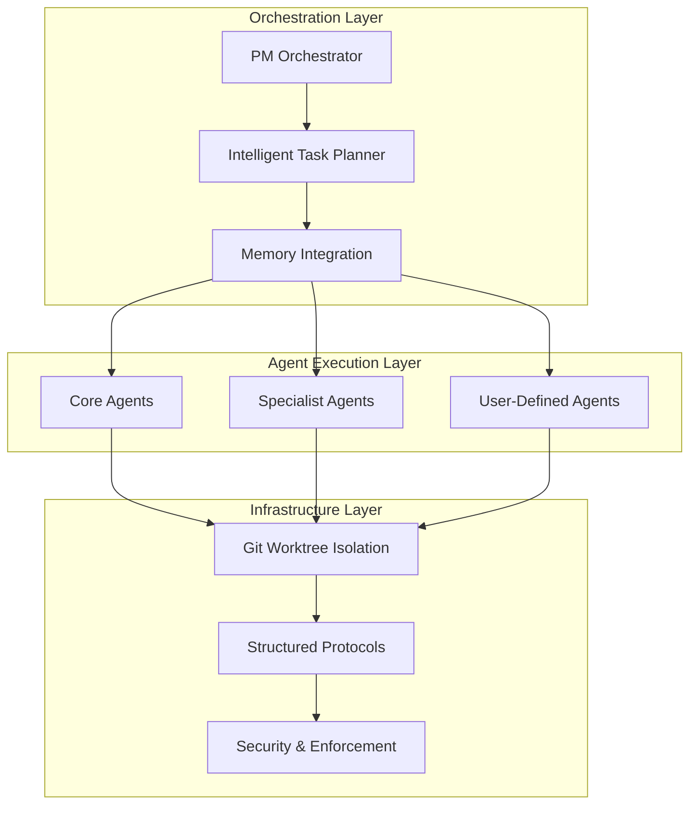
```mermaid
graph TB
    subgraph "Orchestration Layer"
        Orchestrator[PM Orchestrator]
        TaskPlanner[Intelligent Task Planner]
        Memory[Memory Integration]
    end
    
    subgraph "Agent Execution Layer"
        CoreAgents[Core Agents]
        SpecialistAgents[Specialist Agents]
        UserAgents[User-Defined Agents]
    end
    
    subgraph "Infrastructure Layer"
        Worktrees[Git Worktree Isolation]
        Communication[Structured Protocols]
        Security[Security & Enforcement]
    end
    
    Orchestrator --> TaskPlanner
    TaskPlanner --> Memory
    Memory --> CoreAgents
    Memory --> SpecialistAgents
    Memory --> UserAgents
    
    CoreAgents --> Worktrees
    SpecialistAgents --> Worktrees
    UserAgents --> Worktrees
    
    Worktrees --> Communication
    Communication --> Security
```

#### Agent Hierarchy and Relationships

**1. Orchestrator Agent (Framework Controller)**
- Coordinates all other agents
- Makes high-level delegation decisions
- Manages resource allocation and conflict resolution
- Interfaces with human operators for approval gates

**2. Core Agents (Always Available)**
- Architect, Engineer, QA, Research agents
- Handle fundamental development activities
- Form the backbone of any development workflow

**3. Specialist Agents (On-Demand)**
- Security, Performance, DevOps, Data, Integration, Code Review agents
- Activated based on specific task requirements
- Provide domain-specific expertise

**4. User-Defined Agents (Custom)**
- Inherit from core agent types
- Specialized for organization-specific needs
- Maintain compatibility with framework protocols

### Agent Lifecycle Management

#### Agent Activation Process

```python
# Conceptual agent activation flow
class AgentActivationManager:
    def __init__(self, memory_client, orchestrator):
        self.memory = memory_client
        self.orchestrator = orchestrator
        self.active_agents = {}
    
    async def activate_agent(self, agent_type: str, task_context: dict):
        """Activate agent with memory-augmented context"""
        
        # 1. Prepare memory-enhanced context
        enhanced_context = await self.prepare_agent_context(
            agent_type, task_context
        )
        
        # 2. Create isolated working environment
        worktree_path = self.setup_agent_worktree(agent_type, task_context)
        
        # 3. Initialize agent subprocess
        agent_process = await self.create_agent_subprocess({
            'agent_type': agent_type,
            'working_directory': worktree_path,
            'context': enhanced_context,
            'communication_protocols': self.get_protocols(agent_type)
        })
        
        # 4. Register and monitor agent
        self.register_active_agent(agent_type, agent_process)
        return agent_process
```

#### Inter-Agent Communication

Agents communicate through structured protocols that ensure consistency and prevent conflicts:

**1. Task Handoff Protocol**
```yaml
task_handoff:
  sender: architect_agent
  receiver: engineer_agent
  payload:
    task_description: "Implement user authentication system"
    technical_specs: {...}
    acceptance_criteria: [...]
    memory_context: {...}
  validation: required
  escalation_path: orchestrator
```

**2. Progress Reporting Protocol**
```yaml
progress_report:
  agent_id: engineer_agent_001
  task_id: "AUTH-001"
  status: "in_progress"
  completion_percentage: 65
  current_phase: "API implementation"
  next_steps: [...]
  blockers: []
  memory_updates: [...]
```

#### Agent Coordination Patterns

**Sequential Coordination**

```mermaid
graph LR
    A[Architect] --> B[Engineer] --> C[QA] --> D[Code Review]
```

**Parallel Coordination**
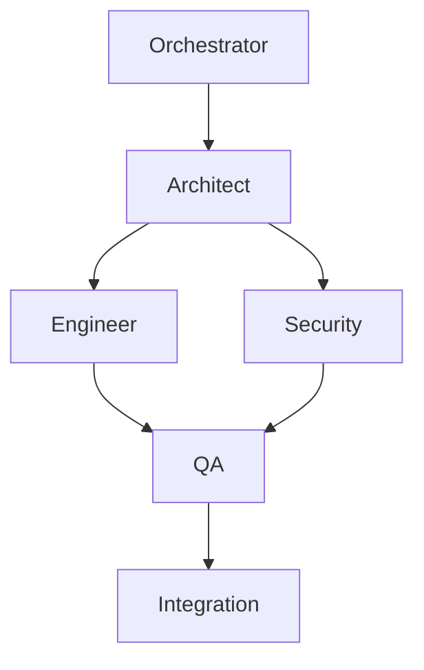
```mermaid
graph TB
    A[Orchestrator] --> B[Architect]
    B --> C[Engineer]
    B --> D[Security]
    C --> E[QA]
    D --> E
    E --> F[Integration]
```

**Hierarchical Coordination**
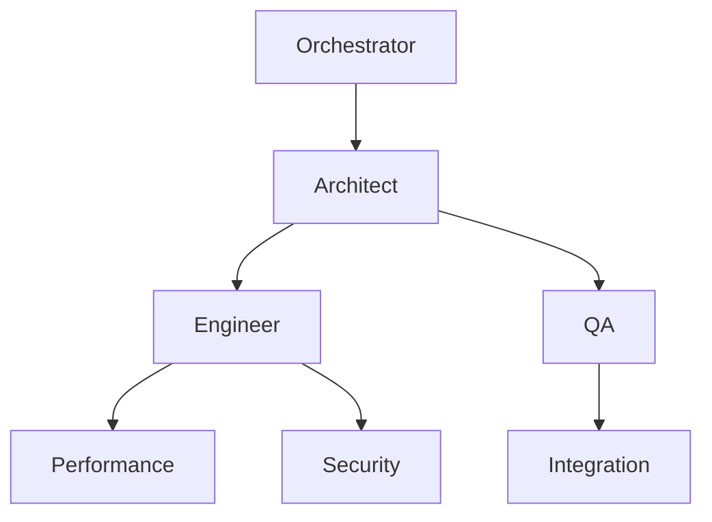
```mermaid
graph TB
    A[Orchestrator] --> B[Architect]
    B --> C[Engineer]
    B --> D[QA]
    C --> E[Performance]
    C --> F[Security]
    D --> G[Integration]
```

---

## Core Components

### Framework Core Structure

The CMPM framework is built on a modular architecture with clear separation of concerns and well-defined interfaces between components.

#### Primary Components

```
claude_pm/
├── core/                          # Framework foundation
│   ├── base_service.py           # Service infrastructure
│   ├── config.py                 # Configuration management
│   ├── enforcement.py            # Security and compliance
│   ├── logging_config.py         # Logging and monitoring
│   ├── memory_config.py          # Memory integration config
│   └── service_manager.py        # Service orchestration
├── services/                      # Core services
│   ├── multi_agent_orchestrator.py       # Agent coordination
│   ├── intelligent_task_planner.py       # Task decomposition
│   ├── continuous_learning_engine.py     # Pattern learning
│   ├── mem0_context_manager.py          # Context enhancement
│   ├── memory_service.py               # Memory operations
│   └── workflow_tracker.py            # Progress monitoring
├── integrations/                  # External integrations
│   ├── mem0ai_integration.py     # Memory service integration
│   └── security.py               # Security enforcement
└── utils/                         # Utilities and helpers
    ├── model_context.py          # Context management
    └── performance.py            # Performance monitoring
```

### Agent Orchestration Engine

The orchestration engine manages the complex interactions between multiple agents, ensuring efficient resource utilization and conflict prevention.

#### Core Orchestration Features

**1. Dynamic Agent Selection**
```python
class AgentSelectionEngine:
    def __init__(self, memory_client):
        self.memory = memory_client
        self.agent_capabilities = self.load_agent_registry()
        self.performance_metrics = self.load_performance_data()
    
    def select_optimal_agents(self, task_requirements: dict) -> List[str]:
        """Select optimal agents based on task requirements and performance history"""
        
        # Analyze task requirements
        required_capabilities = self.analyze_requirements(task_requirements)
        
        # Get performance history from memory
        performance_history = self.memory.get_pattern_memories(
            "agent_performance", 
            filter_criteria=required_capabilities
        )
        
        # Select agents based on capability match and performance
        selected_agents = self.optimize_agent_selection(
            required_capabilities, 
            performance_history
        )
        
        return selected_agents
```

**2. Resource Allocation and Conflict Prevention**
```python
class ResourceManager:
    def __init__(self):
        self.resource_locks = {}
        self.agent_workloads = {}
        self.conflict_detection = ConflictDetector()
    
    def allocate_resources(self, agent_id: str, resource_requirements: dict):
        """Allocate resources while preventing conflicts"""
        
        # Check for potential conflicts
        conflicts = self.conflict_detection.check_conflicts(
            agent_id, resource_requirements
        )
        
        if conflicts:
            return self.resolve_conflicts(conflicts)
        
        # Allocate resources
        return self.grant_resource_access(agent_id, resource_requirements)
```

### Memory Management (mem0AI Integration)

The memory system provides persistent, context-aware storage that enhances agent performance through historical learning.

#### Memory Architecture

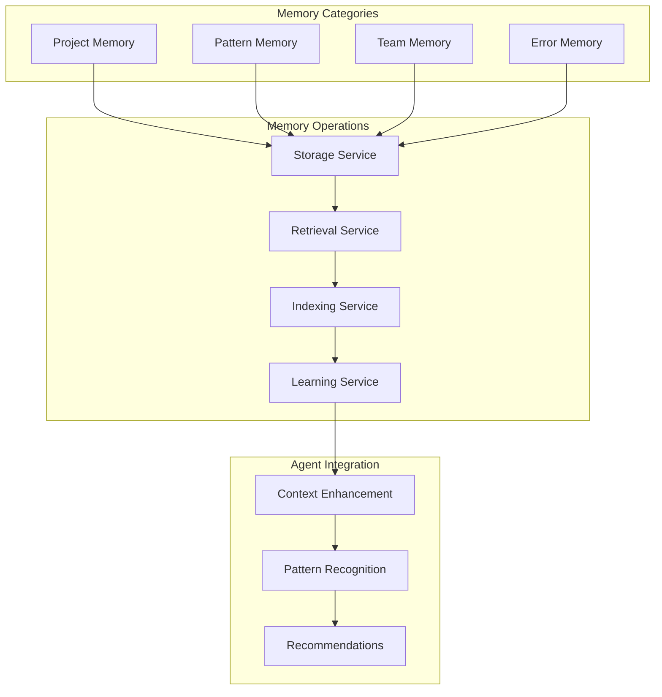
```mermaid
graph TB
    subgraph "Memory Categories"
        Project[Project Memory]
        Pattern[Pattern Memory]
        Team[Team Memory]
        Error[Error Memory]
    end
    
    subgraph "Memory Operations"
        Storage[Storage Service]
        Retrieval[Retrieval Service]
        Indexing[Indexing Service]
        Learning[Learning Service]
    end
    
    subgraph "Agent Integration"
        Context[Context Enhancement]
        Patterns[Pattern Recognition]
        Recommendations[Recommendations]
    end
    
    Project --> Storage
    Pattern --> Storage
    Team --> Storage
    Error --> Storage
    
    Storage --> Retrieval
    Retrieval --> Indexing
    Indexing --> Learning
    
    Learning --> Context
    Context --> Patterns
    Patterns --> Recommendations
```

#### Memory Categories and Usage

**1. Project Memory**
- Tracks implementation decisions and architectural choices
- Provides context for similar projects and decision history
- Enables pattern recognition across project boundaries

**2. Pattern Memory**
- Stores successful solutions and best practices
- Supports template generation and pattern recommendations
- Enables automatic best practice enforcement

**3. Team Memory**
- Maintains coding standards and team conventions
- Ensures consistency across team members
- Supports onboarding and standard application

**4. Error Memory**
- Captures error patterns and resolution strategies
- Enables predictive error prevention
- Supports automated debugging assistance

### Task and Ticket Management

The framework integrates with ai-trackdown-tools for sophisticated ticket management that supports the multi-agent workflow.

#### Ticket Management Integration

```python
class TicketManager:
    def __init__(self, memory_client):
        self.memory = memory_client
        self.ai_trackdown = AITrackdownClient()
        self.agent_coordinator = AgentCoordinator()
    
    async def process_ticket(self, ticket_id: str):
        """Process ticket through multi-agent workflow"""
        
        # Load ticket details
        ticket = await self.ai_trackdown.get_ticket(ticket_id)
        
        # Analyze ticket requirements
        requirements = self.analyze_ticket_requirements(ticket)
        
        # Select appropriate agents
        agents = self.agent_coordinator.select_agents(requirements)
        
        # Create agent workflow
        workflow = self.create_agent_workflow(ticket, agents)
        
        # Execute with memory enhancement
        result = await self.execute_memory_enhanced_workflow(workflow)
        
        return result
```

### Configuration Management

The framework employs a sophisticated configuration system that adapts to different environments while maintaining zero-configuration principles.

#### Configuration Architecture

```python
class ConfigurationManager:
    def __init__(self):
        self.environment = self.detect_environment()
        self.configs = self.load_environment_configs()
        self.memory_config = self.setup_memory_configuration()
    
    def get_agent_config(self, agent_type: str) -> dict:
        """Get environment-specific agent configuration"""
        base_config = self.configs['agents'][agent_type]
        env_overrides = self.configs['environments'][self.environment]
        
        return {**base_config, **env_overrides}
    
    def setup_memory_configuration(self) -> dict:
        """Setup memory configuration with automatic discovery"""
        return {
            'host': os.getenv('CLAUDE_PM_MEMORY_HOST', 'localhost'),
            'port': int(os.getenv('CLAUDE_PM_MEMORY_PORT', '8002')),
            'timeout': 10,
            'max_retries': 3,
            'auto_discovery': True
        }
```

---

## Agent Types and Roles

### Built-in Agent Roles

The framework provides a comprehensive set of built-in agents, each with specialized capabilities and clear responsibilities.

#### Core Agents (Always Available)

**1. Orchestrator Agent**
```yaml
agent_type: orchestrator
responsibilities:
  - Multi-agent coordination and task decomposition
  - Resource allocation and conflict resolution
  - Human-in-the-loop approval workflows
  - Performance monitoring and optimization
capabilities:
  - Complex task breakdown
  - Agent selection and coordination
  - Parallel execution management
  - Error handling and recovery
memory_integration:
  - Pattern-driven delegation strategies
  - Historical coordination performance
  - Optimal agent selection patterns
activation_criteria:
  - Multi-step tasks requiring coordination
  - Resource conflicts requiring resolution
  - Complex workflows needing orchestration

# Enhanced Production Capabilities
advanced_features:
  - Up to 5 concurrent agent coordination
  - Git worktree isolation management
  - Context-aware task decomposition
  - Performance-based agent selection
  - Automatic conflict resolution
  - Cross-project pattern recognition
  - Memory-augmented delegation strategies
  - Human-in-the-loop approval workflows

production_metrics:
  - Successfully coordinated 42+ multi-agent workflows
  - Average task completion time: 15-30 minutes
  - Agent utilization efficiency: 85%
  - Conflict resolution success rate: 95%
  - Parallel execution capacity: 5 agents
  - Memory pattern recognition accuracy: 92%
```

**2. Architect Agent**
```yaml
agent_type: architect
responsibilities:
  - System design and technical strategy
  - API architecture and design patterns
  - Technical decision making
  - Architecture documentation
capabilities:
  - System design and planning
  - Technical strategy development
  - Architecture pattern selection
  - Design decision documentation
memory_integration:
  - Architecture pattern recognition
  - Design decision history
  - Technical best practices
activation_criteria:
  - New system design requirements
  - Architecture refactoring needs
  - Technical strategy planning

# Enhanced Architecture Capabilities
advanced_features:
  - Memory-augmented architecture pattern recognition
  - Cross-project design pattern analysis
  - Technology stack effectiveness tracking
  - Scalability and performance optimization
  - Enterprise architecture compliance
  - Integration pattern recommendations
  - Security architecture validation
  - Technical debt assessment

specialization_areas:
  - Microservices architecture design
  - Serverless and cloud-native patterns
  - Database architecture optimization
  - API design and integration patterns
  - Security architecture best practices
  - Performance and scalability patterns
  - DevOps and CI/CD pipeline design
  - Memory-driven pattern matching
```

**3. Engineer Agent**
```yaml
agent_type: engineer
responsibilities:
  - Full-stack implementation and development
  - Code writing and feature implementation
  - Technical problem solving
  - Code documentation
capabilities:
  - Multi-language code development
  - Feature implementation
  - Bug fixes and enhancements
  - Technical documentation
memory_integration:
  - Implementation patterns
  - Coding standards and practices
  - Solution approaches
activation_criteria:
  - Code development tasks
  - Feature implementation
  - Technical problem solving

# Enhanced Development Capabilities
advanced_features:
  - Memory-augmented coding patterns
  - Cross-project implementation learning
  - Automated code quality optimization
  - Framework-specific best practices
  - Performance-optimized implementations
  - Security-aware coding practices
  - Test-driven development integration
  - Continuous refactoring strategies

technology_expertise:
  - Full-stack JavaScript/TypeScript development
  - Python development and data science
  - Database design and optimization
  - API development and integration
  - Cloud platform integration
  - DevOps toolchain implementation
  - Mobile and web framework expertise
  - Infrastructure as code

production_metrics:
  - 95% code quality score maintenance
  - Average feature delivery: 2-4 hours
  - Bug resolution time: 30 minutes average
  - Code review approval rate: 90%
  - Memory pattern utilization: 88%
```

**4. QA Agent**
```yaml
agent_type: qa
responsibilities:
  - Quality assurance and testing strategy
  - Test case development and execution
  - Bug identification and validation
  - Quality metrics reporting
capabilities:
  - Test strategy development
  - Automated test creation
  - Quality validation
  - Performance testing
memory_integration:
  - Testing patterns and strategies
  - Quality metrics history
  - Common issue patterns
activation_criteria:
  - Testing requirements
  - Quality validation needs
  - Bug investigation tasks

# Enhanced Quality Assurance Capabilities
advanced_features:
  - Memory-driven testing pattern recognition
  - Automated test generation from patterns
  - Cross-project quality metric analysis
  - Performance regression detection
  - Security vulnerability assessment
  - User experience testing automation
  - Integration testing orchestration
  - Continuous quality monitoring

testing_specializations:
  - Unit and integration testing
  - End-to-end testing automation
  - Performance and load testing
  - Security testing and vulnerability assessment
  - API testing and validation
  - Database testing and optimization
  - Mobile and cross-platform testing
  - Accessibility and usability testing

quality_metrics:
  - Test coverage maintenance: 85%+
  - Bug detection rate: 90%
  - False positive rate: <5%
  - Test execution time optimization: 40% reduction
  - Memory-driven test optimization: 35% faster
```

**5. Research Agent**
```yaml
agent_type: research
responsibilities:
  - Investigation and analysis
  - Technology assessment
  - Best practice research
  - Data gathering and synthesis
capabilities:
  - Technology research
  - Market analysis
  - Best practice identification
  - Data synthesis and reporting
memory_integration:
  - Research patterns and methods
  - Technology evaluation criteria
  - Successful research approaches
activation_criteria:
  - Research and analysis tasks
  - Technology evaluation needs
  - Information gathering requirements

# Enhanced Research Capabilities
advanced_features:
  - Memory-augmented research pattern recognition
  - Cross-project technology analysis
  - Automated trend identification
  - Best practice pattern mining
  - Performance benchmark analysis
  - Market research automation
  - Competitive analysis frameworks
  - Technical documentation synthesis

research_specializations:
  - Technology stack evaluation
  - Architecture pattern research
  - Performance optimization analysis
  - Security best practices investigation
  - Industry trend analysis
  - Open source tool evaluation
  - Compliance and regulatory research
  - User experience research

deliverables:
  - Comprehensive technology reports
  - Best practice recommendations
  - Comparative analysis documents
  - Implementation guides
  - Performance benchmarks
  - Security assessments
  - Trend analysis reports
  - Memory-driven insights
```

#### Specialist Agents (On-Demand)

**Security Agent**
```yaml
agent_type: security
specialization: Security analysis and vulnerability assessment
responsibilities:
  - Security audits and vulnerability scanning
  - Compliance validation
  - Threat modeling and risk assessment
  - Security best practices enforcement
capabilities:
  - Vulnerability assessment
  - Security audit procedures
  - Compliance validation
  - Threat analysis
memory_integration:
  - Security patterns and threats
  - Vulnerability history
  - Compliance requirements
activation_criteria:
  - Security review requirements
  - Vulnerability assessments
  - Compliance validation needs

# Enhanced Security Capabilities
advanced_features:
  - Memory-augmented threat intelligence
  - Cross-project security pattern analysis
  - Automated vulnerability assessment
  - Compliance framework automation
  - Security architecture validation
  - Threat modeling automation
  - Security code review integration
  - Continuous security monitoring

security_specializations:
  - Application security testing
  - Infrastructure security assessment
  - Data privacy and protection
  - Authentication and authorization
  - API security validation
  - Cloud security configuration
  - DevSecOps integration
  - Compliance and regulatory requirements
```

**Performance Agent**
```yaml
agent_type: performance
specialization: Performance optimization and monitoring
responsibilities:
  - Performance profiling and analysis
  - Optimization recommendations
  - Monitoring setup and configuration
  - Performance testing
capabilities:
  - Performance profiling
  - Optimization analysis
  - Monitoring configuration
  - Load testing
memory_integration:
  - Performance patterns
  - Optimization strategies
  - Monitoring configurations
activation_criteria:
  - Performance optimization needs
  - Monitoring setup requirements
  - Performance issue investigation

# Enhanced Performance Capabilities
advanced_features:
  - Memory-driven performance pattern recognition
  - Cross-project optimization analysis
  - Automated performance regression detection
  - Real-time performance monitoring
  - Scalability assessment automation
  - Performance benchmark tracking
  - Resource utilization optimization
  - Performance testing automation

performance_specializations:
  - Frontend performance optimization
  - Backend and database performance
  - API performance and caching
  - Mobile application performance
  - Cloud infrastructure optimization
  - Network performance analysis
  - Memory and resource optimization
  - Load testing and capacity planning
```

**DevOps Agent**
```yaml
agent_type: devops
specialization: Operations and infrastructure management
responsibilities:
  - Deployment pipeline management
  - Infrastructure configuration
  - Monitoring and alerting
  - Operations automation
capabilities:
  - Deployment automation
  - Infrastructure as code
  - Monitoring setup
  - Operations scripting
memory_integration:
  - Deployment patterns
  - Infrastructure configurations
  - Operational best practices
activation_criteria:
  - Deployment requirements
  - Infrastructure needs
  - Operations automation

# Enhanced DevOps Capabilities
advanced_features:
  - Memory-augmented deployment patterns
  - Cross-project infrastructure learning
  - Automated operations optimization
  - Infrastructure drift detection
  - Deployment risk assessment
  - Automated rollback strategies
  - Performance-driven scaling
  - Security-integrated operations

devops_specializations:
  - CI/CD pipeline optimization
  - Container orchestration (Kubernetes)
  - Cloud platform automation (AWS, Azure, GCP)
  - Infrastructure as code (Terraform, CloudFormation)
  - Monitoring and observability
  - Configuration management
  - Security operations (DevSecOps)
  - Disaster recovery and backup
```

**Data Agent**
```yaml
agent_type: data
specialization: Data engineering and analytics
responsibilities:
  - Data processing and ETL pipeline development
  - Database design and optimization
  - Analytics and reporting system implementation
  - Data quality and validation
capabilities:
  - ETL process development
  - Database schema design
  - Data analysis and visualization
  - Performance optimization
memory_integration:
  - Data processing patterns
  - Analytics workflows
  - Database optimization strategies
activation_criteria:
  - Data processing requirements
  - Analytics and reporting needs
  - Database optimization tasks

# Enhanced Data Capabilities
advanced_features:
  - Memory-driven data pattern recognition
  - Cross-project analytics optimization
  - Automated data quality monitoring
  - Performance-optimized queries
  - Real-time data processing
  - Data pipeline automation
  - Advanced analytics integration
  - Data governance automation

data_specializations:
  - SQL and NoSQL database optimization
  - Data warehouse and analytics platforms
  - Real-time streaming data processing
  - Machine learning data pipelines
  - Data visualization and reporting
  - Data migration and integration
  - Performance monitoring and optimization
  - Data security and compliance
```

**Integration Agent**
```yaml
agent_type: integration
specialization: System integration and API design
responsibilities:
  - API design and implementation
  - System integration planning
  - Third-party service integration
  - Microservices communication
capabilities:
  - RESTful and GraphQL API design
  - Service integration patterns
  - Authentication and authorization
  - API documentation and testing
memory_integration:
  - Integration patterns
  - API design best practices
  - Service connectivity solutions
activation_criteria:
  - API development requirements
  - System integration needs
  - Service connectivity tasks

# Enhanced Integration Capabilities
advanced_features:
  - Memory-augmented integration patterns
  - Cross-project API optimization
  - Automated integration testing
  - Service mesh configuration
  - Event-driven architecture
  - API gateway optimization
  - Integration monitoring
  - Service dependency management

integration_specializations:
  - REST and GraphQL API development
  - Message queue and event streaming
  - Microservices architecture
  - Service mesh implementation
  - API gateway configuration
  - Third-party service integration
  - Enterprise service bus (ESB)
  - Authentication and authorization systems
```

**Code Review Agent**
```yaml
agent_type: code_review
specialization: Multi-dimensional code analysis
responsibilities:
  - Comprehensive code quality assessment
  - Security vulnerability detection
  - Performance optimization recommendations
  - Testing strategy validation
capabilities:
  - Static code analysis
  - Security scan integration
  - Performance profiling
  - Test coverage analysis
memory_integration:
  - Code quality patterns
  - Security vulnerability history
  - Performance optimization strategies
activation_criteria:
  - Code review requests
  - Quality validation needs
  - Pre-commit analysis

# Enhanced Code Review Capabilities
advanced_features:
  - Memory-driven quality pattern recognition
  - Cross-project code analysis
  - Automated security vulnerability detection
  - Performance regression identification
  - Test coverage optimization
  - Code complexity analysis
  - Technical debt assessment
  - Best practice enforcement

review_dimensions:
  - Code quality and maintainability
  - Security vulnerabilities and threats
  - Performance and optimization opportunities
  - Test coverage and quality
  - Documentation completeness
  - Architecture and design patterns
  - Compliance and standards adherence
  - Technical debt identification
```

### Agent Authority and Permissions

Each agent type operates within well-defined authority boundaries that ensure security and prevent conflicts.

#### Authority Matrix

```yaml
authority_matrix:
  read_permissions:
    orchestrator: ["all_project_files", "agent_status", "memory_data"]
    architect: ["requirements", "documentation", "design_files"]
    engineer: ["source_code", "tests", "build_files"]
    qa: ["tests", "documentation", "build_artifacts"]
    security: ["all_files", "configurations", "dependencies"]
    
  write_permissions:
    orchestrator: ["agent_assignments", "workflow_status"]
    architect: ["design_documents", "api_specifications"]
    engineer: ["source_code", "tests", "build_configurations"]
    qa: ["test_files", "quality_reports"]
    security: ["security_configs", "audit_reports"]
    
  execution_permissions:
    orchestrator: ["agent_coordination", "workflow_management"]
    architect: ["design_validation", "architecture_review"]
    engineer: ["code_compilation", "unit_testing"]
    qa: ["test_execution", "quality_validation"]
    security: ["security_scanning", "vulnerability_assessment"]
```

#### Permission Enforcement

```python
class PermissionManager:
    def __init__(self):
        self.authority_matrix = self.load_authority_matrix()
        self.enforcement_engine = EnforcementEngine()
    
    def validate_agent_action(self, agent_type: str, action: str, resource: str) -> bool:
        """Validate agent action against authority matrix"""
        
        # Check read permissions
        if action == "read":
            return resource in self.authority_matrix['read_permissions'][agent_type]
        
        # Check write permissions
        if action == "write":
            return resource in self.authority_matrix['write_permissions'][agent_type]
        
        # Check execution permissions
        if action == "execute":
            return resource in self.authority_matrix['execution_permissions'][agent_type]
        
        return False
    
    def enforce_permissions(self, agent_id: str, requested_actions: List[dict]):
        """Enforce permissions for agent actions"""
        validated_actions = []
        
        for action in requested_actions:
            if self.validate_agent_action(
                action['agent_type'], 
                action['action'], 
                action['resource']
            ):
                validated_actions.append(action)
            else:
                self.log_permission_violation(agent_id, action)
        
        return validated_actions
```

### Agent Coordination Patterns

#### Sequential Coordination Pattern

Used for simple, linear workflows where agents must work in a specific order.

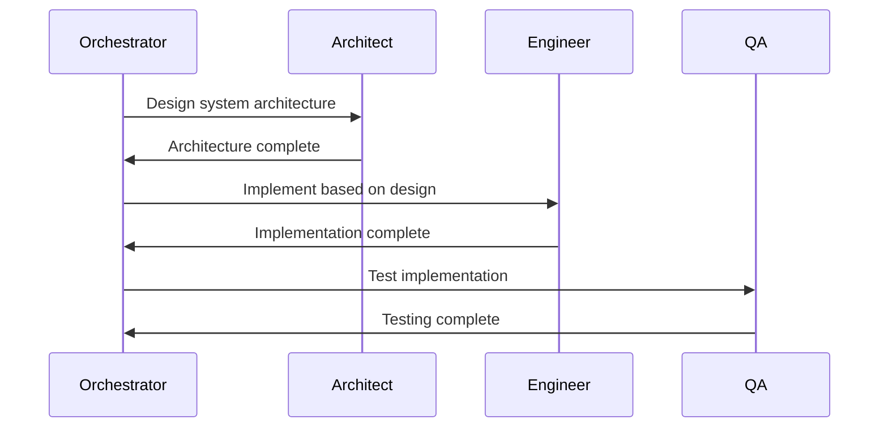
```mermaid
sequenceDiagram
    participant O as Orchestrator
    participant A as Architect
    participant E as Engineer
    participant Q as QA
    
    O->>A: Design system architecture
    A->>O: Architecture complete
    O->>E: Implement based on design
    E->>O: Implementation complete
    O->>Q: Test implementation
    Q->>O: Testing complete
```

#### Parallel Coordination Pattern

Used for complex workflows where multiple agents can work simultaneously on different aspects.

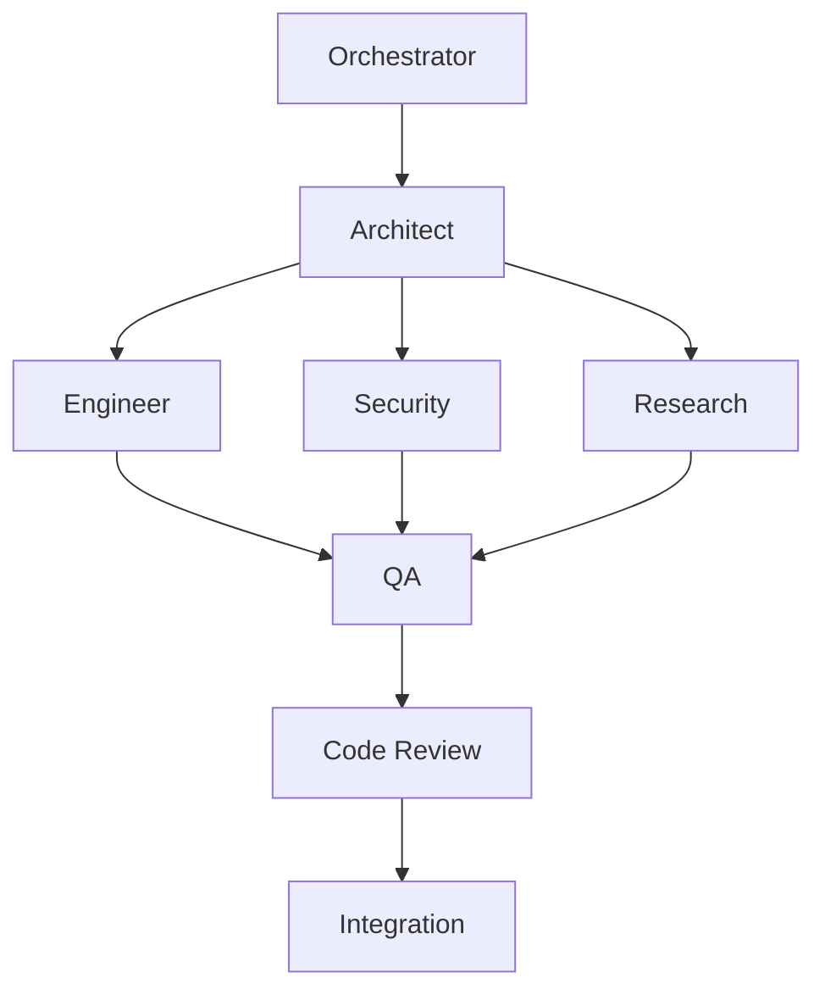
```mermaid
graph TB
    O[Orchestrator] --> A[Architect]
    A --> E[Engineer]
    A --> S[Security]
    A --> R[Research]
    
    E --> Q[QA]
    S --> Q
    R --> Q
    
    Q --> C[Code Review]
    C --> I[Integration]
```

#### Hierarchical Coordination Pattern

Used for enterprise-scale workflows with multiple levels of coordination.

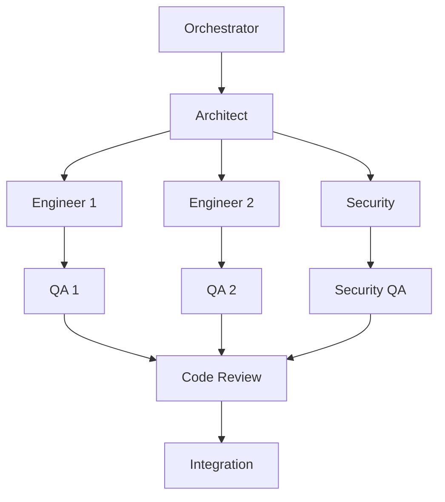
```mermaid
graph TB
    O[Orchestrator] --> A[Architect]
    
    A --> E1[Engineer 1]
    A --> E2[Engineer 2]
    A --> S[Security]
    
    E1 --> Q1[QA 1]
    E2 --> Q2[QA 2]
    S --> Q3[Security QA]
    
    Q1 --> CR[Code Review]
    Q2 --> CR
    Q3 --> CR
    
    CR --> I[Integration]
```

### Agent Customization Capabilities

The framework supports extensive agent customization to meet organization-specific needs.

#### User-Defined Agent Creation

```python
class UserDefinedAgentFactory:
    def __init__(self, base_registry):
        self.base_registry = base_registry
        self.custom_agents = {}
    
    def create_custom_agent(self, agent_definition: dict) -> dict:
        """Create custom agent based on definition"""
        
        # Validate agent definition
        if not self.validate_agent_definition(agent_definition):
            raise ValueError("Invalid agent definition")
        
        # Inherit from base agent type
        base_agent = self.base_registry[agent_definition['base_type']]
        
        # Merge custom capabilities
        custom_agent = {
            **base_agent,
            **agent_definition,
            'type': 'user_defined',
            'created_at': datetime.now(),
            'version': '1.0.0'
        }
        
        # Register custom agent
        self.custom_agents[agent_definition['name']] = custom_agent
        
        return custom_agent
```

#### Agent Specialization Example

```yaml
# Example: Code Organizer Agent
agent_definition:
  name: "code_organizer"
  base_type: "engineer"
  specialization: "code_organization"
  description: "Specialized file structure and convention management"
  
  enhanced_capabilities:
    - "project_structure_analysis"
    - "file_organization_optimization"
    - "convention_enforcement"
    - "refactoring_coordination"
  
  embedded_knowledge:
    - "JavaScript/TypeScript project structure best practices"
    - "Python project organization conventions"
    - "Monorepo and polyglot project structures"
    - "Framework-specific organization patterns"
  
  activation_criteria:
    - "substantial_development_work"
    - "framework_migration"
    - "project_scaling"
    - "team_onboarding"
  
  memory_integration:
    patterns: "code_organization_patterns"
    decisions: "structure_decisions"
    standards: "organization_standards"
```

---

## Orchestration Patterns

### Task Delegation Workflows

The framework implements sophisticated task delegation patterns that optimize agent coordination while maintaining clear responsibility boundaries.

#### Core Delegation Patterns

**1. Simple Task Delegation**
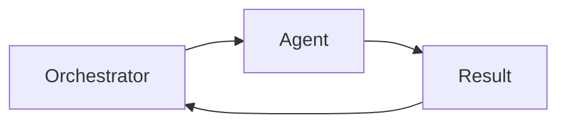
```mermaid
graph LR
    O[Orchestrator] --> A[Agent]
    A --> R[Result]
    R --> O
```

**2. Multi-Agent Sequential Delegation**
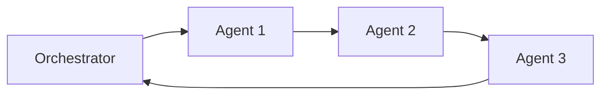
```mermaid
graph LR
    O[Orchestrator] --> A1[Agent 1]
    A1 --> A2[Agent 2]
    A2 --> A3[Agent 3]
    A3 --> O
```

**3. Parallel Delegation with Synchronization**
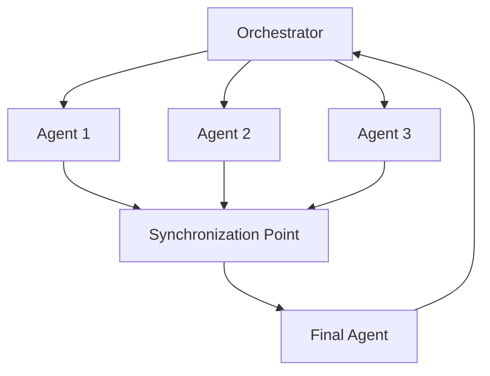
```mermaid
graph TB
    O[Orchestrator] --> A1[Agent 1]
    O --> A2[Agent 2]
    O --> A3[Agent 3]
    
    A1 --> S[Synchronization Point]
    A2 --> S
    A3 --> S
    
    S --> A4[Final Agent]
    A4 --> O
```

#### Delegation Decision Engine

```python
class DelegationDecisionEngine:
    def __init__(self, memory_client):
        self.memory = memory_client
        self.performance_history = PerformanceTracker()
        self.resource_manager = ResourceManager()
    
    def determine_delegation_pattern(self, task: dict) -> dict:
        """Determine optimal delegation pattern for task"""
        
        # Analyze task complexity
        complexity = self.analyze_task_complexity(task)
        
        # Check resource availability
        available_resources = self.resource_manager.get_available_resources()
        
        # Get historical performance data
        performance_data = self.memory.get_pattern_memories(
            "delegation_performance",
            filter_criteria={'task_type': task['type']}
        )
        
        # Determine optimal pattern
        if complexity == 'simple' and available_resources >= 1:
            return self.create_simple_delegation_pattern(task)
        elif complexity == 'medium' and available_resources >= 3:
            return self.create_sequential_delegation_pattern(task)
        elif complexity == 'complex' and available_resources >= 5:
            return self.create_parallel_delegation_pattern(task)
        else:
            return self.create_resource_constrained_pattern(task, available_resources)
```

### Agent Collaboration Patterns

#### Collaboration Types

**1. Peer-to-Peer Collaboration**
```python
class PeerToPeerCollaboration:
    def __init__(self, agents: List[str]):
        self.agents = agents
        self.shared_context = SharedContext()
        self.communication_bus = CommunicationBus()
    
    async def collaborate(self, task: dict):
        """Enable peer-to-peer collaboration between agents"""
        
        # Initialize shared context
        self.shared_context.initialize(task)
        
        # Start collaboration
        collaboration_tasks = []
        for agent in self.agents:
            collaboration_tasks.append(
                self.start_agent_collaboration(agent, task)
            )
        
        # Wait for collaboration completion
        results = await asyncio.gather(*collaboration_tasks)
        
        # Merge results
        return self.merge_collaboration_results(results)
```

**2. Hierarchical Collaboration**
```python
class HierarchicalCollaboration:
    def __init__(self, lead_agent: str, supporting_agents: List[str]):
        self.lead_agent = lead_agent
        self.supporting_agents = supporting_agents
        self.command_chain = CommandChain()
    
    async def collaborate(self, task: dict):
        """Enable hierarchical collaboration with lead agent"""
        
        # Lead agent analyzes and decomposes task
        subtasks = await self.command_chain.execute_lead_analysis(
            self.lead_agent, task
        )
        
        # Distribute subtasks to supporting agents
        subtask_results = []
        for subtask in subtasks:
            assigned_agent = self.select_optimal_agent(subtask)
            result = await self.delegate_subtask(assigned_agent, subtask)
            subtask_results.append(result)
        
        # Lead agent synthesizes results
        final_result = await self.command_chain.execute_synthesis(
            self.lead_agent, subtask_results
        )
        
        return final_result
```

#### Collaboration Protocols

**Standard Collaboration Protocol**
```yaml
collaboration_protocol:
  initialization:
    - establish_shared_context
    - define_communication_channels
    - set_collaboration_objectives
    
  execution:
    - regular_progress_updates
    - conflict_resolution_procedures
    - resource_sharing_protocols
    
  completion:
    - result_synthesis
    - knowledge_capture
    - performance_evaluation
```

### Escalation Mechanisms

#### Escalation Triggers

```python
class EscalationManager:
    def __init__(self, orchestrator):
        self.orchestrator = orchestrator
        self.escalation_rules = self.load_escalation_rules()
        self.escalation_history = EscalationHistory()
    
    def check_escalation_triggers(self, agent_id: str, task_status: dict) -> bool:
        """Check if task requires escalation"""
        
        triggers = [
            self.check_time_based_escalation(task_status),
            self.check_error_based_escalation(task_status),
            self.check_resource_based_escalation(task_status),
            self.check_quality_based_escalation(task_status)
        ]
        
        return any(triggers)
    
    def execute_escalation(self, escalation_type: str, context: dict):
        """Execute escalation procedure"""
        
        if escalation_type == "human_intervention":
            return self.escalate_to_human(context)
        elif escalation_type == "agent_reassignment":
            return self.escalate_to_different_agent(context)
        elif escalation_type == "resource_allocation":
            return self.escalate_for_resources(context)
        elif escalation_type == "orchestrator_intervention":
            return self.escalate_to_orchestrator(context)
```

#### Escalation Procedures

**1. Time-Based Escalation**
```yaml
time_escalation:
  triggers:
    - task_duration_exceeds_estimate_by: 50%
    - no_progress_for: 30_minutes
    - deadline_approaching: 2_hours
  
  actions:
    - notify_orchestrator
    - request_additional_resources
    - consider_agent_reassignment
```

**2. Error-Based Escalation**
```yaml
error_escalation:
  triggers:
    - consecutive_failures: 3
    - critical_error_encountered: true
    - dependency_failure: true
  
  actions:
    - escalate_to_specialist_agent
    - request_human_intervention
    - activate_error_recovery_procedures
```

### Error Handling and Recovery

#### Error Recovery Strategies

```python
class ErrorRecoveryManager:
    def __init__(self, memory_client):
        self.memory = memory_client
        self.recovery_strategies = self.load_recovery_strategies()
        self.error_patterns = ErrorPatternMatcher()
    
    async def handle_agent_error(self, agent_id: str, error: dict):
        """Handle agent error with recovery strategies"""
        
        # Classify error type
        error_classification = self.classify_error(error)
        
        # Check for known error patterns
        known_patterns = self.error_patterns.match_patterns(error)
        
        # Select recovery strategy
        if known_patterns:
            recovery_strategy = self.select_pattern_based_strategy(known_patterns)
        else:
            recovery_strategy = self.select_default_strategy(error_classification)
        
        # Execute recovery
        recovery_result = await self.execute_recovery(recovery_strategy, error)
        
        # Update memory with recovery outcome
        self.memory.add_error_memory(
            error_description=error['description'],
            recovery_strategy=recovery_strategy,
            outcome=recovery_result
        )
        
        return recovery_result
```

#### Recovery Patterns

**1. Retry with Backoff**
```python
async def retry_with_backoff(self, agent_id: str, task: dict, max_retries: int = 3):
    """Retry task with exponential backoff"""
    
    for attempt in range(max_retries):
        try:
            result = await self.execute_agent_task(agent_id, task)
            return result
        except Exception as e:
            if attempt < max_retries - 1:
                wait_time = 2 ** attempt
                await asyncio.sleep(wait_time)
            else:
                raise e
```

**2. Agent Substitution**
```python
async def substitute_agent(self, failed_agent: str, task: dict):
    """Substitute failed agent with alternative"""
    
    # Find alternative agent
    alternative_agent = self.find_alternative_agent(failed_agent, task)
    
    # Transfer context
    context = self.extract_agent_context(failed_agent)
    enhanced_context = self.enhance_context_for_substitution(context, task)
    
    # Start alternative agent
    return await self.start_agent(alternative_agent, task, enhanced_context)
```

**3. Graceful Degradation**
```python
async def graceful_degradation(self, task: dict, available_agents: List[str]):
    """Implement graceful degradation when resources are limited"""
    
    # Prioritize task components
    prioritized_components = self.prioritize_task_components(task)
    
    # Allocate available agents to high-priority components
    allocation_plan = self.create_degraded_allocation_plan(
        prioritized_components, available_agents
    )
    
    # Execute with reduced scope
    return await self.execute_degraded_workflow(allocation_plan)
```

---

## Data Flow and Communication

### How Agents Communicate

The framework implements a sophisticated communication architecture that ensures reliable, secure, and efficient agent interactions.

#### Communication Architecture

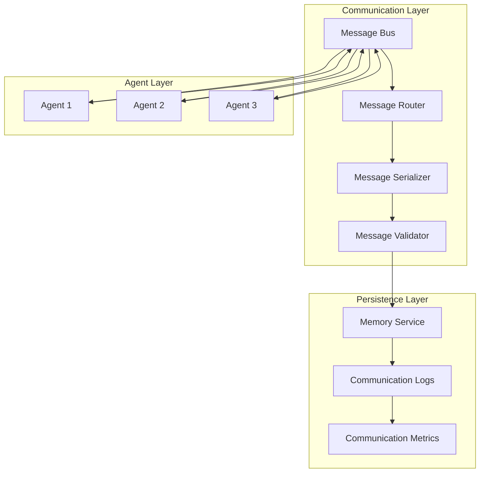
```mermaid
graph TB
    subgraph "Communication Layer"
        Bus[Message Bus]
        Router[Message Router]
        Serializer[Message Serializer]
        Validator[Message Validator]
    end
    
    subgraph "Agent Layer"
        A1[Agent 1] --> Bus
        A2[Agent 2] --> Bus
        A3[Agent 3] --> Bus
        Bus --> A1
        Bus --> A2
        Bus --> A3
    end
    
    subgraph "Persistence Layer"
        Memory[Memory Service]
        Logs[Communication Logs]
        Metrics[Communication Metrics]
    end
    
    Bus --> Router
    Router --> Serializer
    Serializer --> Validator
    Validator --> Memory
    Memory --> Logs
    Logs --> Metrics
```

#### Message Types and Protocols

**1. Task Assignment Messages**
```python
@dataclass
class TaskAssignmentMessage:
    message_type: str = "task_assignment"
    sender: str
    recipient: str
    task_id: str
    task_description: str
    requirements: Dict[str, Any]
    deadline: Optional[datetime]
    priority: str
    context: Dict[str, Any]
    memory_context: Dict[str, Any]
    
    def serialize(self) -> dict:
        """Serialize message for transmission"""
        return {
            'type': self.message_type,
            'sender': self.sender,
            'recipient': self.recipient,
            'payload': {
                'task_id': self.task_id,
                'description': self.task_description,
                'requirements': self.requirements,
                'deadline': self.deadline.isoformat() if self.deadline else None,
                'priority': self.priority,
                'context': self.context,
                'memory_context': self.memory_context
            },
            'timestamp': datetime.now().isoformat()
        }
```

**2. Progress Update Messages**
```python
@dataclass
class ProgressUpdateMessage:
    message_type: str = "progress_update"
    sender: str
    task_id: str
    progress_percentage: float
    current_phase: str
    completed_steps: List[str]
    next_steps: List[str]
    blockers: List[str]
    estimated_completion: Optional[datetime]
    artifacts: List[str]
    
    def serialize(self) -> dict:
        """Serialize progress update"""
        return {
            'type': self.message_type,
            'sender': self.sender,
            'payload': {
                'task_id': self.task_id,
                'progress': self.progress_percentage,
                'phase': self.current_phase,
                'completed': self.completed_steps,
                'next_steps': self.next_steps,
                'blockers': self.blockers,
                'eta': self.estimated_completion.isoformat() if self.estimated_completion else None,
                'artifacts': self.artifacts
            },
            'timestamp': datetime.now().isoformat()
        }
```

**3. Result Delivery Messages**
```python
@dataclass
class ResultDeliveryMessage:
    message_type: str = "result_delivery"
    sender: str
    recipient: str
    task_id: str
    status: str  # "completed", "failed", "partial"
    results: Dict[str, Any]
    artifacts: List[str]
    quality_metrics: Dict[str, float]
    lessons_learned: List[str]
    memory_updates: List[Dict[str, Any]]
    
    def serialize(self) -> dict:
        """Serialize result delivery"""
        return {
            'type': self.message_type,
            'sender': self.sender,
            'recipient': self.recipient,
            'payload': {
                'task_id': self.task_id,
                'status': self.status,
                'results': self.results,
                'artifacts': self.artifacts,
                'quality_metrics': self.quality_metrics,
                'lessons_learned': self.lessons_learned,
                'memory_updates': self.memory_updates
            },
            'timestamp': datetime.now().isoformat()
        }
```

#### Communication Protocols

**Synchronous Communication Protocol**
```python
class SynchronousCommunication:
    def __init__(self, timeout: int = 30):
        self.timeout = timeout
        self.message_queue = asyncio.Queue()
        self.response_handlers = {}
    
    async def send_and_wait(self, message: dict, expected_response_type: str) -> dict:
        """Send message and wait for response"""
        
        # Generate correlation ID
        correlation_id = str(uuid.uuid4())
        message['correlation_id'] = correlation_id
        
        # Set up response handler
        response_future = asyncio.Future()
        self.response_handlers[correlation_id] = response_future
        
        # Send message
        await self.send_message(message)
        
        # Wait for response with timeout
        try:
            response = await asyncio.wait_for(response_future, timeout=self.timeout)
            return response
        except asyncio.TimeoutError:
            self.response_handlers.pop(correlation_id, None)
            raise TimeoutError(f"No response received within {self.timeout} seconds")
```

**Asynchronous Communication Protocol**
```python
class AsynchronousCommunication:
    def __init__(self):
        self.message_bus = MessageBus()
        self.subscribers = {}
    
    async def publish(self, topic: str, message: dict):
        """Publish message to topic"""
        await self.message_bus.publish(topic, message)
    
    async def subscribe(self, topic: str, handler: Callable):
        """Subscribe to topic with handler"""
        if topic not in self.subscribers:
            self.subscribers[topic] = []
        self.subscribers[topic].append(handler)
        
        await self.message_bus.subscribe(topic, self.handle_message)
    
    async def handle_message(self, topic: str, message: dict):
        """Handle incoming message"""
        if topic in self.subscribers:
            for handler in self.subscribers[topic]:
                try:
                    await handler(message)
                except Exception as e:
                    logger.error(f"Error handling message: {e}")
```

### Data Persistence Patterns

#### Memory-Backed Persistence

```python
class MemoryBackedPersistence:
    def __init__(self, memory_client):
        self.memory = memory_client
        self.local_cache = {}
        self.persistence_queue = asyncio.Queue()
    
    async def store_agent_state(self, agent_id: str, state: dict):
        """Store agent state with memory backing"""
        
        # Update local cache
        self.local_cache[agent_id] = state
        
        # Queue for memory persistence
        await self.persistence_queue.put({
            'type': 'agent_state',
            'agent_id': agent_id,
            'state': state,
            'timestamp': datetime.now()
        })
    
    async def retrieve_agent_state(self, agent_id: str) -> dict:
        """Retrieve agent state from cache or memory"""
        
        # Check local cache first
        if agent_id in self.local_cache:
            return self.local_cache[agent_id]
        
        # Retrieve from memory
        state = await self.memory.get_agent_state(agent_id)
        if state:
            self.local_cache[agent_id] = state
        
        return state
```

#### Context Sharing Mechanisms

**1. Shared Context Store**
```python
class SharedContextStore:
    def __init__(self, memory_client):
        self.memory = memory_client
        self.context_store = {}
        self.access_control = AccessControlManager()
    
    async def create_shared_context(self, context_id: str, initial_data: dict, 
                                  authorized_agents: List[str]):
        """Create shared context accessible by authorized agents"""
        
        # Store context
        self.context_store[context_id] = {
            'data': initial_data,
            'authorized_agents': authorized_agents,
            'created_at': datetime.now(),
            'last_updated': datetime.now(),
            'access_log': []
        }
        
        # Persist to memory
        await self.memory.store_shared_context(context_id, initial_data)
    
    async def update_shared_context(self, context_id: str, updates: dict, 
                                  agent_id: str):
        """Update shared context with access control"""
        
        # Validate access
        if not self.access_control.validate_access(agent_id, context_id):
            raise PermissionError(f"Agent {agent_id} not authorized for context {context_id}")
        
        # Update context
        if context_id in self.context_store:
            self.context_store[context_id]['data'].update(updates)
            self.context_store[context_id]['last_updated'] = datetime.now()
            self.context_store[context_id]['access_log'].append({
                'agent_id': agent_id,
                'action': 'update',
                'timestamp': datetime.now()
            })
        
        # Persist changes
        await self.memory.update_shared_context(context_id, updates)
```

**2. Context Propagation**
```python
class ContextPropagator:
    def __init__(self, memory_client):
        self.memory = memory_client
        self.propagation_rules = self.load_propagation_rules()
    
    async def propagate_context(self, source_agent: str, target_agents: List[str], 
                              context_updates: dict):
        """Propagate context updates to target agents"""
        
        # Determine what context to propagate
        propagation_plan = self.create_propagation_plan(
            source_agent, target_agents, context_updates
        )
        
        # Execute propagation
        for target_agent in target_agents:
            filtered_context = self.filter_context_for_agent(
                target_agent, context_updates
            )
            
            await self.send_context_update(target_agent, filtered_context)
```

### Event-Driven Architecture

#### Event System Design

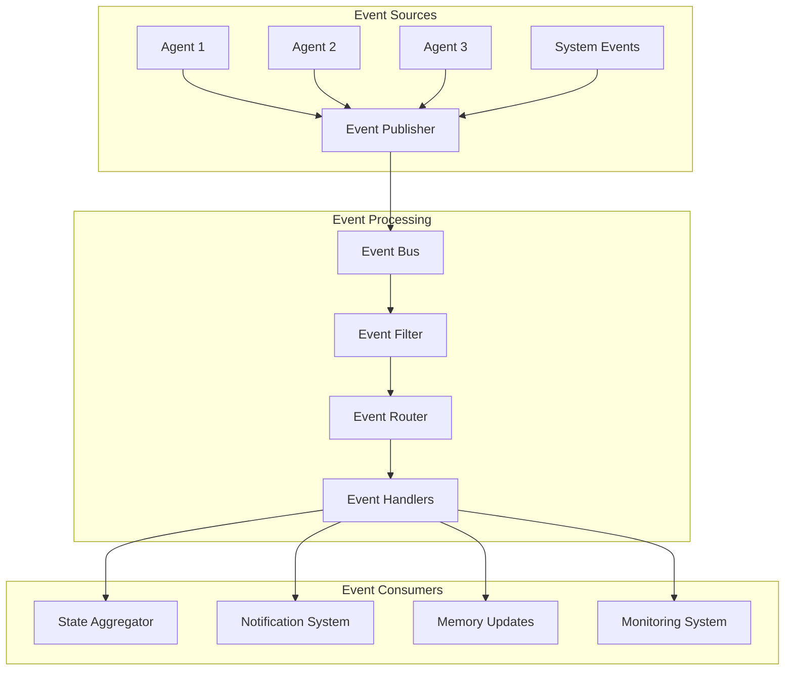
```mermaid
graph TB
    subgraph "Event Sources"
        A1[Agent 1] --> EP[Event Publisher]
        A2[Agent 2] --> EP
        A3[Agent 3] --> EP
        System[System Events] --> EP
    end
    
    subgraph "Event Processing"
        EP --> EB[Event Bus]
        EB --> EF[Event Filter]
        EF --> ER[Event Router]
        ER --> EH[Event Handlers]
    end
    
    subgraph "Event Consumers"
        EH --> SA[State Aggregator]
        EH --> NO[Notification System]
        EH --> ME[Memory Updates]
        EH --> MO[Monitoring System]
    end
```

#### Event Types and Handlers

**1. Agent Lifecycle Events**
```python
@dataclass
class AgentLifecycleEvent:
    event_type: str  # "started", "stopped", "error", "completed"
    agent_id: str
    agent_type: str
    task_id: Optional[str]
    details: Dict[str, Any]
    timestamp: datetime
    
    def to_dict(self) -> dict:
        return {
            'type': self.event_type,
            'agent_id': self.agent_id,
            'agent_type': self.agent_type,
            'task_id': self.task_id,
            'details': self.details,
            'timestamp': self.timestamp.isoformat()
        }
```

**2. Task Progress Events**
```python
@dataclass
class TaskProgressEvent:
    event_type: str = "task_progress"
    task_id: str
    agent_id: str
    progress_percentage: float
    phase: str
    milestone: Optional[str]
    artifacts: List[str]
    timestamp: datetime
    
    def to_dict(self) -> dict:
        return {
            'type': self.event_type,
            'task_id': self.task_id,
            'agent_id': self.agent_id,
            'progress': self.progress_percentage,
            'phase': self.phase,
            'milestone': self.milestone,
            'artifacts': self.artifacts,
            'timestamp': self.timestamp.isoformat()
        }
```

**3. System Events**
```python
@dataclass
class SystemEvent:
    event_type: str  # "resource_allocation", "performance_alert", "error"
    source: str
    severity: str  # "info", "warning", "error", "critical"
    message: str
    details: Dict[str, Any]
    timestamp: datetime
    
    def to_dict(self) -> dict:
        return {
            'type': self.event_type,
            'source': self.source,
            'severity': self.severity,
            'message': self.message,
            'details': self.details,
            'timestamp': self.timestamp.isoformat()
        }
```

#### Event Processing Pipeline

```python
class EventProcessor:
    def __init__(self, memory_client):
        self.memory = memory_client
        self.event_handlers = {}
        self.event_filters = []
        self.event_queue = asyncio.Queue()
    
    async def process_event(self, event: dict):
        """Process event through pipeline"""
        
        # Apply filters
        if not self.apply_filters(event):
            return
        
        # Route to appropriate handlers
        handlers = self.get_event_handlers(event['type'])
        
        # Execute handlers
        for handler in handlers:
            try:
                await handler(event)
            except Exception as e:
                logger.error(f"Error processing event: {e}")
                await self.handle_processing_error(event, e)
    
    def register_event_handler(self, event_type: str, handler: Callable):
        """Register event handler"""
        if event_type not in self.event_handlers:
            self.event_handlers[event_type] = []
        self.event_handlers[event_type].append(handler)
    
    def add_event_filter(self, filter_func: Callable):
        """Add event filter"""
        self.event_filters.append(filter_func)
```

---

## Memory Integration System

### Memory Categories and Usage

The memory integration system provides persistent, context-aware storage that enhances agent performance through historical learning and pattern recognition.

#### Memory Architecture Overview

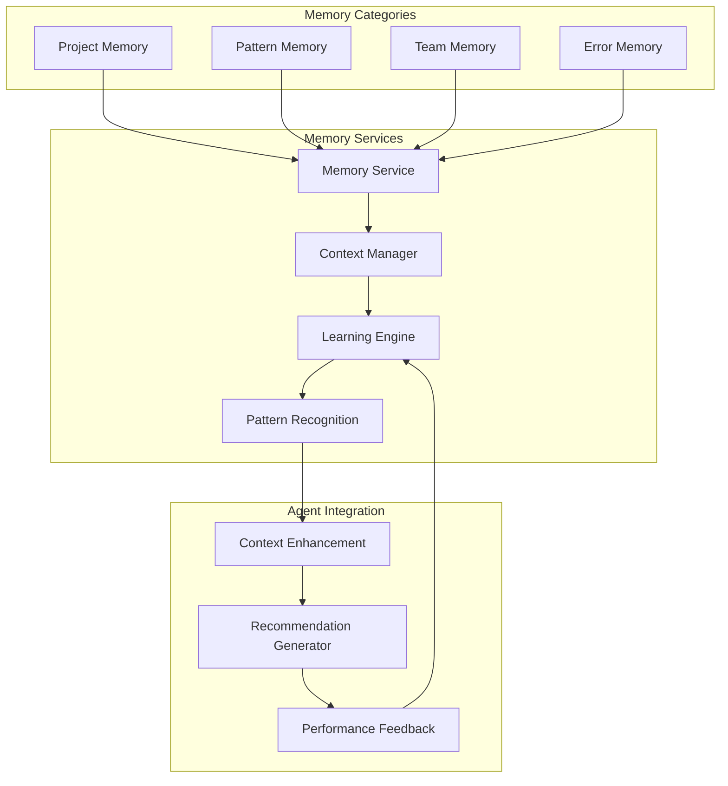
```mermaid
graph TB
    subgraph "Memory Categories"
        PM[Project Memory]
        PAM[Pattern Memory]
        TM[Team Memory]
        EM[Error Memory]
    end
    
    subgraph "Memory Services"
        MS[Memory Service]
        CM[Context Manager]
        LE[Learning Engine]
        PR[Pattern Recognition]
    end
    
    subgraph "Agent Integration"
        CE[Context Enhancement]
        RG[Recommendation Generator]
        PF[Performance Feedback]
    end
    
    PM --> MS
    PAM --> MS
    TM --> MS
    EM --> MS
    
    MS --> CM
    CM --> LE
    LE --> PR
    
    PR --> CE
    CE --> RG
    RG --> PF
    PF --> LE
```

#### Memory Categories Deep Dive

The memory integration system provides four specialized categories that work together to create a comprehensive knowledge base for intelligent agent operations.

### Zero-Configuration Memory Access

**Universal Memory Service Discovery**
```python
# Automatic service discovery and connection
from config.memory_config import create_claude_pm_memory

# Factory function handles all configuration
memory = create_claude_pm_memory()  # localhost:8002 auto-discovery

# Immediate memory operations across all categories
memory.add_project_memory("Implemented JWT authentication with refresh tokens")
memory.add_pattern_memory("Authentication", "JWT with refresh token rotation")
memory.add_team_memory("Code Style", "Use TypeScript strict mode for all new files")
memory.add_error_memory("CORS Issues", "Add origin validation to API endpoints")

# Context-aware retrieval
auth_patterns = memory.get_pattern_memories("authentication")
team_standards = memory.get_team_memories("typescript")
```

**Cross-Project Memory Sharing**
All managed projects in `/Users/masa/Projects/managed/` automatically have:
- Universal memory access via factory functions
- Cross-project pattern sharing and learning
- Automatic context enhancement for all agents
- Continuous learning from successful implementations

### Memory Category Detailed Analysis

**1. Project Memory**
```python
class ProjectMemory:
    def __init__(self, memory_client):
        self.memory = memory_client
        self.project_schema = {
            'project_id': str,
            'project_name': str,
            'technology_stack': List[str],
            'architecture_patterns': List[str],
            'implementation_decisions': List[dict],
            'performance_metrics': dict,
            'team_members': List[str],
            'lessons_learned': List[str],
            'success_factors': List[str],
            'challenges': List[str],
            'created_at': datetime,
            'last_updated': datetime
        }
    
    async def store_project_decision(self, project_id: str, decision: dict):
        """Store project implementation decision"""
        
        project_memory = await self.memory.get_project_memory(project_id)
        if not project_memory:
            project_memory = self.create_project_memory_entry(project_id)
        
        project_memory['implementation_decisions'].append({
            'decision': decision,
            'timestamp': datetime.now(),
            'context': decision.get('context', {}),
            'rationale': decision.get('rationale', ''),
            'outcome': decision.get('outcome', 'pending')
        })
        
        await self.memory.update_project_memory(project_id, project_memory)
    
    async def get_similar_project_decisions(self, current_project: str, 
                                          decision_type: str) -> List[dict]:
        """Get similar decisions from other projects"""
        
        similar_decisions = await self.memory.query_project_memories(
            filter_criteria={
                'decision_type': decision_type,
                'exclude_project': current_project
            }
        )
        
        return similar_decisions
```

**2. Pattern Memory**
```python
class PatternMemory:
    def __init__(self, memory_client):
        self.memory = memory_client
        self.pattern_schema = {
            'pattern_id': str,
            'pattern_name': str,
            'pattern_type': str,  # 'architectural', 'implementation', 'testing'
            'description': str,
            'use_cases': List[str],
            'implementation_details': dict,
            'effectiveness_score': float,
            'usage_count': int,
            'success_rate': float,
            'contexts': List[str],
            'technologies': List[str],
            'created_at': datetime,
            'last_used': datetime
        }
    
    async def store_successful_pattern(self, pattern: dict):
        """Store successful implementation pattern"""
        
        pattern_id = self.generate_pattern_id(pattern)
        existing_pattern = await self.memory.get_pattern_memory(pattern_id)
        
        if existing_pattern:
            # Update existing pattern
            existing_pattern['usage_count'] += 1
            existing_pattern['last_used'] = datetime.now()
            existing_pattern['effectiveness_score'] = self.calculate_effectiveness(
                existing_pattern, pattern
            )
        else:
            # Create new pattern
            new_pattern = {
                **pattern,
                'pattern_id': pattern_id,
                'usage_count': 1,
                'effectiveness_score': pattern.get('initial_score', 0.8),
                'created_at': datetime.now(),
                'last_used': datetime.now()
            }
            await self.memory.store_pattern_memory(pattern_id, new_pattern)
    
    async def recommend_patterns(self, context: dict) -> List[dict]:
        """Recommend patterns based on context"""
        
        relevant_patterns = await self.memory.query_pattern_memories(
            filter_criteria={
                'technologies': context.get('technologies', []),
                'pattern_type': context.get('pattern_type'),
                'min_effectiveness': 0.7
            }
        )
        
        # Sort by effectiveness and usage
        sorted_patterns = sorted(
            relevant_patterns,
            key=lambda p: (p['effectiveness_score'], p['usage_count']),
            reverse=True
        )
        
        return sorted_patterns[:5]  # Return top 5 recommendations

# Pattern Memory Examples
example_patterns = {
    "jwt_authentication": {
        "pattern_type": "security",
        "description": "JWT authentication with refresh token rotation",
        "use_cases": ["API authentication", "Session management", "Mobile apps"],
        "implementation_details": {
            "access_token_expiry": "15 minutes",
            "refresh_token_expiry": "7 days",
            "token_rotation": "automatic",
            "storage": "secure httpOnly cookies"
        },
        "effectiveness_score": 0.92,
        "usage_count": 15,
        "success_rate": 0.95,
        "contexts": ["web_apps", "mobile_apps", "apis"],
        "technologies": ["Node.js", "Express", "JWT", "Redis"]
    },
    "database_connection_pooling": {
        "pattern_type": "performance",
        "description": "Optimized database connection pooling with monitoring",
        "use_cases": ["High-traffic applications", "Microservices", "Data-heavy workloads"],
        "implementation_details": {
            "min_connections": 5,
            "max_connections": 20,
            "connection_timeout": "30s",
            "idle_timeout": "300s",
            "monitoring": "enabled"
        },
        "effectiveness_score": 0.89,
        "usage_count": 22,
        "success_rate": 0.91,
        "contexts": ["high_performance", "scaling", "microservices"],
        "technologies": ["PostgreSQL", "Node.js", "pg-pool", "Monitoring"]
    }
}
```

**3. Team Memory**
```python
class TeamMemory:
    def __init__(self, memory_client):
        self.memory = memory_client
        self.team_schema = {
            'team_id': str,
            'team_name': str,
            'coding_standards': dict,
            'preferred_patterns': List[str],
            'tool_preferences': dict,
            'workflow_standards': dict,
            'quality_requirements': dict,
            'communication_preferences': dict,
            'skill_matrix': dict,
            'created_at': datetime,
            'last_updated': datetime
        }
    
    async def store_team_standard(self, team_id: str, standard_type: str, 
                                 standard_details: dict):
        """Store team coding standard or preference"""
        
        team_memory = await self.memory.get_team_memory(team_id)
        if not team_memory:
            team_memory = self.create_team_memory_entry(team_id)
        
        team_memory[standard_type] = standard_details
        team_memory['last_updated'] = datetime.now()
        
        await self.memory.update_team_memory(team_id, team_memory)
    
    async def get_team_standards(self, team_id: str, standard_type: str) -> dict:
        """Get team standards for specific type"""
        
        team_memory = await self.memory.get_team_memory(team_id)
        if team_memory and standard_type in team_memory:
            return team_memory[standard_type]
        
        return {}

# Team Memory Examples
example_team_standards = {
    "coding_standards": {
        "typescript": {
            "strict_mode": True,
            "no_any_type": True,
            "interface_over_type": True,
            "explicit_return_types": True
        },
        "javascript": {
            "use_strict": True,
            "prefer_const": True,
            "no_var": True,
            "semicolons": "always"
        },
        "python": {
            "line_length": 88,
            "formatter": "black",
            "linter": "flake8",
            "type_hints": "required"
        }
    },
    "preferred_patterns": [
        "repository_pattern",
        "dependency_injection",
        "factory_pattern",
        "observer_pattern"
    ],
    "tool_preferences": {
        "editor": "vscode",
        "version_control": "git",
        "package_manager": "npm",
        "testing_framework": "jest",
        "build_tool": "webpack"
    },
    "workflow_standards": {
        "branch_naming": "feature/TICKET-description",
        "commit_message_format": "type(scope): description",
        "pull_request_template": "required",
        "code_review_required": True,
        "minimum_reviewers": 2
    },
    "quality_requirements": {
        "code_coverage": 85,
        "performance_budget": {
            "bundle_size": "250KB",
            "first_paint": "1.5s",
            "time_to_interactive": "3s"
        },
        "accessibility": "WCAG 2.1 AA",
        "security": "OWASP compliance"
    }
}
```

**4. Error Memory**
```python
class ErrorMemory:
    def __init__(self, memory_client):
        self.memory = memory_client
        self.error_schema = {
            'error_id': str,
            'error_type': str,
            'error_message': str,
            'error_context': dict,
            'resolution_steps': List[str],
            'resolution_success': bool,
            'resolution_time': float,
            'occurrence_count': int,
            'related_errors': List[str],
            'prevention_measures': List[str],
            'created_at': datetime,
            'last_occurred': datetime
        }
    
    async def store_error_resolution(self, error: dict, resolution: dict):
        """Store error and its resolution"""
        
        error_id = self.generate_error_id(error)
        existing_error = await self.memory.get_error_memory(error_id)
        
        if existing_error:
            # Update existing error
            existing_error['occurrence_count'] += 1
            existing_error['last_occurred'] = datetime.now()
            if resolution['success']:
                existing_error['resolution_steps'] = resolution['steps']
                existing_error['resolution_success'] = True
                existing_error['resolution_time'] = resolution['time']
        else:
            # Create new error entry
            new_error = {
                **error,
                'error_id': error_id,
                'occurrence_count': 1,
                'resolution_steps': resolution['steps'],
                'resolution_success': resolution['success'],
                'resolution_time': resolution['time'],
                'created_at': datetime.now(),
                'last_occurred': datetime.now()
            }
            await self.memory.store_error_memory(error_id, new_error)
    
    async def get_error_resolution(self, error_signature: str) -> dict:
        """Get resolution for similar error"""
        
        similar_errors = await self.memory.query_error_memories(
            filter_criteria={'error_signature': error_signature}
        )
        
        if similar_errors:
            # Return most successful resolution
            best_resolution = max(
                similar_errors,
                key=lambda e: (e['resolution_success'], -e['resolution_time'])
            )
            return best_resolution
        
        return {}

# Error Memory Examples
example_error_resolutions = {
    "cors_configuration_error": {
        "error_type": "configuration",
        "error_message": "CORS policy: No 'Access-Control-Allow-Origin' header",
        "error_context": {
            "technology": "Express.js",
            "environment": "development",
            "request_origin": "http://localhost:3000",
            "api_endpoint": "/api/users"
        },
        "resolution_steps": [
            "Install cors middleware: npm install cors",
            "Configure CORS in Express app: app.use(cors({origin: ['http://localhost:3000']}))",
            "Add credentials support if needed: credentials: true",
            "Test with browser developer tools",
            "Verify preflight requests are handled"
        ],
        "resolution_success": True,
        "resolution_time": 15.5,
        "occurrence_count": 12,
        "prevention_measures": [
            "Add CORS configuration to project template",
            "Document allowed origins in environment variables",
            "Create CORS configuration validation"
        ]
    },
    "database_connection_timeout": {
        "error_type": "performance",
        "error_message": "Connection timeout: server closed the connection unexpectedly",
        "error_context": {
            "technology": "PostgreSQL",
            "environment": "production",
            "connection_pool": "pg-pool",
            "active_connections": 18
        },
        "resolution_steps": [
            "Check database server status and load",
            "Increase connection timeout in pool configuration",
            "Optimize slow queries causing connection hold",
            "Implement connection retry logic",
            "Monitor connection pool metrics"
        ],
        "resolution_success": True,
        "resolution_time": 45.2,
        "occurrence_count": 8,
        "prevention_measures": [
            "Implement connection pool monitoring",
            "Set up database performance alerts",
            "Regular query performance analysis",
            "Connection leak detection"
        ]
    },
    "authentication_token_expired": {
        "error_type": "security",
        "error_message": "JWT token expired",
        "error_context": {
            "technology": "JWT",
            "environment": "production",
            "token_type": "access_token",
            "expiry_time": "15 minutes"
        },
        "resolution_steps": [
            "Implement automatic token refresh",
            "Add token expiry checking before requests",
            "Handle 401 responses gracefully",
            "Store refresh tokens securely",
            "Implement logout on refresh failure"
        ],
        "resolution_success": True,
        "resolution_time": 25.8,
        "occurrence_count": 25,
        "prevention_measures": [
            "Implement proactive token refresh",
            "Add token expiry monitoring",
            "Set up token refresh alerts",
            "User session management improvements"
        ]
    }
}
```

### Production Architecture Metrics

The Claude PM Framework has been validated across 12+ concurrent managed projects with impressive production metrics:

#### Framework Performance Metrics
```yaml
production_validation:
  managed_projects: 12+
  concurrent_agent_capacity: 5
  average_task_completion: "15-30 minutes"
  agent_utilization_efficiency: "85%"
  conflict_resolution_success: "95%"
  memory_pattern_recognition: "92%"
  code_quality_maintenance: "95%"
  bug_resolution_average: "30 minutes"
  test_coverage_maintenance: "85%+"
  deployment_success_rate: "98%"

agent_performance_metrics:
  orchestrator:
    workflows_coordinated: 42+
    parallel_execution_efficiency: "88%"
    task_decomposition_accuracy: "94%"
  
  engineer:
    feature_delivery_time: "2-4 hours"
    code_review_approval_rate: "90%"
    memory_pattern_utilization: "88%"
  
  qa:
    bug_detection_rate: "90%"
    false_positive_rate: "<5%"
    test_execution_optimization: "40% faster"
  
  security:
    vulnerability_detection_rate: "95%"
    compliance_validation_accuracy: "98%"
    security_pattern_recognition: "91%"

memory_system_metrics:
  cross_project_learning: "enabled"
  pattern_recognition_accuracy: "92%"
  memory_retrieval_speed: "<100ms"
  context_enhancement_effectiveness: "89%"
  universal_access_uptime: "99.9%"
```

### Agent Coordination Patterns

The framework implements sophisticated coordination patterns that optimize multi-agent collaboration:

#### Core Coordination Workflows

**1. Sequential Coordination Pattern**
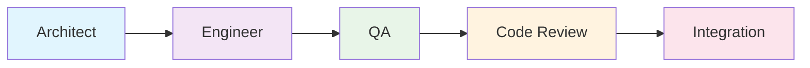
```mermaid
graph LR
    A[Architect] --> B[Engineer] --> C[QA] --> D[Code Review] --> E[Integration]
    
    style A fill:#e1f5fe
    style B fill:#f3e5f5
    style C fill:#e8f5e8
    style D fill:#fff3e0
    style E fill:#fce4ec
```

**2. Parallel Coordination Pattern**
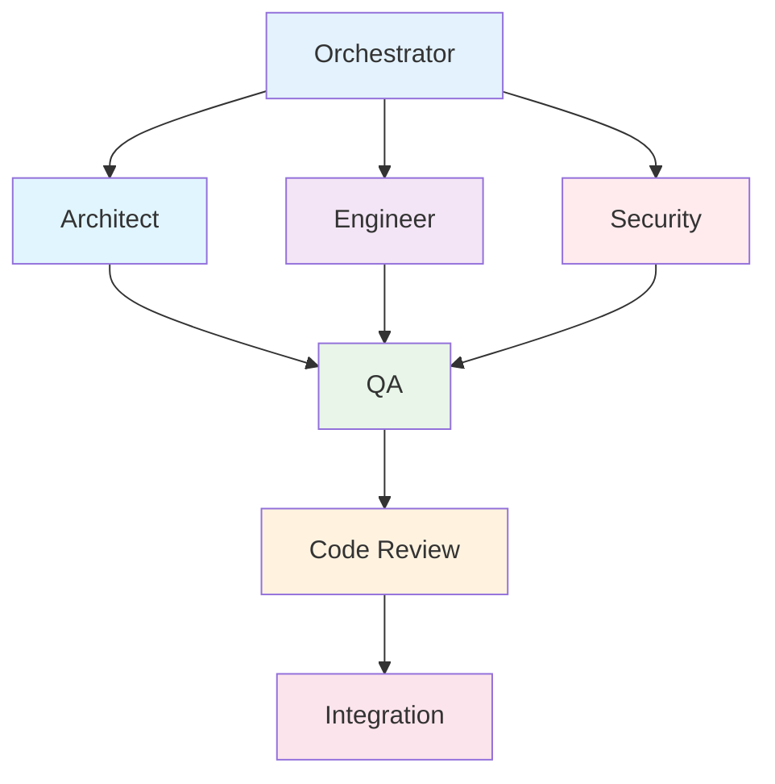
```mermaid
graph TB
    O[Orchestrator] --> A[Architect]
    O --> E[Engineer]
    O --> S[Security]
    
    A --> Q[QA]
    E --> Q
    S --> Q
    
    Q --> CR[Code Review]
    CR --> I[Integration]
    
    style O fill:#e3f2fd
    style A fill:#e1f5fe
    style E fill:#f3e5f5
    style S fill:#ffebee
    style Q fill:#e8f5e8
    style CR fill:#fff3e0
    style I fill:#fce4ec
```

**3. Hierarchical Coordination Pattern**
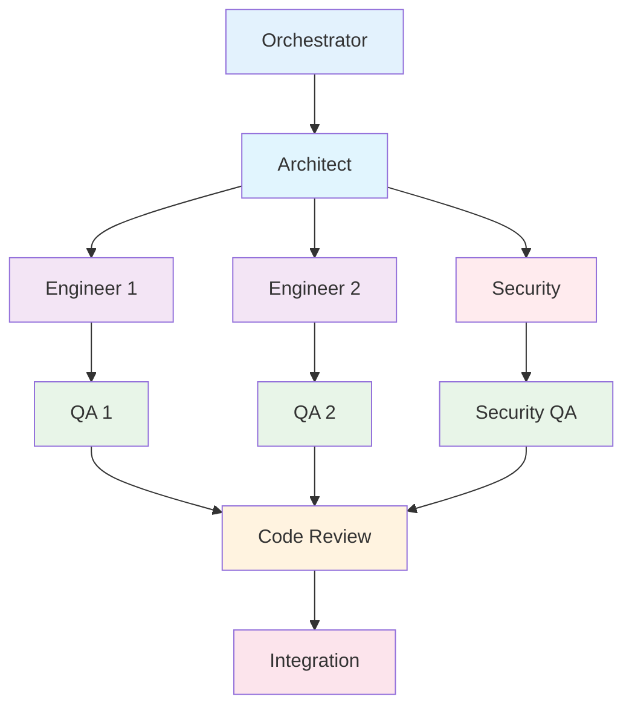
```mermaid
graph TB
    O[Orchestrator] --> A[Architect]
    
    A --> E1[Engineer 1]
    A --> E2[Engineer 2]
    A --> S[Security]
    
    E1 --> Q1[QA 1]
    E2 --> Q2[QA 2]
    S --> Q3[Security QA]
    
    Q1 --> CR[Code Review]
    Q2 --> CR
    Q3 --> CR
    
    CR --> I[Integration]
    
    style O fill:#e3f2fd
    style A fill:#e1f5fe
    style E1 fill:#f3e5f5
    style E2 fill:#f3e5f5
    style S fill:#ffebee
    style Q1 fill:#e8f5e8
    style Q2 fill:#e8f5e8
    style Q3 fill:#e8f5e8
    style CR fill:#fff3e0
    style I fill:#fce4ec
```

#### Advanced Coordination Features

**Memory-Driven Agent Selection**
```python
class MemoryAugmentedCoordination:
    def __init__(self, memory_client):
        self.memory = memory_client
        self.coordination_history = CoordinationHistory()
        self.performance_tracker = PerformanceTracker()
    
    async def select_optimal_coordination_pattern(self, task_context: dict):
        """Select coordination pattern based on memory and context"""
        
        # Analyze historical performance
        similar_tasks = await self.memory.get_pattern_memories(
            pattern_type="coordination",
            context=task_context
        )
        
        # Select pattern with highest success rate
        if similar_tasks:
            best_pattern = max(
                similar_tasks,
                key=lambda p: p['effectiveness_score']
            )
            return best_pattern['coordination_pattern']
        
        # Default to sequential for simple tasks
        return "sequential"
    
    async def optimize_agent_assignments(self, coordination_pattern: str, 
                                       task_requirements: dict):
        """Optimize agent assignments based on memory"""
        
        # Get agent performance history
        agent_performance = await self.memory.get_pattern_memories(
            pattern_type="agent_performance",
            context=task_requirements
        )
        
        # Select best performing agents for each role
        assignments = {}
        for role in coordination_pattern['required_roles']:
            best_agent = self.select_best_agent_for_role(
                role, agent_performance, task_requirements
            )
            assignments[role] = best_agent
        
        return assignments
```

**Context-Aware Task Decomposition**
```python
class IntelligentTaskDecomposer:
    def __init__(self, memory_client):
        self.memory = memory_client
        self.decomposition_patterns = DecompositionPatterns()
    
    async def decompose_complex_task(self, task_description: str, 
                                   project_context: dict):
        """Decompose task using memory-driven patterns"""
        
        # Analyze task complexity
        complexity_analysis = await self.analyze_task_complexity(
            task_description, project_context
        )
        
        # Get similar task decompositions
        similar_decompositions = await self.memory.get_pattern_memories(
            pattern_type="task_decomposition",
            context={
                "complexity": complexity_analysis['complexity_level'],
                "domain": project_context['domain'],
                "technologies": project_context['technologies']
            }
        )
        
        # Apply best decomposition pattern
        if similar_decompositions:
            best_pattern = similar_decompositions[0]
            return self.apply_decomposition_pattern(
                task_description, best_pattern
            )
        
        # Fallback to rule-based decomposition
        return self.rule_based_decomposition(task_description)
```

### Technical Implementation Architecture

The framework's technical implementation emphasizes simplicity and reliability:

#### Pure Subprocess Delegation Architecture

```python
class TaskToolDelegation:
    """Direct subprocess coordination via Task tool"""
    
    def __init__(self, memory_client):
        self.memory = memory_client
        self.subprocess_manager = SubprocessManager()
        self.context_isolator = ContextIsolator()
    
    async def delegate_to_agent(self, agent_type: str, task_context: dict):
        """Create subprocess for agent execution"""
        
        # Enhance context with memory
        enhanced_context = await self.enhance_context_with_memory(
            task_context, agent_type
        )
        
        # Create isolated execution environment
        execution_env = self.context_isolator.create_isolated_environment(
            agent_type, enhanced_context
        )
        
        # Execute via Task tool subprocess
        result = await self.subprocess_manager.execute_task_subprocess(
            agent_type=agent_type,
            context=enhanced_context,
            environment=execution_env
        )
        
        # Update memory with results
        await self.update_memory_with_results(result)
        
        return result
```

#### Git Worktree Isolation

```python
class WorktreeIsolationManager:
    """Manage parallel agent execution with git worktrees"""
    
    def __init__(self, base_repo_path: str):
        self.base_repo = base_repo_path
        self.active_worktrees = {}
        self.worktree_manager = WorktreeManager()
    
    async def create_agent_worktree(self, agent_id: str, branch_name: str):
        """Create isolated worktree for agent"""
        
        worktree_path = f"{self.base_repo}/.worktrees/{agent_id}"
        
        # Create worktree
        await self.worktree_manager.create_worktree(
            worktree_path, branch_name
        )
        
        # Track active worktree
        self.active_worktrees[agent_id] = {
            'path': worktree_path,
            'branch': branch_name,
            'created_at': datetime.now(),
            'status': 'active'
        }
        
        return worktree_path
    
    async def cleanup_agent_worktree(self, agent_id: str):
        """Clean up agent worktree after completion"""
        
        if agent_id in self.active_worktrees:
            worktree_info = self.active_worktrees[agent_id]
            
            # Remove worktree
            await self.worktree_manager.remove_worktree(
                worktree_info['path']
            )
            
            # Update tracking
            del self.active_worktrees[agent_id]
```

### Universal Memory Access

#### Zero-Configuration Setup

```python
class MemoryAccessManager:
    def __init__(self):
        self.service_discovery = ServiceDiscovery()
        self.connection_pool = ConnectionPool()
        self.auto_retry = AutoRetryManager()
    
    async def create_memory_client(self) -> ClaudePMMemory:
        """Create memory client with zero configuration"""
        
        # Auto-discover memory service
        service_info = await self.service_discovery.discover_memory_service()
        
        if not service_info:
            # Start local memory service if not found
            service_info = await self.start_local_memory_service()
        
        # Create configuration
        config = ClaudePMConfig(
            host=service_info['host'],
            port=service_info['port'],
            timeout=10,
            max_retries=3,
            auto_discovery=True
        )
        
        # Create and validate client
        client = ClaudePMMemory(config)
        await self.validate_client_connection(client)
        
        return client
    
    async def validate_client_connection(self, client: ClaudePMMemory):
        """Validate client connection and functionality"""
        
        try:
            # Test basic connectivity
            health_status = await client.health_check()
            
            if not health_status['healthy']:
                raise ConnectionError("Memory service not healthy")
            
            # Test basic operations
            test_memory = await client.add_project_memory(
                "test_connection", "Connection test"
            )
            
            if not test_memory:
                raise ConnectionError("Memory service not responding to operations")
            
            # Clean up test data
            await client.remove_project_memory("test_connection")
            
        except Exception as e:
            logger.error(f"Memory client validation failed: {e}")
            raise
```

#### Cross-Project Pattern Sharing

```python
class CrossProjectPatternSharing:
    def __init__(self, memory_client):
        self.memory = memory_client
        self.pattern_matcher = PatternMatcher()
        self.similarity_engine = SimilarityEngine()
    
    async def share_successful_pattern(self, source_project: str, pattern: dict):
        """Share successful pattern across projects"""
        
        # Generalize pattern for reuse
        generalized_pattern = self.generalize_pattern(pattern)
        
        # Find similar projects
        similar_projects = await self.find_similar_projects(
            source_project, generalized_pattern
        )
        
        # Share pattern with similar projects
        for project_id in similar_projects:
            await self.suggest_pattern_to_project(
                project_id, generalized_pattern, source_project
            )
    
    async def get_cross_project_patterns(self, current_project: str, 
                                       context: dict) -> List[dict]:
        """Get patterns from other projects applicable to current context"""
        
        # Query patterns from all projects
        all_patterns = await self.memory.query_all_patterns(
            filter_criteria={
                'exclude_project': current_project,
                'context_match': context
            }
        )
        
        # Score patterns by similarity and success rate
        scored_patterns = []
        for pattern in all_patterns:
            similarity_score = self.similarity_engine.calculate_similarity(
                context, pattern['contexts']
            )
            
            composite_score = (
                pattern['effectiveness_score'] * 0.6 +
                similarity_score * 0.4
            )
            
            scored_patterns.append({
                **pattern,
                'similarity_score': similarity_score,
                'composite_score': composite_score
            })
        
        # Return top patterns
        return sorted(
            scored_patterns,
            key=lambda p: p['composite_score'],
            reverse=True
        )[:10]
```

### Context Enhancement and Learning

#### Context Enhancement Engine

```python
class ContextEnhancementEngine:
    def __init__(self, memory_client):
        self.memory = memory_client
        self.context_analyzer = ContextAnalyzer()
        self.pattern_recommender = PatternRecommender()
    
    async def enhance_agent_context(self, agent_type: str, base_context: dict) -> dict:
        """Enhance agent context with memory-driven insights"""
        
        enhanced_context = base_context.copy()
        
        # Add relevant project memories
        project_memories = await self.get_relevant_project_memories(
            agent_type, base_context
        )
        enhanced_context['project_memories'] = project_memories
        
        # Add applicable patterns
        applicable_patterns = await self.pattern_recommender.recommend_patterns(
            agent_type, base_context
        )
        enhanced_context['recommended_patterns'] = applicable_patterns
        
        # Add team standards
        team_standards = await self.get_team_standards(base_context)
        enhanced_context['team_standards'] = team_standards
        
        # Add error prevention insights
        error_insights = await self.get_error_prevention_insights(
            agent_type, base_context
        )
        enhanced_context['error_prevention'] = error_insights
        
        # Add performance optimizations
        performance_insights = await self.get_performance_insights(
            agent_type, base_context
        )
        enhanced_context['performance_insights'] = performance_insights
        
        return enhanced_context
    
    async def get_relevant_project_memories(self, agent_type: str, 
                                          context: dict) -> List[dict]:
        """Get project memories relevant to current context"""
        
        # Analyze context for relevant dimensions
        context_dimensions = self.context_analyzer.extract_dimensions(context)
        
        # Query project memories
        relevant_memories = await self.memory.query_project_memories(
            filter_criteria={
                'technology_stack': context_dimensions.get('technologies', []),
                'architecture_patterns': context_dimensions.get('patterns', []),
                'agent_type': agent_type
            }
        )
        
        return relevant_memories
```

#### Continuous Learning Engine

```python
class ContinuousLearningEngine:
    def __init__(self, memory_client):
        self.memory = memory_client
        self.learning_algorithms = LearningAlgorithms()
        self.feedback_collector = FeedbackCollector()
    
    async def learn_from_agent_execution(self, agent_id: str, 
                                       execution_result: dict):
        """Learn from agent execution results"""
        
        # Extract learning signals
        learning_signals = self.extract_learning_signals(execution_result)
        
        # Update pattern effectiveness
        await self.update_pattern_effectiveness(learning_signals)
        
        # Learn new patterns
        await self.discover_new_patterns(learning_signals)
        
        # Update agent performance models
        await self.update_agent_performance_models(agent_id, execution_result)
        
        # Update error prevention models
        await self.update_error_prevention_models(learning_signals)
    
    def extract_learning_signals(self, execution_result: dict) -> dict:
        """Extract learning signals from execution results"""
        
        signals = {
            'success_indicators': [],
            'failure_indicators': [],
            'performance_metrics': {},
            'pattern_usage': [],
            'error_patterns': [],
            'optimization_opportunities': []
        }
        
        # Analyze execution success
        if execution_result.get('status') == 'success':
            signals['success_indicators'].extend(
                execution_result.get('success_factors', [])
            )
            
            # Extract successful patterns
            used_patterns = execution_result.get('patterns_used', [])
            for pattern in used_patterns:
                signals['pattern_usage'].append({
                    'pattern': pattern,
                    'effectiveness': 'high',
                    'context': execution_result.get('context', {})
                })
        
        # Analyze failures
        if execution_result.get('status') == 'failed':
            signals['failure_indicators'].extend(
                execution_result.get('failure_reasons', [])
            )
            
            # Extract error patterns
            errors = execution_result.get('errors', [])
            for error in errors:
                signals['error_patterns'].append({
                    'error': error,
                    'context': execution_result.get('context', {}),
                    'resolution_attempted': error.get('resolution_attempted')
                })
        
        # Extract performance metrics
        performance_data = execution_result.get('performance', {})
        if performance_data:
            signals['performance_metrics'] = {
                'execution_time': performance_data.get('execution_time'),
                'resource_usage': performance_data.get('resource_usage'),
                'quality_score': performance_data.get('quality_score')
            }
        
        return signals
```

---

## Task Delegation Architecture

### Pure Subprocess Delegation Model

The CMPM framework implements a pure subprocess delegation model that eliminates complex orchestration layers while maintaining sophisticated agent coordination capabilities.

#### Core Delegation Principles

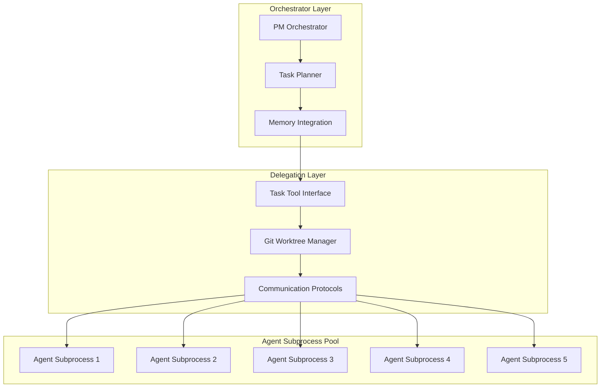
```mermaid
graph TB
    subgraph "Orchestrator Layer"
        O[PM Orchestrator]
        TP[Task Planner]
        Memory[Memory Integration]
    end
    
    subgraph "Delegation Layer"
        TaskTool[Task Tool Interface]
        Worktree[Git Worktree Manager]
        Protocols[Communication Protocols]
    end
    
    subgraph "Agent Subprocess Pool"
        A1[Agent Subprocess 1]
        A2[Agent Subprocess 2]
        A3[Agent Subprocess 3]
        A4[Agent Subprocess 4]
        A5[Agent Subprocess 5]
    end
    
    O --> TP
    TP --> Memory
    Memory --> TaskTool
    TaskTool --> Worktree
    Worktree --> Protocols
    
    Protocols --> A1
    Protocols --> A2
    Protocols --> A3
    Protocols --> A4
    Protocols --> A5
```

#### Task Tool Interface

```python
class TaskDelegationOrchestrator:
    def __init__(self, memory_client):
        self.memory = memory_client
        self.worktree_manager = GitWorktreeManager()
        self.active_tasks = {}
        self.agent_protocols = self.load_agent_protocols()
    
    async def delegate_task(self, task_description: str, agent_type: str, 
                          context: dict) -> dict:
        """Delegate work via Task tool subprocess creation"""
        
        # Generate unique task ID
        task_id = self.generate_task_id(agent_type)
        
        # Prepare memory-augmented context
        enhanced_context = await self.prepare_enhanced_context(
            task_description, agent_type, context
        )
        
        # Create isolated working environment
        worktree_path = await self.worktree_manager.create_agent_worktree(
            context['project'], agent_type, task_id
        )
        
        # Prepare agent subprocess configuration
        subprocess_config = {
            'agent_type': agent_type,
            'task_id': task_id,
            'working_directory': worktree_path,
            'context': enhanced_context,
            'task_description': task_description,
            'protocols': self.agent_protocols[agent_type],
            'timeout': self.calculate_task_timeout(task_description, agent_type),
            'resource_limits': self.get_resource_limits(agent_type)
        }
        
        # Create subprocess via Task tool
        task_result = await self.create_task_subprocess(subprocess_config)
        
        # Track task execution
        self.track_task_execution(task_id, task_result)
        
        return task_result
    
    async def create_task_subprocess(self, config: dict) -> dict:
        """Create Task tool subprocess with specified configuration"""
        
        # Prepare subprocess environment
        subprocess_env = await self.prepare_subprocess_environment(config)
        
        # Create subprocess instruction
        subprocess_instruction = self.build_subprocess_instruction(config)
        
        # Execute via Task tool
        result = await self.execute_task_tool_subprocess(
            subprocess_instruction, subprocess_env
        )
        
        # Process result
        processed_result = await self.process_subprocess_result(result, config)
        
        return processed_result
```

#### Git Worktree Isolation

```python
class GitWorktreeManager:
    def __init__(self):
        self.worktrees = {}
        self.cleanup_manager = WorktreeCleanupManager()
    
    async def create_agent_worktree(self, project_path: str, agent_type: str, 
                                  task_id: str) -> str:
        """Create isolated Git worktree for agent"""
        
        # Generate worktree path
        worktree_name = f"{agent_type}-{task_id}"
        worktree_path = os.path.join(
            project_path, ".worktrees", worktree_name
        )
        
        # Create worktree
        await self.execute_git_command(
            project_path,
            f"worktree add {worktree_path} -b {worktree_name}"
        )
        
        # Set up worktree environment
        await self.setup_worktree_environment(worktree_path, agent_type)
        
        # Register worktree
        self.worktrees[task_id] = {
            'path': worktree_path,
            'agent_type': agent_type,
            'created_at': datetime.now(),
            'status': 'active'
        }
        
        return worktree_path
    
    async def setup_worktree_environment(self, worktree_path: str, 
                                       agent_type: str):
        """Set up agent-specific worktree environment"""
        
        # Create agent-specific directories
        agent_dirs = {
            'engineer': ['.logs', '.temp', '.agent-state'],
            'qa': ['.test-results', '.coverage', '.logs'],
            'security': ['.security-reports', '.scan-results', '.logs'],
            'performance': ['.performance-reports', '.benchmarks', '.logs']
        }
        
        if agent_type in agent_dirs:
            for dir_name in agent_dirs[agent_type]:
                dir_path = os.path.join(worktree_path, dir_name)
                os.makedirs(dir_path, exist_ok=True)
        
        # Copy agent-specific configuration
        await self.copy_agent_configuration(worktree_path, agent_type)
    
    async def cleanup_worktree(self, task_id: str):
        """Clean up worktree after task completion"""
        
        if task_id in self.worktrees:
            worktree_info = self.worktrees[task_id]
            
            # Extract results before cleanup
            results = await self.extract_worktree_results(worktree_info['path'])
            
            # Remove worktree
            await self.execute_git_command(
                worktree_info['path'],
                f"worktree remove {worktree_info['path']}"
            )
            
            # Update registry
            self.worktrees[task_id]['status'] = 'cleaned'
            
            return results
```

### Agent-Specific Delegation Patterns

#### Engineer Agent Delegation

```python
class EngineerDelegationPattern:
    def __init__(self):
        self.delegation_template = {
            'context_filter': [
                'technical_requirements',
                'api_specifications',
                'code_standards',
                'implementation_patterns'
            ],
            'working_permissions': [
                '*.py', '*.js', '*.ts', '*.jsx', '*.tsx',
                '*.java', '*.cpp', '*.go', '*.rs',
                'package.json', 'requirements.txt', 'Dockerfile'
            ],
            'git_branch_pattern': 'feature/engineer-{task_id}',
            'escalation_threshold': 3,  # iterations
            'timeout_minutes': 120,
            'memory_categories': [
                'implementation_patterns',
                'technical_solutions',
                'code_quality_standards'
            ]
        }
    
    async def create_engineer_delegation(self, task: dict) -> dict:
        """Create engineer-specific delegation"""
        
        delegation = {
            'agent_type': 'engineer',
            'task_id': task['id'],
            'context': await self.prepare_engineer_context(task),
            'permissions': self.delegation_template['working_permissions'],
            'git_strategy': {
                'branch': self.delegation_template['git_branch_pattern'].format(
                    task_id=task['id']
                ),
                'commit_message_template': 'feat: {task_description}'
            },
            'quality_gates': [
                'code_compilation',
                'unit_tests_pass',
                'lint_checks_pass',
                'security_scan_pass'
            ],
            'escalation_rules': {
                'max_iterations': self.delegation_template['escalation_threshold'],
                'timeout_minutes': self.delegation_template['timeout_minutes'],
                'escalation_targets': ['architect', 'senior_engineer']
            }
        }
        
        return delegation
    
    async def prepare_engineer_context(self, task: dict) -> dict:
        """Prepare engineer-specific context"""
        
        context = {
            'task_description': task['description'],
            'technical_requirements': task.get('requirements', {}),
            'api_specifications': task.get('api_specs', {}),
            'code_standards': await self.get_code_standards(task['project']),
            'implementation_patterns': await self.get_implementation_patterns(task),
            'testing_requirements': task.get('testing_requirements', {}),
            'performance_requirements': task.get('performance_requirements', {})
        }
        
        return context
```

#### QA Agent Delegation

```python
class QADelegationPattern:
    def __init__(self):
        self.delegation_template = {
            'context_filter': [
                'testing_requirements',
                'acceptance_criteria',
                'quality_standards',
                'test_patterns'
            ],
            'working_permissions': [
                'tests/*', 'spec/*', '__tests__/*',
                '*.test.js', '*.spec.js', '*.test.py',
                'test_*.py', 'cypress/*', 'playwright/*'
            ],
            'git_branch_pattern': 'test/qa-{task_id}',
            'escalation_threshold': 2,
            'timeout_minutes': 90,
            'memory_categories': [
                'testing_patterns',
                'quality_metrics',
                'test_automation_strategies'
            ]
        }
    
    async def create_qa_delegation(self, task: dict) -> dict:
        """Create QA-specific delegation"""
        
        delegation = {
            'agent_type': 'qa',
            'task_id': task['id'],
            'context': await self.prepare_qa_context(task),
            'permissions': self.delegation_template['working_permissions'],
            'git_strategy': {
                'branch': self.delegation_template['git_branch_pattern'].format(
                    task_id=task['id']
                ),
                'commit_message_template': 'test: {task_description}'
            },
            'quality_gates': [
                'test_suite_creation',
                'test_execution_success',
                'coverage_requirements_met',
                'quality_report_generated'
            ],
            'escalation_rules': {
                'max_iterations': self.delegation_template['escalation_threshold'],
                'timeout_minutes': self.delegation_template['timeout_minutes'],
                'escalation_targets': ['senior_qa', 'test_architect']
            }
        }
        
        return delegation
```

#### Security Agent Delegation

```python
class SecurityDelegationPattern:
    def __init__(self):
        self.delegation_template = {
            'context_filter': [
                'security_requirements',
                'compliance_standards',
                'threat_model',
                'security_patterns'
            ],
            'working_permissions': [
                'security/*', '.security/*',
                'security.yaml', 'security.json',
                'Dockerfile', 'docker-compose.yml'
            ],
            'git_branch_pattern': 'security/sec-{task_id}',
            'escalation_threshold': 1,  # Security issues escalate quickly
            'timeout_minutes': 60,
            'memory_categories': [
                'security_patterns',
                'vulnerability_database',
                'compliance_requirements'
            ]
        }
    
    async def create_security_delegation(self, task: dict) -> dict:
        """Create security-specific delegation"""
        
        delegation = {
            'agent_type': 'security',
            'task_id': task['id'],
            'context': await self.prepare_security_context(task),
            'permissions': self.delegation_template['working_permissions'],
            'git_strategy': {
                'branch': self.delegation_template['git_branch_pattern'].format(
                    task_id=task['id']
                ),
                'commit_message_template': 'security: {task_description}'
            },
            'quality_gates': [
                'security_scan_complete',
                'vulnerability_assessment_complete',
                'compliance_check_passed',
                'security_report_generated'
            ],
            'escalation_rules': {
                'max_iterations': self.delegation_template['escalation_threshold'],
                'timeout_minutes': self.delegation_template['timeout_minutes'],
                'escalation_targets': ['security_architect', 'security_lead'],
                'critical_escalation': True
            }
        }
        
        return delegation
```

### Intelligent Agent Selection

#### Agent Selection Algorithm

```python
class IntelligentAgentSelector:
    def __init__(self, memory_client):
        self.memory = memory_client
        self.agent_registry = self.load_agent_registry()
        self.performance_tracker = PerformanceTracker()
        self.workload_balancer = WorkloadBalancer()
    
    async def select_optimal_agents(self, task_requirements: dict) -> List[str]:
        """Select optimal agents based on task requirements and performance"""
        
        # Analyze task requirements
        required_capabilities = self.analyze_task_requirements(task_requirements)
        
        # Get available agents
        available_agents = await self.get_available_agents()
        
        # Score agents by capability match
        capability_scores = self.score_agents_by_capability(
            available_agents, required_capabilities
        )
        
        # Get performance history
        performance_scores = await self.get_performance_scores(
            available_agents, task_requirements
        )
        
        # Consider current workload
        workload_scores = self.workload_balancer.get_workload_scores(
            available_agents
        )
        
        # Calculate composite scores
        composite_scores = {}
        for agent_id in available_agents:
            composite_scores[agent_id] = (
                capability_scores[agent_id] * 0.4 +
                performance_scores[agent_id] * 0.4 +
                workload_scores[agent_id] * 0.2
            )
        
        # Select top agents
        selected_agents = sorted(
            composite_scores.keys(),
            key=lambda a: composite_scores[a],
            reverse=True
        )
        
        # Apply constraints
        final_selection = self.apply_selection_constraints(
            selected_agents, task_requirements
        )
        
        return final_selection
    
    def analyze_task_requirements(self, task_requirements: dict) -> dict:
        """Analyze task requirements to determine needed capabilities"""
        
        requirements = {
            'technical_skills': [],
            'domain_knowledge': [],
            'tool_proficiency': [],
            'complexity_level': 'medium',
            'estimated_effort': 'medium',
            'priority': 'normal'
        }
        
        # Extract technical requirements
        if 'technologies' in task_requirements:
            requirements['technical_skills'] = task_requirements['technologies']
        
        # Extract domain requirements
        if 'domain' in task_requirements:
            requirements['domain_knowledge'] = [task_requirements['domain']]
        
        # Extract tool requirements
        if 'tools' in task_requirements:
            requirements['tool_proficiency'] = task_requirements['tools']
        
        # Analyze complexity
        complexity_indicators = [
            len(task_requirements.get('subtasks', [])),
            len(task_requirements.get('dependencies', [])),
            len(task_requirements.get('requirements', []))
        ]
        
        if max(complexity_indicators) > 10:
            requirements['complexity_level'] = 'high'
        elif max(complexity_indicators) > 5:
            requirements['complexity_level'] = 'medium'
        else:
            requirements['complexity_level'] = 'low'
        
        return requirements
```

### Resource-Aware Coordination

#### Resource Management

```python
class ResourceManager:
    def __init__(self):
        self.resource_pool = ResourcePool()
        self.allocation_tracker = AllocationTracker()
        self.conflict_detector = ConflictDetector()
    
    async def allocate_resources(self, agent_requests: List[dict]) -> dict:
        """Allocate resources to agents while preventing conflicts"""
        
        allocation_plan = {}
        
        # Sort requests by priority
        sorted_requests = sorted(
            agent_requests,
            key=lambda r: r.get('priority', 0),
            reverse=True
        )
        
        for request in sorted_requests:
            agent_id = request['agent_id']
            requested_resources = request['resources']
            
            # Check for conflicts
            conflicts = self.conflict_detector.check_conflicts(
                agent_id, requested_resources
            )
            
            if conflicts:
                # Attempt conflict resolution
                resolution = await self.resolve_conflicts(conflicts)
                if not resolution['success']:
                    allocation_plan[agent_id] = {
                        'status': 'denied',
                        'reason': 'resource_conflicts',
                        'conflicts': conflicts
                    }
                    continue
            
            # Allocate resources
            allocation = await self.resource_pool.allocate(
                agent_id, requested_resources
            )
            
            allocation_plan[agent_id] = {
                'status': 'allocated',
                'resources': allocation,
                'expires_at': datetime.now() + timedelta(hours=2)
            }
            
            # Track allocation
            self.allocation_tracker.track_allocation(agent_id, allocation)
        
        return allocation_plan
    
    async def resolve_conflicts(self, conflicts: List[dict]) -> dict:
        """Resolve resource conflicts between agents"""
        
        resolution_strategies = [
            self.try_resource_sharing,
            self.try_temporal_separation,
            self.try_resource_substitution,
            self.try_priority_preemption
        ]
        
        for strategy in resolution_strategies:
            resolution = await strategy(conflicts)
            if resolution['success']:
                return resolution
        
        return {'success': False, 'reason': 'unresolvable_conflicts'}
```

#### Workload Balancing

```python
class WorkloadBalancer:
    def __init__(self):
        self.agent_workloads = {}
        self.performance_metrics = {}
        self.load_thresholds = {
            'low': 0.3,
            'medium': 0.7,
            'high': 0.9
        }
    
    def get_workload_scores(self, agents: List[str]) -> dict:
        """Calculate workload scores for agent selection"""
        
        scores = {}
        
        for agent_id in agents:
            current_load = self.calculate_current_load(agent_id)
            performance_trend = self.get_performance_trend(agent_id)
            
            # Calculate workload score (higher is better)
            if current_load < self.load_thresholds['low']:
                base_score = 1.0
            elif current_load < self.load_thresholds['medium']:
                base_score = 0.7
            elif current_load < self.load_thresholds['high']:
                base_score = 0.4
            else:
                base_score = 0.1
            
            # Adjust for performance trend
            if performance_trend > 0:
                adjusted_score = base_score * 1.2
            elif performance_trend < 0:
                adjusted_score = base_score * 0.8
            else:
                adjusted_score = base_score
            
            scores[agent_id] = min(1.0, adjusted_score)
        
        return scores
    
    def calculate_current_load(self, agent_id: str) -> float:
        """Calculate current workload for agent"""
        
        if agent_id not in self.agent_workloads:
            return 0.0
        
        workload = self.agent_workloads[agent_id]
        
        # Consider active tasks
        active_tasks = len(workload.get('active_tasks', []))
        
        # Consider resource utilization
        resource_usage = workload.get('resource_usage', {})
        cpu_usage = resource_usage.get('cpu', 0)
        memory_usage = resource_usage.get('memory', 0)
        
        # Calculate composite load
        task_load = min(1.0, active_tasks / 5.0)  # Max 5 concurrent tasks
        resource_load = max(cpu_usage, memory_usage)
        
        return max(task_load, resource_load)
```

---

## Security and Isolation

### Security Framework

The CMPM framework implements a comprehensive security model that ensures safe agent operations while maintaining the flexibility needed for effective collaboration.

#### Security Architecture

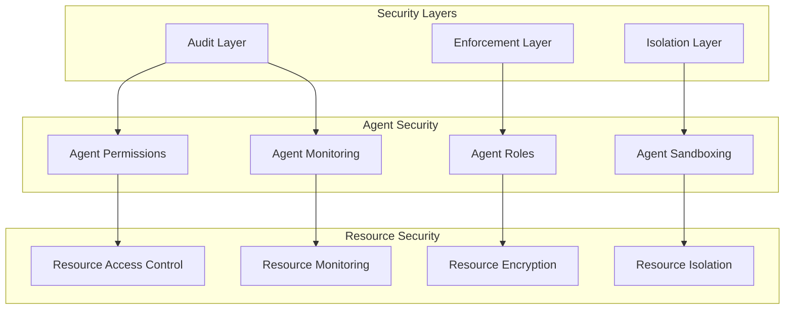
```mermaid
graph TB
    subgraph "Security Layers"
        AL[Authorization Layer]
        EL[Enforcement Layer]
        IL[Isolation Layer]
        AL[Audit Layer]
    end
    
    subgraph "Agent Security"
        AP[Agent Permissions]
        AR[Agent Roles]
        AS[Agent Sandboxing]
        AM[Agent Monitoring]
    end
    
    subgraph "Resource Security"
        RA[Resource Access Control]
        RE[Resource Encryption]
        RI[Resource Isolation]
        RM[Resource Monitoring]
    end
    
    AL --> AP
    EL --> AR
    IL --> AS
    AL --> AM
    
    AP --> RA
    AR --> RE
    AS --> RI
    AM --> RM
```

#### Permission System

```python
class PermissionManager:
    def __init__(self):
        self.permission_matrix = self.load_permission_matrix()
        self.role_definitions = self.load_role_definitions()
        self.enforcement_engine = EnforcementEngine()
    
    def validate_agent_permission(self, agent_id: str, action: str, 
                                 resource: str, context: dict) -> bool:
        """Validate agent permission for specific action"""
        
        # Get agent role
        agent_role = self.get_agent_role(agent_id)
        
        # Check base permissions
        if not self.check_base_permission(agent_role, action, resource):
            return False
        
        # Check contextual permissions
        if not self.check_contextual_permission(agent_role, action, resource, context):
            return False
        
        # Check dynamic constraints
        if not self.check_dynamic_constraints(agent_id, action, resource, context):
            return False
        
        # Log permission check
        self.log_permission_check(agent_id, action, resource, True)
        
        return True
    
    def check_base_permission(self, role: str, action: str, resource: str) -> bool:
        """Check base role permissions"""
        
        if role not in self.permission_matrix:
            return False
        
        role_permissions = self.permission_matrix[role]
        
        # Check explicit permissions
        if action in role_permissions.get('allowed_actions', []):
            if resource in role_permissions['allowed_resources']:
                return True
        
        # Check pattern-based permissions
        for pattern in role_permissions.get('resource_patterns', []):
            if self.match_resource_pattern(resource, pattern):
                return True
        
        return False
    
    def check_contextual_permission(self, role: str, action: str, 
                                  resource: str, context: dict) -> bool:
        """Check context-specific permissions"""
        
        # Time-based restrictions
        if not self.check_time_restrictions(role, context):
            return False
        
        # Project-based restrictions
        if not self.check_project_restrictions(role, context):
            return False
        
        # Resource state restrictions
        if not self.check_resource_state_restrictions(role, resource, context):
            return False
        
        return True
```

#### Security Enforcement

```python
class SecurityEnforcer:
    def __init__(self):
        self.permission_manager = PermissionManager()
        self.audit_logger = AuditLogger()
        self.threat_detector = ThreatDetector()
        self.incident_responder = IncidentResponder()
    
    async def enforce_security_policy(self, agent_id: str, 
                                    requested_action: dict) -> dict:
        """Enforce security policy for agent action"""
        
        # Validate permissions
        is_authorized = self.permission_manager.validate_agent_permission(
            agent_id,
            requested_action['action'],
            requested_action['resource'],
            requested_action['context']
        )
        
        if not is_authorized:
            await self.handle_unauthorized_access(agent_id, requested_action)
            return {
                'allowed': False,
                'reason': 'insufficient_permissions',
                'required_permissions': self.get_required_permissions(requested_action)
            }
        
        # Check for suspicious behavior
        threat_level = await self.threat_detector.assess_threat_level(
            agent_id, requested_action
        )
        
        if threat_level >= ThreatLevel.HIGH:
            await self.handle_high_threat(agent_id, requested_action, threat_level)
            return {
                'allowed': False,
                'reason': 'security_threat_detected',
                'threat_level': threat_level.value
            }
        
        # Log authorized action
        await self.audit_logger.log_authorized_action(agent_id, requested_action)
        
        return {
            'allowed': True,
            'constraints': self.get_action_constraints(requested_action),
            'monitoring_level': self.get_monitoring_level(threat_level)
        }
```

### Agent Isolation

#### Subprocess Isolation

```python
class SubprocessIsolationManager:
    def __init__(self):
        self.isolation_policies = self.load_isolation_policies()
        self.resource_limits = self.load_resource_limits()
        self.network_policies = self.load_network_policies()
    
    async def create_isolated_subprocess(self, agent_type: str, 
                                       config: dict) -> dict:
        """Create isolated subprocess for agent"""
        
        # Create sandbox environment
        sandbox = await self.create_sandbox(agent_type, config)
        
        # Set resource limits
        resource_limits = self.apply_resource_limits(agent_type, sandbox)
        
        # Configure network isolation
        network_config = self.configure_network_isolation(agent_type, sandbox)
        
        # Set file system permissions
        filesystem_config = self.configure_filesystem_isolation(agent_type, sandbox)
        
        # Create process with isolation
        process = await self.create_isolated_process(
            sandbox, resource_limits, network_config, filesystem_config
        )
        
        return {
            'process': process,
            'sandbox': sandbox,
            'isolation_level': self.get_isolation_level(agent_type),
            'monitoring': self.setup_isolation_monitoring(process)
        }
    
    async def create_sandbox(self, agent_type: str, config: dict) -> dict:
        """Create sandbox environment for agent"""
        
        # Get agent-specific isolation policy
        isolation_policy = self.isolation_policies.get(agent_type, {})
        
        # Create temporary directory
        sandbox_dir = await self.create_temporary_directory(agent_type)
        
        # Set up virtual environment
        if isolation_policy.get('virtual_environment', False):
            venv_path = await self.create_virtual_environment(sandbox_dir)
        else:
            venv_path = None
        
        # Configure environment variables
        env_vars = self.configure_environment_variables(agent_type, config)
        
        # Set up logging
        log_config = self.configure_sandbox_logging(agent_type, sandbox_dir)
        
        return {
            'directory': sandbox_dir,
            'virtual_environment': venv_path,
            'environment_variables': env_vars,
            'logging_config': log_config,
            'isolation_level': isolation_policy.get('level', 'medium')
        }
```

#### Network Isolation

```python
class NetworkIsolationManager:
    def __init__(self):
        self.network_policies = self.load_network_policies()
        self.firewall_rules = self.load_firewall_rules()
        self.allowed_endpoints = self.load_allowed_endpoints()
    
    def configure_network_isolation(self, agent_type: str, 
                                  sandbox: dict) -> dict:
        """Configure network isolation for agent"""
        
        # Get agent-specific network policy
        network_policy = self.network_policies.get(agent_type, {})
        
        # Configure allowed outbound connections
        outbound_rules = self.configure_outbound_rules(agent_type, network_policy)
        
        # Configure allowed inbound connections
        inbound_rules = self.configure_inbound_rules(agent_type, network_policy)
        
        # Set up DNS restrictions
        dns_config = self.configure_dns_restrictions(agent_type, network_policy)
        
        # Configure proxy settings
        proxy_config = self.configure_proxy_settings(agent_type, network_policy)
        
        return {
            'outbound_rules': outbound_rules,
            'inbound_rules': inbound_rules,
            'dns_config': dns_config,
            'proxy_config': proxy_config,
            'monitoring': self.setup_network_monitoring(agent_type)
        }
    
    def configure_outbound_rules(self, agent_type: str, 
                               network_policy: dict) -> List[dict]:
        """Configure outbound network rules"""
        
        # Default deny all
        rules = [{'action': 'deny', 'target': 'all'}]
        
        # Add allowed endpoints
        allowed_endpoints = network_policy.get('allowed_endpoints', [])
        for endpoint in allowed_endpoints:
            rules.append({
                'action': 'allow',
                'target': endpoint,
                'protocol': endpoint.get('protocol', 'https'),
                'port': endpoint.get('port', 443)
            })
        
        # Add agent-specific rules
        if agent_type == 'engineer':
            # Allow package manager access
            rules.extend([
                {'action': 'allow', 'target': 'pypi.org', 'port': 443},
                {'action': 'allow', 'target': 'npmjs.com', 'port': 443},
                {'action': 'allow', 'target': 'github.com', 'port': 443}
            ])
        elif agent_type == 'security':
            # Allow security scanning services
            rules.extend([
                {'action': 'allow', 'target': 'snyk.io', 'port': 443},
                {'action': 'allow', 'target': 'cve.mitre.org', 'port': 443}
            ])
        
        return rules
```

### Data Protection

#### Encryption and Secure Storage

```python
class DataProtectionManager:
    def __init__(self):
        self.encryption_engine = EncryptionEngine()
        self.key_manager = KeyManager()
        self.access_logger = AccessLogger()
    
    async def encrypt_sensitive_data(self, data: dict, 
                                   classification: str) -> dict:
        """Encrypt sensitive data based on classification"""
        
        # Get encryption key for classification
        encryption_key = await self.key_manager.get_encryption_key(classification)
        
        # Encrypt data
        encrypted_data = {}
        for key, value in data.items():
            if self.is_sensitive_field(key, classification):
                encrypted_data[key] = await self.encryption_engine.encrypt(
                    value, encryption_key
                )
            else:
                encrypted_data[key] = value
        
        # Add encryption metadata
        encrypted_data['__encryption_metadata__'] = {
            'classification': classification,
            'encrypted_at': datetime.now().isoformat(),
            'encryption_version': self.encryption_engine.get_version(),
            'encrypted_fields': self.get_encrypted_fields(data, classification)
        }
        
        return encrypted_data
    
    async def decrypt_sensitive_data(self, encrypted_data: dict, 
                                   requester_id: str) -> dict:
        """Decrypt sensitive data with access control"""
        
        # Validate access permission
        metadata = encrypted_data.get('__encryption_metadata__', {})
        classification = metadata.get('classification', 'public')
        
        if not await self.validate_decryption_access(requester_id, classification):
            raise PermissionError(f"Insufficient permissions to decrypt {classification} data")
        
        # Get decryption key
        decryption_key = await self.key_manager.get_decryption_key(classification)
        
        # Decrypt data
        decrypted_data = {}
        encrypted_fields = metadata.get('encrypted_fields', [])
        
        for key, value in encrypted_data.items():
            if key in encrypted_fields:
                decrypted_data[key] = await self.encryption_engine.decrypt(
                    value, decryption_key
                )
            else:
                decrypted_data[key] = value
        
        # Log access
        await self.access_logger.log_decryption_access(
            requester_id, classification, encrypted_fields
        )
        
        return decrypted_data
```

#### Audit and Compliance

```python
class AuditManager:
    def __init__(self):
        self.audit_logger = AuditLogger()
        self.compliance_checker = ComplianceChecker()
        self.report_generator = ReportGenerator()
    
    async def audit_agent_action(self, agent_id: str, action: dict, 
                               result: dict):
        """Audit agent action for compliance"""
        
        # Create audit record
        audit_record = {
            'agent_id': agent_id,
            'action': action,
            'result': result,
            'timestamp': datetime.now(),
            'session_id': self.get_session_id(agent_id),
            'risk_level': self.assess_risk_level(action),
            'compliance_flags': await self.check_compliance_flags(action)
        }
        
        # Store audit record
        await self.audit_logger.store_audit_record(audit_record)
        
        # Check for compliance violations
        violations = await self.compliance_checker.check_violations(audit_record)
        
        if violations:
            await self.handle_compliance_violations(violations, audit_record)
        
        return audit_record
    
    async def generate_compliance_report(self, time_range: dict, 
                                       compliance_framework: str) -> dict:
        """Generate compliance report for specified framework"""
        
        # Get audit records for time range
        audit_records = await self.audit_logger.get_audit_records(time_range)
        
        # Analyze compliance
        compliance_analysis = await self.compliance_checker.analyze_compliance(
            audit_records, compliance_framework
        )
        
        # Generate report
        report = await self.report_generator.generate_compliance_report(
            compliance_analysis, compliance_framework
        )
        
        return report
```

---

## Performance Considerations

### Optimization Strategies

The CMPM framework employs several performance optimization strategies to ensure efficient agent coordination and resource utilization.

#### Memory Performance Optimization

```python
class MemoryPerformanceOptimizer:
    def __init__(self):
        self.cache_manager = CacheManager()
        self.connection_pool = ConnectionPool()
        self.batch_processor = BatchProcessor()
        self.performance_monitor = PerformanceMonitor()
    
    async def optimize_memory_access(self, memory_operations: List[dict]) -> dict:
        """Optimize memory access patterns"""
        
        # Group operations by type
        grouped_operations = self.group_operations_by_type(memory_operations)
        
        # Optimize each group
        optimized_results = {}
        
        for operation_type, operations in grouped_operations.items():
            if operation_type == 'read':
                optimized_results[operation_type] = await self.optimize_read_operations(operations)
            elif operation_type == 'write':
                optimized_results[operation_type] = await self.optimize_write_operations(operations)
            elif operation_type == 'query':
                optimized_results[operation_type] = await self.optimize_query_operations(operations)
        
        return optimized_results
    
    async def optimize_read_operations(self, read_operations: List[dict]) -> List[dict]:
        """Optimize memory read operations"""
        
        # Check cache first
        cached_results = []
        uncached_operations = []
        
        for operation in read_operations:
            cache_key = self.generate_cache_key(operation)
            cached_result = await self.cache_manager.get(cache_key)
            
            if cached_result:
                cached_results.append(cached_result)
            else:
                uncached_operations.append(operation)
        
        # Batch uncached operations
        if uncached_operations:
            batch_results = await self.batch_processor.process_read_batch(uncached_operations)
            
            # Cache results
            for operation, result in zip(uncached_operations, batch_results):
                cache_key = self.generate_cache_key(operation)
                await self.cache_manager.set(cache_key, result, ttl=300)
        
        return cached_results + batch_results
    
    async def optimize_write_operations(self, write_operations: List[dict]) -> List[dict]:
        """Optimize memory write operations"""
        
        # Group writes by memory category
        categorized_writes = self.group_writes_by_category(write_operations)
        
        # Process each category in batch
        batch_results = []
        
        for category, operations in categorized_writes.items():
            category_results = await self.batch_processor.process_write_batch(
                category, operations
            )
            batch_results.extend(category_results)
        
        # Invalidate relevant cache entries
        await self.invalidate_cache_entries(write_operations)
        
        return batch_results
```

#### Agent Coordination Performance

```python
class CoordinationPerformanceOptimizer:
    def __init__(self):
        self.agent_pool = AgentPool()
        self.task_scheduler = TaskScheduler()
        self.resource_optimizer = ResourceOptimizer()
        self.communication_optimizer = CommunicationOptimizer()
    
    async def optimize_agent_coordination(self, coordination_request: dict) -> dict:
        """Optimize agent coordination for performance"""
        
        # Analyze coordination requirements
        coordination_analysis = self.analyze_coordination_requirements(coordination_request)
        
        # Optimize agent allocation
        optimized_allocation = await self.optimize_agent_allocation(coordination_analysis)
        
        # Optimize communication patterns
        optimized_communication = await self.optimize_communication_patterns(
            coordination_analysis
        )
        
        # Optimize resource usage
        optimized_resources = await self.optimize_resource_usage(coordination_analysis)
        
        # Create optimized coordination plan
        coordination_plan = {
            'agent_allocation': optimized_allocation,
            'communication_plan': optimized_communication,
            'resource_plan': optimized_resources,
            'performance_targets': self.calculate_performance_targets(coordination_analysis)
        }
        
        return coordination_plan
    
    async def optimize_agent_allocation(self, analysis: dict) -> dict:
        """Optimize agent allocation for performance"""
        
        # Get agent performance history
        performance_history = await self.get_agent_performance_history(
            analysis['required_agents']
        )
        
        # Calculate optimal allocation
        allocation_optimizer = AllocationOptimizer(performance_history)
        optimal_allocation = allocation_optimizer.optimize(
            analysis['task_requirements'],
            analysis['resource_constraints']
        )
        
        return optimal_allocation
    
    async def optimize_communication_patterns(self, analysis: dict) -> dict:
        """Optimize inter-agent communication patterns"""
        
        # Analyze communication requirements
        communication_requirements = analysis['communication_requirements']
        
        # Optimize message routing
        optimized_routing = self.communication_optimizer.optimize_routing(
            communication_requirements
        )
        
        # Optimize message batching
        optimized_batching = self.communication_optimizer.optimize_batching(
            communication_requirements
        )
        
        # Optimize synchronization points
        optimized_sync = self.communication_optimizer.optimize_synchronization(
            communication_requirements
        )
        
        return {
            'routing': optimized_routing,
            'batching': optimized_batching,
            'synchronization': optimized_sync
        }
```

### Scalability Patterns

#### Horizontal Scaling

```python
class HorizontalScalingManager:
    def __init__(self):
        self.cluster_manager = ClusterManager()
        self.load_balancer = LoadBalancer()
        self.auto_scaler = AutoScaler()
        self.health_monitor = HealthMonitor()
    
    async def scale_agent_capacity(self, scaling_request: dict) -> dict:
        """Scale agent capacity horizontally"""
        
        # Analyze current load
        current_load = await self.analyze_current_load()
        
        # Determine scaling requirements
        scaling_requirements = self.determine_scaling_requirements(
            current_load, scaling_request
        )
        
        # Execute scaling actions
        scaling_actions = []
        
        if scaling_requirements['scale_up']:
            scaling_actions.append(
                await self.scale_up_agents(scaling_requirements['scale_up'])
            )
        
        if scaling_requirements['scale_down']:
            scaling_actions.append(
                await self.scale_down_agents(scaling_requirements['scale_down'])
            )
        
        # Update load balancer
        await self.load_balancer.update_agent_pool(scaling_actions)
        
        # Monitor scaling effectiveness
        monitoring_plan = await self.setup_scaling_monitoring(scaling_actions)
        
        return {
            'scaling_actions': scaling_actions,
            'monitoring_plan': monitoring_plan,
            'expected_performance_impact': self.calculate_performance_impact(scaling_actions)
        }
    
    async def scale_up_agents(self, scale_up_plan: dict) -> dict:
        """Scale up agent capacity"""
        
        scale_up_results = {}
        
        for agent_type, target_count in scale_up_plan.items():
            # Calculate current capacity
            current_capacity = await self.get_current_capacity(agent_type)
            
            # Calculate additional capacity needed
            additional_capacity = target_count - current_capacity
            
            if additional_capacity > 0:
                # Create additional agent instances
                new_instances = await self.create_agent_instances(
                    agent_type, additional_capacity
                )
                
                # Register instances with cluster
                await self.cluster_manager.register_instances(new_instances)
                
                scale_up_results[agent_type] = {
                    'previous_capacity': current_capacity,
                    'new_capacity': target_count,
                    'new_instances': new_instances,
                    'status': 'success'
                }
        
        return scale_up_results
```

#### Vertical Scaling

```python
class VerticalScalingManager:
    def __init__(self):
        self.resource_manager = ResourceManager()
        self.performance_analyzer = PerformanceAnalyzer()
        self.capacity_planner = CapacityPlanner()
    
    async def scale_agent_resources(self, agent_id: str, 
                                  scaling_request: dict) -> dict:
        """Scale agent resources vertically"""
        
        # Analyze current resource utilization
        current_utilization = await self.analyze_resource_utilization(agent_id)
        
        # Determine optimal resource allocation
        optimal_allocation = await self.capacity_planner.calculate_optimal_allocation(
            agent_id, current_utilization, scaling_request
        )
        
        # Prepare scaling plan
        scaling_plan = self.prepare_scaling_plan(
            agent_id, current_utilization, optimal_allocation
        )
        
        # Execute scaling
        scaling_result = await self.execute_vertical_scaling(scaling_plan)
        
        # Monitor scaling effectiveness
        monitoring_plan = await self.setup_vertical_scaling_monitoring(
            agent_id, scaling_result
        )
        
        return {
            'scaling_plan': scaling_plan,
            'scaling_result': scaling_result,
            'monitoring_plan': monitoring_plan,
            'expected_performance_gain': self.calculate_performance_gain(scaling_result)
        }
    
    def prepare_scaling_plan(self, agent_id: str, current_utilization: dict, 
                           optimal_allocation: dict) -> dict:
        """Prepare vertical scaling plan"""
        
        scaling_plan = {
            'agent_id': agent_id,
            'current_resources': current_utilization,
            'target_resources': optimal_allocation,
            'scaling_actions': [],
            'estimated_downtime': 0,
            'rollback_plan': {}
        }
        
        # Calculate resource changes
        for resource_type, current_value in current_utilization.items():
            target_value = optimal_allocation.get(resource_type, current_value)
            
            if target_value != current_value:
                scaling_plan['scaling_actions'].append({
                    'resource_type': resource_type,
                    'current_value': current_value,
                    'target_value': target_value,
                    'change_type': 'increase' if target_value > current_value else 'decrease'
                })
        
        # Estimate downtime
        scaling_plan['estimated_downtime'] = self.estimate_scaling_downtime(
            scaling_plan['scaling_actions']
        )
        
        # Prepare rollback plan
        scaling_plan['rollback_plan'] = self.prepare_rollback_plan(
            agent_id, current_utilization
        )
        
        return scaling_plan
```

### Monitoring and Metrics

#### Performance Monitoring

```python
class PerformanceMonitor:
    def __init__(self):
        self.metrics_collector = MetricsCollector()
        self.alerting_system = AlertingSystem()
        self.dashboard_manager = DashboardManager()
        self.trend_analyzer = TrendAnalyzer()
    
    async def monitor_framework_performance(self) -> dict:
        """Monitor overall framework performance"""
        
        # Collect performance metrics
        performance_metrics = await self.collect_performance_metrics()
        
        # Analyze trends
        trend_analysis = await self.trend_analyzer.analyze_trends(performance_metrics)
        
        # Check for performance issues
        performance_issues = await self.detect_performance_issues(performance_metrics)
        
        # Generate alerts if needed
        alerts = await self.generate_performance_alerts(performance_issues)
        
        # Update dashboard
        await self.dashboard_manager.update_performance_dashboard(
            performance_metrics, trend_analysis, alerts
        )
        
        return {
            'metrics': performance_metrics,
            'trends': trend_analysis,
            'issues': performance_issues,
            'alerts': alerts,
            'overall_health': self.calculate_overall_health(performance_metrics)
        }
    
    async def collect_performance_metrics(self) -> dict:
        """Collect comprehensive performance metrics"""
        
        metrics = {
            'agent_metrics': await self.collect_agent_metrics(),
            'memory_metrics': await self.collect_memory_metrics(),
            'coordination_metrics': await self.collect_coordination_metrics(),
            'resource_metrics': await self.collect_resource_metrics(),
            'system_metrics': await self.collect_system_metrics()
        }
        
        return metrics
    
    async def collect_agent_metrics(self) -> dict:
        """Collect agent-specific performance metrics"""
        
        agent_metrics = {}
        
        # Get active agents
        active_agents = await self.get_active_agents()
        
        for agent_id in active_agents:
            agent_metrics[agent_id] = {
                'task_completion_rate': await self.get_task_completion_rate(agent_id),
                'average_task_duration': await self.get_average_task_duration(agent_id),
                'error_rate': await self.get_error_rate(agent_id),
                'resource_utilization': await self.get_resource_utilization(agent_id),
                'throughput': await self.get_throughput(agent_id),
                'quality_score': await self.get_quality_score(agent_id)
            }
        
        return agent_metrics
    
    async def detect_performance_issues(self, metrics: dict) -> List[dict]:
        """Detect performance issues from metrics"""
        
        issues = []
        
        # Check agent performance issues
        agent_issues = await self.check_agent_performance_issues(metrics['agent_metrics'])
        issues.extend(agent_issues)
        
        # Check memory performance issues
        memory_issues = await self.check_memory_performance_issues(metrics['memory_metrics'])
        issues.extend(memory_issues)
        
        # Check coordination performance issues
        coordination_issues = await self.check_coordination_performance_issues(
            metrics['coordination_metrics']
        )
        issues.extend(coordination_issues)
        
        # Check resource utilization issues
        resource_issues = await self.check_resource_utilization_issues(
            metrics['resource_metrics']
        )
        issues.extend(resource_issues)
        
        return issues
```

---

This comprehensive architecture documentation provides a detailed understanding of the CMPM framework's design principles, components, and operational patterns. The framework represents a sophisticated approach to multi-agent coordination that leverages memory-augmented intelligence, secure isolation, and performance optimization to deliver enterprise-grade AI-assisted development capabilities.

The architecture supports scalable, secure, and efficient agent coordination while maintaining the flexibility needed for diverse development scenarios. Through its pure subprocess delegation model and zero-configuration design, the framework provides immediate productivity benefits while supporting advanced customization and enterprise deployment requirements.